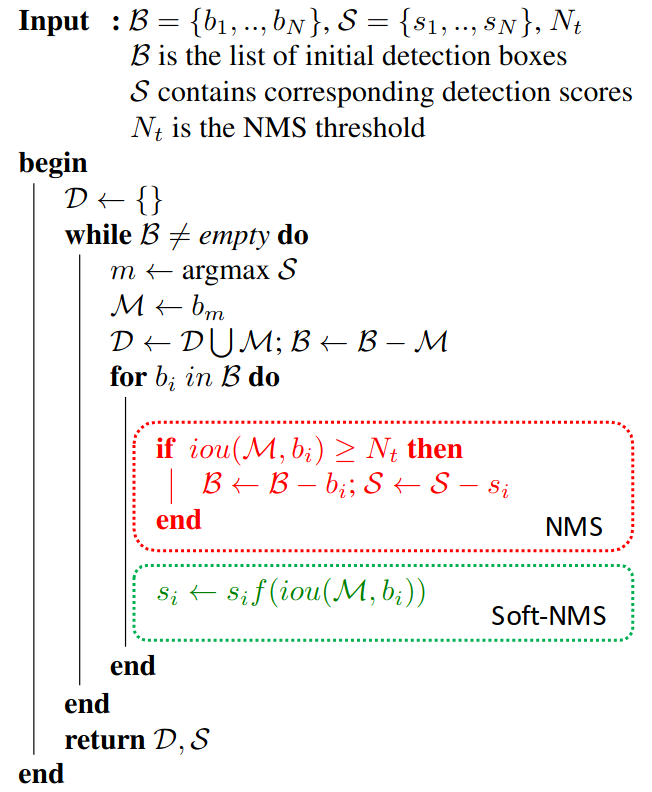
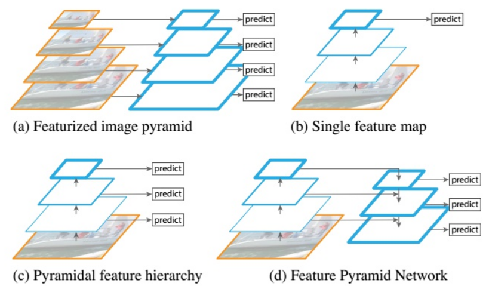
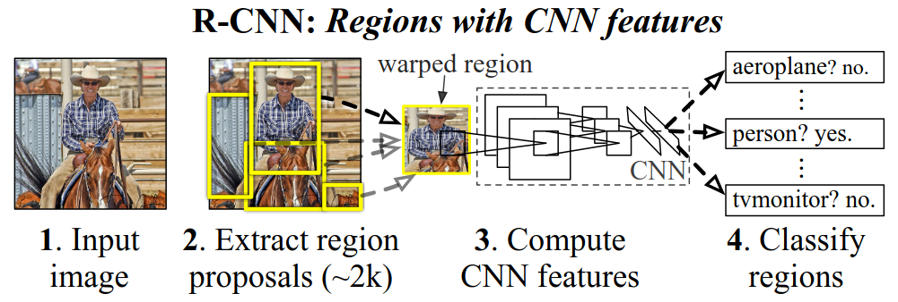
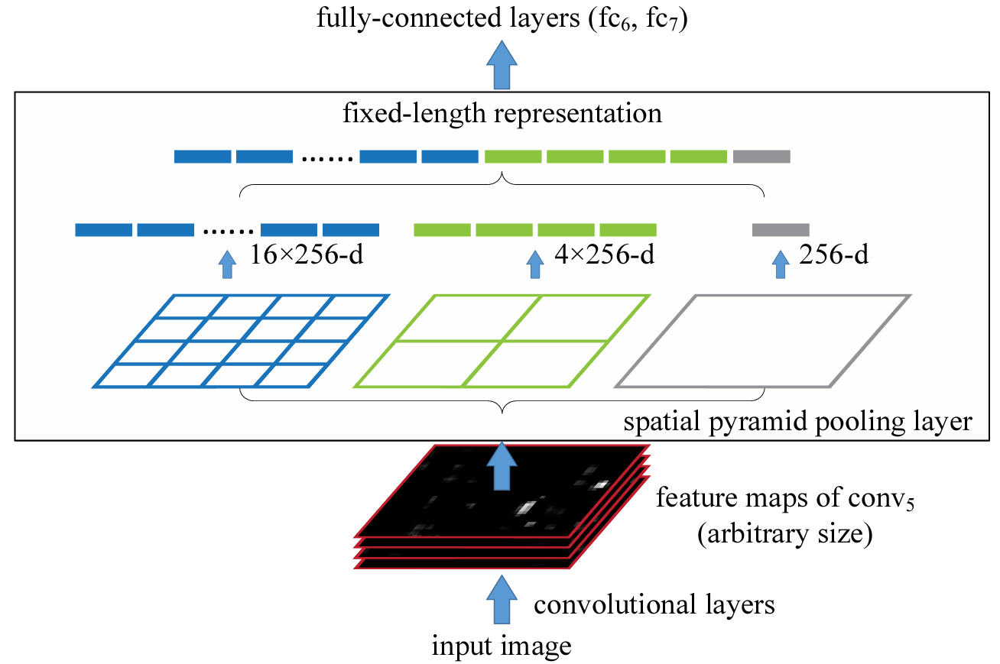

# 目标检测

## 概述

目标检测任务：找到图像中的目标物体（感兴趣区域），并确定其类别和位置信息。 

目标检测算法分类： 

1. One-stage（End-to-End，端到端）: 选取候选区域和目标检测（分类回归）放在一个网络中进行，如：YOLO系列。

2. Two-stage（两阶段）: 选取候选区域和目标检测分两阶段进行，如：R-CNN、SPPNet、Fast R-CNN、Faster R-CNN。

常见损失函数： 

- 分类：CrossEntropy。

- 回归：L1、L2、MSE、IoU等。

两种bounding box（边界框）： 

1. ground-truth bounding box：人为标记的真实边界框。

2. predicted bounding box：网络推理的预测边界框。

## 评价指标

准确率（Accuracy）：所有样本中预测正确的比例，$\rm Acc=(TP+TN)/(TP+FN+FP+TN)$。

精确率（Precision）：预测结果为正例样本中真实为正例的比例（查准率），$\rm P=TP/(TP+FP)$。

召回率（Recall）：真实为正例的样本中预测结果为正例的比例（查全率）：$\rm R=TP/(TP+FN)$ 

平均精确率（Mean Average Precision）：${\rm mAP}=\sum\limits^{n}_{c=0}{\rm AP}/n$ 

在数据集上用$\rm mAP$评估目标检测模型步骤： 

1. 计算每个类别的$\rm AP$：求数据集所有图片中每个类别的AP。
   
   1. 设定一个$\rm IoU$阈值，对每张图中某一类别的所有预测框（目标检测模型的最终输出结果）与该类别的所有真实框进行$\rm IoU$匹配。 
   
   2. 根据预测框与真实框的匹配情况（一个预测框与某个真实框匹配意味着该预测框来预测此目标）判断该类别下$\rm TP$、$\rm FP$、$\rm FN$的值（$\rm TP$为匹配到真实框的预测框，$\rm FP$为未匹配到真实框的预测框，$\rm FN$为未匹配到预测框的真实框，不需要$\rm TN$）。 
   
   3. 对该类别绘制$\rm PR$曲线，依次计算置信度阈值为$[0:1:0.1]$时的$\rm(R,P)$坐标（按置信度由高到低排序，剔除置信度低于阈值的预测框）。 
   
   4. 根据计算得到的不同置信度阈值下的$\rm(R,P)$坐标绘制$\rm PR$曲线，并计算该类别的$\rm AP$（$\rm PR$曲线的线下面积，同$\rm AUC$，即$\rm ROC$线下面积）。 

2. 计算所有类别的$\rm AP$并求平均值得到$\rm mAP$。 

预测框与真实框的匹配原则（同一张图内）： 

1. 与所有真实框的$\rm IoU$均小于$\rm IoU$阈值的预测框不匹配真实框。 

2. 与多个真实框的$\rm IoU$均大于$\rm IoU$阈值的预测框，匹配$\rm IoU$最大的真实框。 

3. 每个真实框最多只与一个预测框匹配。 

$\rm TP$、$\rm FP$、$\rm FN$确定原则： 

针对数据集所有图片每一个类别（模型分类结果）的预测框执行下述操作： 

1. 匹配到真实框的预测框为$\rm TP$。 

2. 未匹配到真实框的预测框为$\rm FP$。 

3. 未匹配到预测框的真实框为$\rm FN$。 

混淆矩阵：

|          | 预测为正     | 预测为反     |
| -------- | -------- | -------- |
| **真实为正** | $\rm TP$ | $\rm FN$ |
| **真实为正** | $\rm FP$ | $\rm TN$ |

$\rm mAP@0.5$是指$\rm IoU$阈值为$0.5$时的$\rm mAP$计算结果，$\rm mAP@0.5:0.95$是指$\rm IoU$阈值为$[0.5:0.95:0.05]$时的$\rm mAP$平均值。

$\rm AAP$（Approximated Average Precision）：

由于计算$\rm AP$（$\rm PR$曲线的线下面积）的公式是一个定积分（$p$代表Precision，$r$代表Recall，$p$是以$r$为自变量的函数）：${\rm AP}=\int^1_0p(r){\rm d}r$。因此在实现过程中，近似为：${\rm AP=}\sum\limits^N_{k=1}p(k)\Delta r(k)$。即，在每个阈值下分别求Precision乘以Recall的变化量，再把所有阈值下求得的乘积进行累加。

标注格式转换工具：

[GitHub - Weifeng-Chen/dl_scripts](https://github.com/Weifeng-Chen/DL_tools) 

标注格式：

- VOC：$x_1,y_1,x_2,y_2$

- YOLO：$c_x,c_y,w,h$

- COCO：$x_1, y_1, w, h$

$\rm mAP$计算工具：

[cocoapi/PythonAPI/pycocotools at master · cocodataset/cocoapi · GitHub](https://github.com/cocodataset/cocoapi/tree/master/PythonAPI/pycocotools)

```python
from pycocotools.coco import COCO 
from pycocotools.cocoeval import COCOeval 
import numpy as np 
import pylab
import json 


if __name__ == "__main__":
    gt_path = "instances_val2017.json"  # 存放真实标签的路径 
    dt_path = "my_result.json"  # 存放检测结果的路径 
    cocoGt = COCO(gt_path) 
    cocoDt = cocoGt.loadRes(dt_path) 
    cocoEval = COCOeval(cocoGt, cocoDt, "bbox") 
    cocoEval.evaluate() 
    cocoEval.accumulate() 
    cocoEval.summarize() 
```

## NMS

NMS，即非极大值抑制（筛选出score最高的候选区域，删除冗余的候选区域）： 

1. 统计整个输入image上预测出的所有候选区域（不区分类别）的位置坐标（左上右下）和score；

2. 对所有候选区域排序（按score由大到小）存入列表a；

3. 建立空列表b收集候选区域下标；

4. 循环（列表a是否为空）：
   
   1. 将当前列表a中score最高的候选区域下标删除并转存到列表b； 
   
   2. 计算列表a中所有候选区域与该候选区域的IoU；
   
   3. 保留所有小于IoU阈值的候选区域在列表a中并进行下一轮循环。

```python
import numpy as np 


def Intersaction(box_a, box_b): 
    a1_x, a1_y, a2_x, a2_y = box_a 
    b1_x, b1_y, b2_x, b2_y = box_b 
    x1 = max(a1_x, b1_x) 
    y1 = min(a1_y, b1_y) 
    x2 = min(a2_x, b2_x) 
    y2 = max(a2_y, b2_y) 
    if y2 - y1 <= 0 or x2 - x1: 
        return 0 
    return (y2 - y1) * (x2 - x1) 


def Union(box_a, box_b): 
    a1_x, a1_y, a2_x, a2_y = box_a 
    b1_x, b1_y, b2_x, b2_y = box_b 
    area_a = (a2_x - a1_x) * (a2_y - a1_y) 
    area_b = (b2_x - b1_x) * (b2_y - b1_y) 
    return area_a + area_b - Intersaction(box_a, box_b) 


def IoU(box_a, box_b): 
    a1_x, a1_y, a2_x, a2_y = box_a 
    b1_x, b1_y, b2_x, b2_y = box_b 
    if a1_x >= a2_x or a1_y >= a2_y or b1_x >= b2_x or b1_y >= b2_y: 
        return 0 
    return float(Intersaction(box_a, box_b) / float(Union(box_a, box_b) + 1e-6)) 


def NMS(dets, thresh): 
    """ 
    :param dets: [[x1, y1, x2, y2, score], [x1, y1, x2, y2, score], ...] 
    :param thresh: iou threshold 
    :return: list to save index of bboxes in dets after nms 
    """ 
    dets = np.array(dets) 
    x1 = dets[:, 0] 
    y1 = dets[:, 1] 
    x2 = dets[:, 2] 
    y2 = dets[:, 3] 
    scores = dets[:, 4] 
    areas = (y2 - y1) * (x2 - x1) 
    order = scores.argsort()[::-1] 
    keep = [] 
    while order.size > 0: 
        i = order[0] 
        keep.append(i) 
        xx1 = np.maximum(x1[i], x1[order[1:]]) 
        yy1 = np.maximum(y1[i], y1[order[1:]]) 
        xx2 = np.minimum(x2[i], x2[order[1:]]) 
        yy2 = np.minimum(y2[i], y2[order[1:]]) 
        w = np.maximum(0.0, xx2 - xx1) 
        h = np.maximum(0.0, yy2 - yy1) 
        inter = w * h 
        iou = inter / (areas[i] + areas[order[1:]] - inter) 
        inds = np.where(iou <= thresh)[0] 
        order = order[inds + 1] 
    return keep    
```

```cpp
#include <iostream> 
#include <vector> 
#include <algorithm> 

struct BBox { 
    float x1; 
    float y1; 
    float x2; 
    float y2; 
    float score; 
}; 

inline float IoU(float x1_box1, float y1_box1, float x2_box1, float y2_box1, float x1_box2, float y1_box2, float x2_box2, float y2_box2) { 
    float inner_x1 = x1_box1 > x1_box2 ? x1_box1 : x1_box2; 
    float inner_y1 = y1_box1 > y1_box2 ? y1_box1 : y1_box2; 
    float inner_x2 = x2_box1 < x2_box2 ? x2_box1 : x2_box2; 
    float inner_y2 = y2_box1 < y2_box2 ? y2_box1 : y2_box2; 
    float inner_h = inner_y2 - inner_y1 + 1; 
    float inner_w = inner_x2 - inner_x1 + 1; 
    if(inner_h <= 0 || inner_w <= 0) 
        return 0; 
    float inner_area = inner_h * inner_w; 
    float h1 = y2_box1 - y1_box1 + 1; 
    float w1 = x2_box1 - x1_box1 + 1; 
    float h2 = y2_box2 - y1_box2 + 1; 
    float w2 = x2_box2 - x1_box2 + 1; 
    float area1 = h1 * w1; 
    float area2 = h2 * w2; 
    float iou = inner_area / (area1 + area2 - inner_area); 
    return iou; 
} 

void NMS(std::vector<BBox>& input, std::vector<BBox>& output, float iou_threshold) { 
    std::sort(input.begin(), input.end(), [](BBox& a, BBox& b) { return a.score > b.score; }); 
    int input_num = input.size(); 
    std::vector<int> merged(input_num, 0); 
    for(int i = 0; i < input_num; ++i) { 
        if(merged[i]) 
            continue; 
        output.push_back(input[i]); 
        merged[i] = 1;  // if input i is added into output or suppressed, set merged[i] = 1, else retained 0 
        if(i == input_num - 1)  
            break; 
        for(int j = i + 1; j < input_num; ++j) { 
            if(merged[j]) 
                continue; 
            float iou = IoU(input[i].x1, input[i].y1, input[i].x2, input[i].y2, input[j].x1, input[j].y1, input[j].x2, input[j].y2); 
            if(iou > iou_threshold) 
                merged[j] = 1; 
        } 
    } 
} 

int main(int argc, char* argv[]) { 
    std::vector<BBox> series = { { 2.f, 2.f, 2.f, 2.f, 0.2f }, { 1.f, 1.f, 1.f, 1.f, 0.1f }, { 3.f, 3.f, 3.f, 3.f, 0.3f }, }; 
    std::vector<BBox> series_out; 
    int n = sizeof(series) / sizeof(series[0]); 
    float iou_thresh = 0.5; 
    NMS(series, series_out, iou_thresh); 
    for(auto& i : series_out) 
        std::cout << i.score << std::endl; 
    return 0; 
} 
```

```c
#include <stdio.h> 
#include <stdlib.h> 

typedef struct BoundingBox { 
    float x1; 
    float y1; 
    float x2; 
    float y2; 
    float score; 
} BBox; 

void ShellSort(BBox A[], int N) { 
    int i, j, increment; 
    BBox tmp; 
    for(increment = N / 2; increment > 0; increment /= 2) {
        for(i = increment; i < N; ++i) {   
            tmp = A[i]; 
            for(j = i; j >= increment; j -= increment) 
                if(tmp.score > A[j - increment].score)   
                    A[j] = A[j - increment]; 
                else 
                    break; 
            A[j] = tmp;  // put tmp in right position 
        } 
    }
} 

float IoU(float x1_box1, float y1_box1, float x2_box1, float y2_box1, float x1_box2, float y1_box2, float x2_box2, float y2_box2) { 
    float inner_x1 = x1_box1 > x1_box2 ? x1_box1 : x1_box2; 
    float inner_y1 = y1_box1 > y1_box2 ? y1_box1 : y1_box2; 
    float inner_x2 = x2_box1 < x2_box2 ? x2_box1 : x2_box2; 
    float inner_y2 = y2_box1 < y2_box2 ? y2_box1 : y2_box2; 
    float inner_h = inner_y2 - inner_y1 + 1; 
    float inner_w = inner_x2 - inner_x1 + 1; 
    if(inner_h <= 0 || inner_w <= 0) 
        return 0; 
    float inner_area = inner_h * inner_w; 
    float h1 = y2_box1 - y1_box1 + 1; 
    float w1 = x2_box1 - x1_box1 + 1; 
    float h2 = y2_box2 - y1_box2 + 1; 
    float w2 = x2_box2 - x1_box2 + 1; 
    float area1 = h1 * w1; 
    float area2 = h2 * w2; 
    float iou = inner_area / (area1 + area2 - inner_area); 
    return iou; 
} 

void NMS(BBox input[], int input_num, float iou_threshold) { 
    ShellSort(input, input_num);  // descending order 
    for(int i = 0; i < input_num; ++i) { 
        if(input[i].score == 0) 
            continue; 
        if(i == input_num - 1)  
            break; 
        for(int j = i + 1; j < input_num; ++j) { 
            if(input[j].score == 0) 
                continue; 
            float iou = IoU(input[i].x1, input[i].y1, input[i].x2, input[i].y2, input[j].x1, input[j].y1, input[j].x2, input[j].y2); 
            if(iou > iou_threshold) 
                input[j].score = 0;  // if a bbox is suppressed, set the score = 0 
        } 
    } 
} 

int main(int argc, char* argv[]) { 
    BBox series[3] = { { 2.f, 2.f, 2.f, 2.f, 0.2f }, { 1.f, 1.f, 1.f, 1.f, 0.1f }, { 3.f, 3.f, 3.f, 3.f, 0.3f }, }; 
    int n = sizeof(series) / sizeof(series[0]); 
    float iou_thresh = 0.5; 
    NMS(series, n, iou_thresh); 
    for(int i = 0; i < n; ++i) {
        if(series[i].score != 0) 
            printf("%f\n", series[i].score); 
    }
    return 0; 
} 
```

## Soft-NMS

NMS缺点：当两个目标距离很近时，score低的预测框可能被删掉。 

核心思想：不要直接删除所有IoU大于阈值的框，而是降低其score，IoU越大score越低。 

NMS可以描述为（把IoU大于阈值的预测框score置为0）：

$s_i=\begin{cases}s_i,\quad iou(\mathcal{M},b_i)\lt N_t\\0,\quad iou(\mathcal{M},b_i)\geq N_t\end{cases}$

Soft-NMS降低score的方法（权重函数）：

1. 线性加权
   
   $s_i=\begin{cases}s_i,\quad iou(\mathcal{M},b_i)\lt N_t\\s_i(1-iou(\mathcal{M},b_i)),\quad iou(\mathcal{M},b_i)\geq N_t\end{cases}$

2. 高斯加权
   
   $s_i=s_ie^{-\frac{ iou(\mathcal{M},b_i)^2}{\sigma}},\forall b_i\notin\mathcal{D}$

算法流程：



$f(iou(\mathcal{M},b_i))$是一个权重函数，该函数会衰减与检测框M有重叠的其它检测框的score，越是与M重叠度高的检测框，其score衰减就越大。

## Trick

解决小目标检测的手段：

1. 优化模型结构，增强特征提取能力，例如加入FPN、SPP或小目标检测层（增加上采样层提高上采样倍数，增加小尺寸anchor）。 

2. 增大输入图像的分辨率。

3. 训练时增加困难样本挖掘。

不同的多尺度（Multi-Scale）特征图预测方式：



(a)首先建立图像金字塔（上/下采样），不同尺度的金字塔图像被输入到对应的网络当中，用于不同scale物体的检测。但这样做的结果就是每个级别的金字塔都需要进行一次处理，速度很慢，在SPPNet使用的就是这种方式。

(b)检测只在最后一层feature map阶段进行，这个结构无法检测不同尺度的物体。

(c)对网络中不同深度的feature map分别进行目标检测。这样小的物体会在浅层的feature map中被检测出来，而大的物体会在深层的feature map被检测出来，从而达到对应不同尺度的物体的目的，缺点是每一个feature map获得的信息仅来源于之前的层，之后的层的特征信息无法获取并加以利用。SSD中采用的便是这样的结构。

(d)与(c)很接近，但不同的是，当前层的feature map会对未来层的feature map进行上采样，并加以利用。因为有了这样一个结构，当前的feature map就可以获得未来层的信息，低阶特征与高阶特征就有机融合起来，提升检测精度。YOLOv3就是采用这种方式来实现多尺度检测的。

总结：把浅层网络提取的特征（细节）传递下来，补充深层网络提取的特征（轮廓），这样就可以获得高分辨率、强语义的特征，有利于检测不同尺度的目标（浅层网络容易提取图像特征，深层网络提取语义特征）。

解决训练过程中正负样本不均衡的手段：

1. 人为控制参与loss计算的anchor的数量与正负样本比例。

2. 增大对少数样本的惩罚权重（如focal Loss）。

解决误检的手段：

- 数据
  
  1. 误检测类别的样本重采样（优点：提升Recall；缺点：可能会降低Precision）。
  
  2. 数据类别平衡。

- 训练策略
  
  1. 在box、confidence loss（YOLO）能够正常收敛的前提下，增大cls loss的权重。
  
  2. 增大focal loss的gamma值，增大对困难分类样本的loss（对于样本数量缺乏的类别不work）；增大focal loss的alpha值，增大正样本的loss权重。
  
  3. 增大cls loss中正样本的loss权重（如bce loss的positive weight）。

- 模型结构
  
  1. 优化模型结构（缺点：params增大）。
  
  2. 增大输入尺寸（缺点：flops增大）。

衡量Precision和Recall的时候，一定要保证Precision达到可接受的指标时，再提升Recall。否则，会出现很多误检测。

解决漏检的手段：

- 数据
  
  1. 漏检测类别的样本重采样。
  
  2. 数据类别平衡。

- 训练策略
  
  1. 在box、cls loss能够正常收敛的前提下，增大confidence loss权重（YOLO）。
  
  2. 增大正样本的loss权重（focal loss的alpha值、bce loss的positive weight）。
  
  3. 针对背景类别使用label-smoothing（SSD，缺点：引入误检测风险）。

- 模型结构
  
  1. 优化模型结构（缺点：params增大）。
  
  2. 增大输入尺寸（缺点：flops增大）。

- 后处理
  
  1. Single-Class NMS
  
  2. Soft NMS

提升目标检测性能的训练手段：

1. 数据增强（mosaic、random affine、resize等）。

2. 使用mask标注优化目标检测性能（在数据集标注完备，例如同时存在边界框和实例分割标注但任务只需要其中部分标注的情况下，可以借助完备的数据标注训练单一任务从而提升性能）。

3. 训练后期关闭数据增强以提升目标检测性能（虽然数据增强可以极大地提升目标检测性能，但是它生成的训练图片远远脱离自然图片的真实分布，在最后15个epoch关掉强增强，转而使用较弱的增强，从而让检测器避开不准确标注框的影响，在自然图片的数据分布下完成最终的收敛）。如果关闭太早则可能没有充分发挥数据增强效果，如果关闭太晚则由于之前已经过拟合，此时再关闭则没有任何增益。

4. 加入纯背景图片抑制误检测。

5. 考虑ignore区域不确定性标注（把ignore区域当做忽略区域即该区域的任何输出都直接忽略，不计算任何loss，不强迫模型拟合）。

## R-CNN

Rich feature hierarchies-CNN

网络结构：



训练步骤： 

1. 训练CNN网络用于提取候选区域的特征向量： 
   
   1. AlexNet网络在ImageNet上做预训练。
   2. AlexNet网络在训练集上做微调。 

2. 训练SVM用于候选区域的分类。 

3. 训练线性回归器用于候选区域的bounding box回归。

预测步骤：

1. 使用选择性搜索（selective search）在输入图片中提取候选区域（region proposal）。 

2. 把每个候选区域输入给CNN网络提取特征向量。 

3. 使用20个SVM分类（VOC有21个类别，包含背景类），每个候选区域用这20个SVM分类器打分（score），大于0.5则属于这个类别。 

4. 使用线性回归器修正候选区域中目标的位置与尺寸。 

5. NMS。

线性回归器：

- 目标函数（ridge regression）：
  
  $\mathrm{w}_{\star}=\argmin\limits_{\hat{\mathrm{w}}_{\star}}\sum\limits^N_i(t^i_{\star}-\hat{\mathrm{w}}^T_{\star}\phi_5(P^i))^2+\lambda\Vert \hat{\mathrm{w}_{\star}}\Vert^2$
  
  其中，$\phi_5$是CNN的数学表达式，$\mathrm{w}_{\star}$是线性回归器的可学习参数。

- 回归目标$t_{\star}$：
  
  $t_x=\frac{(G_x-P_x)}{P_w}$
  
  $t_y=\frac{(G_y-P_y)}{P_h}$
  
  $t_w=\log(\frac{G_w}{P_w})$
  
  $t_h=\log(\frac{G_h}{P_h})$
  
  其中，$G$为region proposal中的ground truth，$P$为region proposal。

R-CNN缺点： 

1. 训练阶段多（微调CNN网络+训练SVM+训练线性回归器），步骤繁琐，无法实现从SVM到CNN的反向传播。 

2. 无法保证图片不变形（CNN网络的输入是选择性搜索得到的候选框，固定为$227\times227$）。

## SPPNet

R-CNN中的AlexNet网络要求输入$227\times227$的固定尺寸图片，因此图片需要经过缩放才能输入进网络，会造成特征丢失。SPPNet引入空间金字塔池化（Spatial Pyramid Pooling，SPP）层以移除固定输入尺寸的限制。

训练步骤：

1. 训练用于提取输入特征图的CNN网络。

2. 训练用于分类的SVM。

3. 训练用于回归坐标的线性回归器。

预测步骤：

1. 将输入图片输入给CNN提取整张图片的特征图（feature map）。

2. 使用选择性搜索在输入图片中提取候选区域。

3. 将候选区域下采样映射到特征图中的对应位置并提取出来输入给SPP层，输出固定长度的特征向量。

4. 使用20个SVM进行分类。

5. 使用线性回归器回归bounding box。

6. NMS。

SPP层（Spacial Pyramid Pooling Layer）：

输入不同尺寸的候选区域，总能输出固定长度的特征向量（通过修改kernel size和stride）。

1. 输入：任意尺寸的候选区域（映射到特征图中的候选区域，论文中举例$13\times13\times256$）。

2. 输入候选区域尺寸（宽、高）为$i$（论文中举例$i=13$），空间金字塔层数设置为3，即分别用3种不同尺寸的kernel size（论文中举例$4\times4,2\times2,1\times1$）进行max pooling（max pooling kernel size为$\lceil\frac{i}{o}\rceil\times\lceil\frac{i}{o}\rceil$，stride为$\lfloor\frac{i}{o}\rfloor$，$o=1,2,4$），产生3层特征图金字塔。 

3. 将每层特征图flatten成特征向量，再进行concat。 

4. 输出concat之后的特征向量：$1\times1+2\times2+4\times4=21$个特征值。



## Fast R-CNN

引入ROI Pooling、End2End。

训练步骤：

1. 端到端训练Fast R-CNN。

预测步骤：

1. 将输入图片输入给CNN提取整张图片的特征图（feature map）。

2. 使用选择性搜索在输入图片中提取候选区域。

3. 将候选区域下采样映射到特征图中的对应位置并提取出来输入给ROI Pooling层输出固定尺寸的特征图，flatten得到固定长度的特征向量。

4. 将特征向量输入给全连接层+softmax进行分类（classification head）。

5. 将特征向量输入给全连接层回归bounding box（regression head）。

6. NMS。

ROI Pooling：

ROI Pooling是一个简单版本的SPP层，为了减少计算时间并且得出固定长度的向量。
