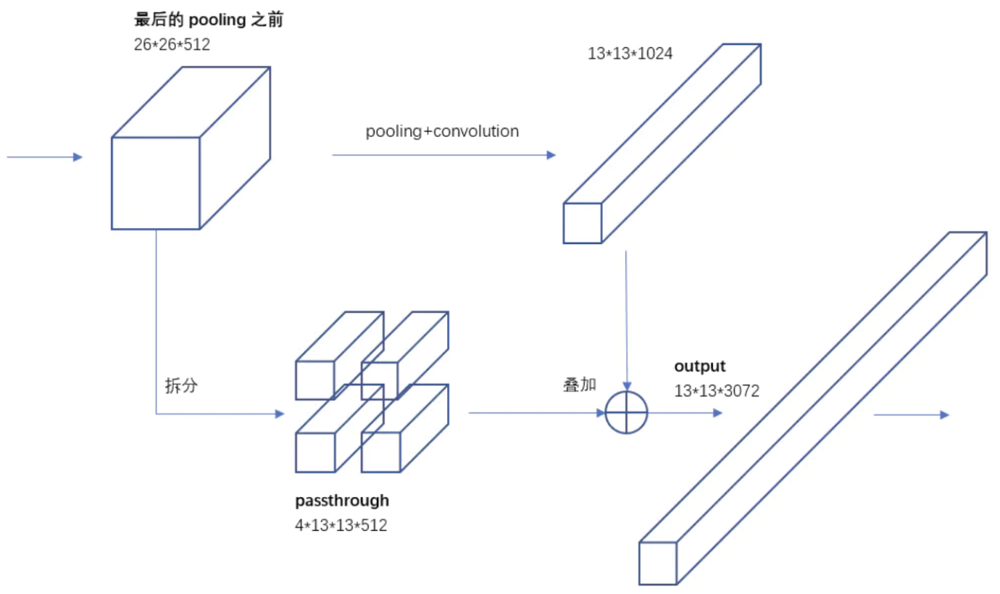

# 目标检测

## 概述

目标检测任务：找到图像中的目标物体（感兴趣区域），并确定其类别和位置信息。 

目标检测算法分类： 

1. One-stage（端到端，End2End）: 选取候选区域和目标检测（分类回归）放在一个网络中进行，如：YOLO系列。

2. Two-stage（两阶段）: 选取候选区域和目标检测分两阶段进行，如：R-CNN、SPPNet、Fast R-CNN、Faster R-CNN。

常见损失函数： 

- 分类：CrossEntropy。

- 回归：L1、L2、MSE、IoU等。

两种bounding box（边界框）： 

1. ground-truth bounding box：人为标记的真实边界框。

2. predicted bounding box：网络推理的预测边界框。

## 评价指标

准确率（Accuracy）：所有样本中预测正确的比例，$\rm Acc=(TP+TN)/(TP+FN+FP+TN)$。

精确率（Precision）：预测结果为正例样本中真实为正例的比例（查准率），$\rm P=TP/(TP+FP)$。

召回率（Recall）：真实为正例的样本中预测结果为正例的比例（查全率）：$\rm R=TP/(TP+FN)$ 

平均精确率（Mean Average Precision）：${\rm mAP}=\sum\limits^{n}_{c=0}{\rm AP}/n$ 

在数据集上用$\rm mAP$评估目标检测模型步骤： 

1. 计算每个类别的$\rm AP$：求数据集所有图片中每个类别的AP。
   
   1. 设定一个$\rm IoU$阈值，对每张图中某一类别的所有预测框（目标检测模型的最终输出结果）与该类别的所有真实框进行$\rm IoU$匹配。 
   
   2. 根据预测框与真实框的匹配情况（一个预测框与某个真实框匹配意味着该预测框来预测此目标）判断该类别下$\rm TP$、$\rm FP$、$\rm FN$的值（$\rm TP$为匹配到真实框的预测框，$\rm FP$为未匹配到真实框的预测框，$\rm FN$为未匹配到预测框的真实框，不需要$\rm TN$）。 
   
   3. 对该类别绘制$\rm PR$曲线，依次计算置信度阈值为$[0:1:0.1]$时的$\rm(R,P)$坐标（按置信度由高到低排序，剔除置信度低于阈值的预测框）。 
   
   4. 根据计算得到的不同置信度阈值下的$\rm(R,P)$坐标绘制$\rm PR$曲线，并计算该类别的$\rm AP$（$\rm PR$曲线的线下面积，同$\rm AUC$，即$\rm ROC$线下面积）。 

2. 计算所有类别的$\rm AP$并求平均值得到$\rm mAP$。 

预测框与真实框的匹配原则（同一张图内）： 

1. 与所有真实框的$\rm IoU$均小于$\rm IoU$阈值的预测框不匹配真实框。 

2. 与多个真实框的$\rm IoU$均大于$\rm IoU$阈值的预测框，匹配$\rm IoU$最大的真实框。 

3. 每个真实框最多只与一个预测框匹配。 

$\rm TP$、$\rm FP$、$\rm FN$确定原则： 

针对数据集所有图片每一个类别（模型分类结果）的预测框执行下述操作： 

1. 匹配到真实框的预测框为$\rm TP$。 

2. 未匹配到真实框的预测框为$\rm FP$。 

3. 未匹配到预测框的真实框为$\rm FN$。 

混淆矩阵：

|          | 预测为正     | 预测为反     |
| -------- | -------- | -------- |
| **真实为正** | $\rm TP$ | $\rm FN$ |
| **真实为正** | $\rm FP$ | $\rm TN$ |

$\rm mAP@0.5$是指$\rm IoU$阈值为$0.5$时的$\rm mAP$计算结果，$\rm mAP@0.5:0.95$是指$\rm IoU$阈值为$[0.5:0.95:0.05]$时的$\rm mAP$平均值。

$\rm AAP$（Approximated Average Precision）：

由于计算$\rm AP$（$\rm PR$曲线的线下面积）的公式是一个定积分（$p$代表Precision，$r$代表Recall，$p$是以$r$为自变量的函数）：${\rm AP}=\int^1_0p(r){\rm d}r$。因此在实现过程中，近似为：${\rm AP=}\sum\limits^N_{k=1}p(k)\Delta r(k)$。即，在每个阈值下分别求Precision乘以Recall的变化量，再把所有阈值下求得的乘积进行累加。

标注格式转换工具：

[GitHub - Weifeng-Chen/dl_scripts](https://github.com/Weifeng-Chen/DL_tools) 

标注格式：

- VOC：$x_1,y_1,x_2,y_2$

- YOLO：$c_x,c_y,w,h$

- COCO：$x_1, y_1, w, h$

$\rm mAP$计算工具：

[cocoapi/PythonAPI/pycocotools at master · cocodataset/cocoapi · GitHub](https://github.com/cocodataset/cocoapi/tree/master/PythonAPI/pycocotools)

```python
from pycocotools.coco import COCO 
from pycocotools.cocoeval import COCOeval 
import numpy as np 
import pylab
import json 


if __name__ == "__main__":
    gt_path = "instances_val2017.json"  # 存放真实标签的路径 
    dt_path = "my_result.json"  # 存放检测结果的路径 
    cocoGt = COCO(gt_path) 
    cocoDt = cocoGt.loadRes(dt_path) 
    cocoEval = COCOeval(cocoGt, cocoDt, "bbox") 
    cocoEval.evaluate() 
    cocoEval.accumulate() 
    cocoEval.summarize() 
```

## NMS

NMS，即非极大值抑制（筛选出score最高的候选区域，删除冗余的候选区域）： 

1. 统计整个输入image上预测出的所有候选区域（不区分类别）的位置坐标（左上右下）和score；

2. 对所有候选区域排序（按score由大到小）存入列表a；

3. 建立空列表b收集候选区域下标；

4. 循环（列表a是否为空）：
   
   1. 将当前列表a中score最高的候选区域下标删除并转存到列表b； 
   
   2. 计算列表a中所有候选区域与该候选区域的IoU；
   
   3. 保留所有小于IoU阈值的候选区域在列表a中并进行下一轮循环。

```python
import numpy as np 


def Intersaction(box_a, box_b): 
    a1_x, a1_y, a2_x, a2_y = box_a 
    b1_x, b1_y, b2_x, b2_y = box_b 
    x1 = max(a1_x, b1_x) 
    y1 = min(a1_y, b1_y) 
    x2 = min(a2_x, b2_x) 
    y2 = max(a2_y, b2_y) 
    if y2 - y1 <= 0 or x2 - x1: 
        return 0 
    return (y2 - y1) * (x2 - x1) 


def Union(box_a, box_b): 
    a1_x, a1_y, a2_x, a2_y = box_a 
    b1_x, b1_y, b2_x, b2_y = box_b 
    area_a = (a2_x - a1_x) * (a2_y - a1_y) 
    area_b = (b2_x - b1_x) * (b2_y - b1_y) 
    return area_a + area_b - Intersaction(box_a, box_b) 


def IoU(box_a, box_b): 
    a1_x, a1_y, a2_x, a2_y = box_a 
    b1_x, b1_y, b2_x, b2_y = box_b 
    if a1_x >= a2_x or a1_y >= a2_y or b1_x >= b2_x or b1_y >= b2_y: 
        return 0 
    return float(Intersaction(box_a, box_b) / float(Union(box_a, box_b) + 1e-6)) 


def NMS(dets, thresh): 
    """ 
    :param dets: [[x1, y1, x2, y2, score], [x1, y1, x2, y2, score], ...] 
    :param thresh: iou threshold 
    :return: list to save index of bboxes in dets after nms 
    """ 
    dets = np.array(dets) 
    x1 = dets[:, 0] 
    y1 = dets[:, 1] 
    x2 = dets[:, 2] 
    y2 = dets[:, 3] 
    scores = dets[:, 4] 
    areas = (y2 - y1) * (x2 - x1) 
    order = scores.argsort()[::-1] 
    keep = [] 
    while order.size > 0: 
        i = order[0] 
        keep.append(i) 
        xx1 = np.maximum(x1[i], x1[order[1:]]) 
        yy1 = np.maximum(y1[i], y1[order[1:]]) 
        xx2 = np.minimum(x2[i], x2[order[1:]]) 
        yy2 = np.minimum(y2[i], y2[order[1:]]) 
        w = np.maximum(0.0, xx2 - xx1) 
        h = np.maximum(0.0, yy2 - yy1) 
        inter = w * h 
        iou = inter / (areas[i] + areas[order[1:]] - inter) 
        inds = np.where(iou <= thresh)[0] 
        order = order[inds + 1] 
    return keep    
```

```cpp
#include <iostream> 
#include <vector> 
#include <algorithm> 

struct BBox { 
    float x1; 
    float y1; 
    float x2; 
    float y2; 
    float score; 
}; 

inline float IoU(float x1_box1, float y1_box1, float x2_box1, float y2_box1, float x1_box2, float y1_box2, float x2_box2, float y2_box2) { 
    float inner_x1 = x1_box1 > x1_box2 ? x1_box1 : x1_box2; 
    float inner_y1 = y1_box1 > y1_box2 ? y1_box1 : y1_box2; 
    float inner_x2 = x2_box1 < x2_box2 ? x2_box1 : x2_box2; 
    float inner_y2 = y2_box1 < y2_box2 ? y2_box1 : y2_box2; 
    float inner_h = inner_y2 - inner_y1 + 1; 
    float inner_w = inner_x2 - inner_x1 + 1; 
    if(inner_h <= 0 || inner_w <= 0) 
        return 0; 
    float inner_area = inner_h * inner_w; 
    float h1 = y2_box1 - y1_box1 + 1; 
    float w1 = x2_box1 - x1_box1 + 1; 
    float h2 = y2_box2 - y1_box2 + 1; 
    float w2 = x2_box2 - x1_box2 + 1; 
    float area1 = h1 * w1; 
    float area2 = h2 * w2; 
    float iou = inner_area / (area1 + area2 - inner_area); 
    return iou; 
} 

void NMS(std::vector<BBox>& input, std::vector<BBox>& output, float iou_threshold) { 
    std::sort(input.begin(), input.end(), [](BBox& a, BBox& b) { return a.score > b.score; }); 
    int input_num = input.size(); 
    std::vector<int> merged(input_num, 0); 
    for(int i = 0; i < input_num; ++i) { 
        if(merged[i]) 
            continue; 
        output.push_back(input[i]); 
        merged[i] = 1;  // if input i is added into output or suppressed, set merged[i] = 1, else retained 0 
        if(i == input_num - 1)  
            break; 
        for(int j = i + 1; j < input_num; ++j) { 
            if(merged[j]) 
                continue; 
            float iou = IoU(input[i].x1, input[i].y1, input[i].x2, input[i].y2, input[j].x1, input[j].y1, input[j].x2, input[j].y2); 
            if(iou > iou_threshold) 
                merged[j] = 1; 
        } 
    } 
} 

int main(int argc, char* argv[]) { 
    std::vector<BBox> series = { { 2.f, 2.f, 2.f, 2.f, 0.2f }, { 1.f, 1.f, 1.f, 1.f, 0.1f }, { 3.f, 3.f, 3.f, 3.f, 0.3f }, }; 
    std::vector<BBox> series_out; 
    int n = sizeof(series) / sizeof(series[0]); 
    float iou_thresh = 0.5; 
    NMS(series, series_out, iou_thresh); 
    for(auto& i : series_out) 
        std::cout << i.score << std::endl; 
    return 0; 
} 
```

```c
#include <stdio.h> 
#include <stdlib.h> 

typedef struct BoundingBox { 
    float x1; 
    float y1; 
    float x2; 
    float y2; 
    float score; 
} BBox; 

void ShellSort(BBox A[], int N) { 
    int i, j, increment; 
    BBox tmp; 
    for(increment = N / 2; increment > 0; increment /= 2) {
        for(i = increment; i < N; ++i) {   
            tmp = A[i]; 
            for(j = i; j >= increment; j -= increment) 
                if(tmp.score > A[j - increment].score)   
                    A[j] = A[j - increment]; 
                else 
                    break; 
            A[j] = tmp;  // put tmp in right position 
        } 
    }
} 

float IoU(float x1_box1, float y1_box1, float x2_box1, float y2_box1, float x1_box2, float y1_box2, float x2_box2, float y2_box2) { 
    float inner_x1 = x1_box1 > x1_box2 ? x1_box1 : x1_box2; 
    float inner_y1 = y1_box1 > y1_box2 ? y1_box1 : y1_box2; 
    float inner_x2 = x2_box1 < x2_box2 ? x2_box1 : x2_box2; 
    float inner_y2 = y2_box1 < y2_box2 ? y2_box1 : y2_box2; 
    float inner_h = inner_y2 - inner_y1 + 1; 
    float inner_w = inner_x2 - inner_x1 + 1; 
    if(inner_h <= 0 || inner_w <= 0) 
        return 0; 
    float inner_area = inner_h * inner_w; 
    float h1 = y2_box1 - y1_box1 + 1; 
    float w1 = x2_box1 - x1_box1 + 1; 
    float h2 = y2_box2 - y1_box2 + 1; 
    float w2 = x2_box2 - x1_box2 + 1; 
    float area1 = h1 * w1; 
    float area2 = h2 * w2; 
    float iou = inner_area / (area1 + area2 - inner_area); 
    return iou; 
} 

void NMS(BBox input[], int input_num, float iou_threshold) { 
    ShellSort(input, input_num);  // descending order 
    for(int i = 0; i < input_num; ++i) { 
        if(input[i].score == 0) 
            continue; 
        if(i == input_num - 1)  
            break; 
        for(int j = i + 1; j < input_num; ++j) { 
            if(input[j].score == 0) 
                continue; 
            float iou = IoU(input[i].x1, input[i].y1, input[i].x2, input[i].y2, input[j].x1, input[j].y1, input[j].x2, input[j].y2); 
            if(iou > iou_threshold) 
                input[j].score = 0;  // if a bbox is suppressed, set the score = 0 
        } 
    } 
} 

int main(int argc, char* argv[]) { 
    BBox series[3] = { { 2.f, 2.f, 2.f, 2.f, 0.2f }, { 1.f, 1.f, 1.f, 1.f, 0.1f }, { 3.f, 3.f, 3.f, 3.f, 0.3f }, }; 
    int n = sizeof(series) / sizeof(series[0]); 
    float iou_thresh = 0.5; 
    NMS(series, n, iou_thresh); 
    for(int i = 0; i < n; ++i) {
        if(series[i].score != 0) 
            printf("%f\n", series[i].score); 
    }
    return 0; 
} 
```

## Soft-NMS

NMS缺点：当两个目标距离很近时，score低的预测框可能被删掉。 

核心思想：不要直接删除所有IoU大于阈值的框，而是降低其score，IoU越大score越低。 

NMS可以描述为（把IoU大于阈值的预测框score置为0）：

$s_i=\begin{cases}s_i,\quad iou(\mathcal{M},b_i)\lt N_t\\0,\quad iou(\mathcal{M},b_i)\geq N_t\end{cases}$

Soft-NMS降低score的方法（权重函数）：

1. 线性加权
   
   $s_i=\begin{cases}s_i,\quad iou(\mathcal{M},b_i)\lt N_t\\s_i(1-iou(\mathcal{M},b_i)),\quad iou(\mathcal{M},b_i)\geq N_t\end{cases}$

2. 高斯加权
   
   $s_i=s_ie^{-\frac{ iou(\mathcal{M},b_i)^2}{\sigma}},\forall b_i\notin\mathcal{D}$

算法流程：


$f(iou(\mathcal{M},b_i))$是一个权重函数，该函数会衰减与检测框M有重叠的其它检测框的score，越是与M重叠度高的检测框，其score衰减就越大。

## Trick

解决小目标检测的手段：

1. 优化模型结构，增强特征提取能力，例如加入FPN、SPP或小目标检测层（增加上采样层提高上采样倍数，增加小尺寸anchor）。 

2. 增大输入图像的分辨率。

3. 训练时增加困难样本挖掘。

不同的多尺度（Multi-Scale）特征图预测方式：


(a)首先建立图像金字塔（上/下采样），不同尺度的金字塔图像被输入到对应的网络当中，用于不同scale物体的检测。但这样做的结果就是每个级别的金字塔都需要进行一次处理，速度很慢，在SPPNet使用的就是这种方式。

(b)检测只在最后一层feature map阶段进行，这个结构无法检测不同尺度的物体。

(c)对网络中不同深度的feature map分别进行目标检测。这样小的物体会在浅层的feature map中被检测出来，而大的物体会在深层的feature map被检测出来，从而达到对应不同尺度的物体的目的，缺点是每一个feature map获得的信息仅来源于之前的层，之后的层的特征信息无法获取并加以利用。SSD中采用的便是这样的结构。

(d)与(c)很接近，但不同的是，当前层的feature map会对未来层的feature map进行上采样，并加以利用。因为有了这样一个结构，当前的feature map就可以获得未来层的信息，低阶特征与高阶特征就有机融合起来，提升检测精度。YOLOv3就是采用这种方式来实现多尺度检测的。

总结：把浅层网络提取的特征（细节）传递下来，补充深层网络提取的特征（轮廓），这样就可以获得高分辨率、强语义的特征，有利于检测不同尺度的目标（浅层网络容易提取图像特征，深层网络提取语义特征）。

解决训练过程中正负样本不均衡的手段：

1. 人为控制参与loss计算的anchor的数量与正负样本比例。

2. 增大对少数样本的惩罚权重（如focal Loss）。

解决误检的手段：

- 数据
  
  1. 误检测类别的样本重采样（优点：提升Recall；缺点：可能会降低Precision）。
  
  2. 数据类别平衡。

- 训练策略
  
  1. 在box、confidence loss（YOLO）能够正常收敛的前提下，增大cls loss的权重。
  
  2. 增大focal loss的gamma值，增大对困难分类样本的loss（对于样本数量缺乏的类别不work）；增大focal loss的alpha值，增大正样本的loss权重。
  
  3. 增大cls loss中正样本的loss权重（如bce loss的positive weight）。

- 模型结构
  
  1. 优化模型结构（缺点：params增大）。
  
  2. 增大输入尺寸（缺点：flops增大）。

衡量Precision和Recall的时候，一定要保证Precision达到可接受的指标时，再提升Recall。否则，会出现很多误检测。

解决漏检的手段：

- 数据
  
  1. 漏检测类别的样本重采样。
  
  2. 数据类别平衡。

- 训练策略
  
  1. 在box、cls loss能够正常收敛的前提下，增大confidence loss权重（YOLO）。
  
  2. 增大正样本的loss权重（focal loss的alpha值、bce loss的positive weight）。
  
  3. 针对背景类别使用label-smoothing（SSD，缺点：引入误检测风险）。

- 模型结构
  
  1. 优化模型结构（缺点：params增大）。
  
  2. 增大输入尺寸（缺点：flops增大）。

- 后处理
  
  1. Single-Class NMS
  
  2. Soft NMS

提升目标检测性能的训练手段：

1. 数据增强（mosaic、random affine、resize等）。

2. 使用mask标注优化目标检测性能（在数据集标注完备，例如同时存在边界框和实例分割标注但任务只需要其中部分标注的情况下，可以借助完备的数据标注训练单一任务从而提升性能）。

3. 训练后期关闭数据增强以提升目标检测性能（虽然数据增强可以极大地提升目标检测性能，但是它生成的训练图片远远脱离自然图片的真实分布，在最后15个epoch关掉强增强，转而使用较弱的增强，从而让检测器避开不准确标注框的影响，在自然图片的数据分布下完成最终的收敛）。如果关闭太早则可能没有充分发挥数据增强效果，如果关闭太晚则由于之前已经过拟合，此时再关闭则没有任何增益。

4. 加入纯背景图片抑制误检测。

5. 考虑ignore区域不确定性标注（把ignore区域当做忽略区域即该区域的任何输出都直接忽略，不计算任何loss，不强迫模型拟合）。

## R-CNN

Rich feature hierarchies-CNN

网络结构：


训练步骤： 

1. 训练CNN网络用于提取候选区域的特征向量： 
   
   1. AlexNet网络在ImageNet上做预训练（pre-train）。
   2. AlexNet网络在训练集上做微调（fine-tune）。 

2. 训练SVM用于候选区域的分类。 

3. 训练线性回归器用于候选区域的bounding box回归。

预测步骤：

1. 使用选择性搜索（selective search）在输入图片中提取候选区域（region proposal）。 

2. 把每个候选区域输入给CNN网络提取特征向量。 

3. 使用20个SVM分类（VOC有21个类别，包含背景类），每个候选区域用这20个SVM分类器打分（score），大于0.5则属于这个类别。 

4. 使用线性回归器修正候选区域中目标的位置与尺寸。 

5. NMS。

线性回归器：

- 目标函数（ridge regression）：
  
  $\mathrm{w}_{\star}=\argmin\limits_{\hat{\mathrm{w}}_{\star}}\sum\limits^N_i(t^i_{\star}-\hat{\mathrm{w}}^T_{\star}\phi_5(P^i))^2+\lambda\Vert \hat{\mathrm{w}_{\star}}\Vert^2$
  
  其中，$\phi_5$是CNN的数学表达式，$\mathrm{w}_{\star}$是线性回归器的可学习参数。

- 回归目标$t_{\star}$：
  
  $t_x=\frac{(G_x-P_x)}{P_w}$
  
  $t_y=\frac{(G_y-P_y)}{P_h}$
  
  $t_w=\log(\frac{G_w}{P_w})$
  
  $t_h=\log(\frac{G_h}{P_h})$
  
  其中，$G$为region proposal中的ground truth，$P$为region proposal。

R-CNN缺点： 

1. 训练阶段多（微调CNN网络+训练SVM+训练线性回归器），步骤繁琐，无法实现从SVM到CNN的反向传播。 

2. 无法保证图片不变形（CNN网络的输入是选择性搜索得到的候选框，固定为$227\times227$）。

## SPPNet

R-CNN中的AlexNet网络要求输入$227\times227$的图片，因此图片需要经过缩放才能输入进网络，会造成特征丢失。SPPNet引入空间金字塔池化（Spatial Pyramid Pooling，SPP）层以移除固定输入尺寸的限制。

训练步骤：

1. 训练用于提取输入特征图的CNN网络（VGG16去掉全连接层与softmax）。

2. 训练用于分类的SVM。

3. 训练用于回归坐标的线性回归器。

预测步骤：

1. 将整张图片输入给CNN网络提取特征图（feature map）。

2. 使用选择性搜索在输入图片中提取候选区域。

3. 将候选区域下采样映射到特征图中的对应位置并提取出来输入给SPP层，输出固定长度的特征向量。

4. 使用20个SVM进行分类。

5. 使用线性回归器回归bounding box。

6. NMS。

SPP层（Spacial Pyramid Pooling Layer）：

输入不同尺寸的候选区域，总能输出固定长度的特征向量（通过修改kernel size和stride）。

1. 输入：任意尺寸的候选区域（映射到特征图中的候选区域，论文中举例$13\times13\times256$）。

2. 输入候选区域尺寸（宽、高）为$i$（论文中举例$i=13$），空间金字塔层数设置为3，即分别用3种不同尺寸的kernel size（论文中举例$4\times4,2\times2,1\times1$）进行max pooling（max pooling kernel size为$\lceil\frac{i}{o}\rceil\times\lceil\frac{i}{o}\rceil$，stride为$\lfloor\frac{i}{o}\rfloor$，$o=1,2,4$），产生3层特征图金字塔。 

3. 将每层特征图flatten成特征向量，再进行concat。 

4. 输出concat之后的特征向量：$1\times1+2\times2+4\times4=21$个特征值。


SPPNet缺点：

1. 仍然使用SVM到CNN的多阶段训练/预测。

## Fast R-CNN

引入ROI Pooling、End2End。

训练步骤：

1. 使用选择性搜索提取候选区域。
2. End2End训练Fast R-CNN。

预测步骤：

1. 将输入图片输入给CNN提取整张图片的特征图（feature map）。

2. 使用选择性搜索在输入图片中提取候选区域。

3. 将候选区域下采样映射到特征图中的对应位置并提取出来输入给ROI Pooling层输出固定尺寸的特征图，flatten得到固定长度的特征向量。

4. 将特征向量输入给全连接层+softmax进行分类（classification head）。

5. 将特征向量输入给全连接层回归bounding box（regression head）。

6. NMS。


ROI Pooling：

ROI Pooling是一个简单版本的SPP层，为了减少计算时间并且得出固定长度的向量。将映射到特征图中的候选区域划分为与ROI Pooling的输出尺寸相同的网格，例如：输出特征图宽高为$4\times3$，那么把输入特征图的宽等分成$4$份，高等分成$3$份。取每个网格内的最大值（Max Pooling）或平均值（Avg Pooling）进行池化操作。

End2End训练： 

从输入端到输出端直接用一个CNN网络加上全连接层与激活函数相连，整体优化目标函数。而CNN网络（去掉全连接层与激活函数）+SVM的组合由于SVM的参数在训练过程中无法通过反向传播与CNN网络同步更新权重，且SVM的模型参数需要写进磁盘中，读取速度较慢。

多任务损失函数（针对End2End网络）：

$L(p,u,t^u,v)=L_{\rm cls}(p,u)+\lambda[u\geq1]L_{\rm loc}(t^u,v)$

其中，$\lambda$为超参数，控制两个损失函数之间的平衡；$L_{\rm cls}(p,u)=-\log p_u$；$p$为网络的分类预测结果；$u$为分类标签值（$u=0$为背景类）；$L_{\rm loc}(t^u,v)=\sum\limits_{i\in\{x,y,w,h\}}{\rm smooth}_{L_1(t^u_i-v_i)}$，${\rm smooth}_{L_1}(x)=\begin{cases}0.5x^2,\quad{\rm if}\vert x\vert\lt1\\\vert x\vert-0.5,\quad{\rm otherwise}\end{cases}$；$t$为预测框相对于候选区域的偏移量，$t^u=(t^u_x,t^u_y,t^u_y,t^u_h)$；$v$为预测框相对于候选区域的偏移量，$v=(v_x,v_y,v_w,v_h)$。

Fast R-CNN优点： 

1. 摒弃了SVM分类器，采用softmax层进行分类，统一了网络结构（End2End），有利于共享卷积层参数的训练。 

2. 采用ROI Pooling层代替SPP层，简化了计算复杂度，训练/检测的效率提高。 

Fast R-CNN缺点： 

1. 仍然使用选择性搜索提取候选区域，不是真正意义上的End2End网络。

## Faster R-CNN

引入RPN代替选择性搜索提取候选区域。

Faster R-CNN：RPN + Fast R-CNN。

网络结构：

1. CNN网络（VGG16）提取整张图片的feature map。

2. feature map输入给RPN网络生成候选区域。

3. Fast R-CNN。


RPN：

RPN，Region Proposal Network，即区域生成网络，用于生成候选区域，也就是粗略的目标框。

在输入feature map的每个sliding window（滑动窗口）上输出256维特征向量，分别输入给cls layer（分类分支）和reg layer（回归分支）用于分类回归候选区域。同时，每个滑动窗口生成k种宽高比的anchor box（锚框）作为预测框和真实框的基准框（计算$t_x,t_y,t_w,t_h$）。

$t_x=\frac{x-x_a}{w_a}$

$t_y=\frac{y-y_a}{h_a}$

$t_w=\log(\frac{w}{w_a})$

$t_h=\log(\frac{h}{h_a})$

$t^*_x=\frac{x^*-x_a}{w_a}$

$t^*_y=\frac{y^*-y_a}{h_a}$

$t^*_w=\log(\frac{w^*}{w_a})$

$t^*_h=\log(\frac{h^*}{h_a})$

其中，$t$为回归偏移量的预测值，$t^*$为回归偏移量的标签值。


由于RPN网络和Fast R-CNN网络共享backbone，因此采用四步训练法：

1. 训练由预训练backbone初始化的RPN网络，用于区域建议任务（提取候选区域）。 

2. 利用步骤1中训练好的RPN网络，收集候选区域，用于训练由预训练backbone初始化的Fast R-CNN网络。 

3. 使用训练好的Fast R-CNN的backbone初始化RPN网络并冻结（fix）backbone进行微调训练。 

4. 利用步骤3中训练好的RPN网络，收集候选区域，冻结（fix）backbone训练Fast R-CNN网络。

训练RPN网络的损失函数：

$L({p_i}{t_i})=\frac{1}{N_{cls}}\sum\limits_iL_{cls}(p_i,p^*_i)+\lambda\frac{1}{N_{reg}}\sum\limits_ip^*_iL_{reg}(t_i,t^*_i)$

其中，$i$是一个batch的样本中的第$i$个anchor，$p_i$是对应的分类预测结果，$p^*_i$是分类预测结果的标签值（如果anchor是正样本，则为$1$，否则为$0$），$L_{cls}$是二分类交叉熵损失函数（是否为object），$L_{reg}$是smooth L1损失函数（只有anchor是正样本时才计算$L_{reg}$），$N_{cls}$为batch size的大小，$N_{reg}$为一个batch中anchor的数量，当$\lambda=10$时，$L_{cls}$和$L_{reg}$的权重相同。

训练RPN网络时的正负样本分配原则：

- 将真实框分配给两种anchor，并标记为正样本：
  
  - 分配给IoU最高的anchor。
  
  - 分配给IoU大于0.7的anchor。
  
  注意，一个真实框可能被分配给多个anchor。

- 如果一个anchor与所有的真实框IoU都小于0.3，则标记为负样本。

- 对于既没有标记为正样本又不没有标记为负样本的anchor，不计算损失函数。

## YOLOv1

You Only Look Once

移除RPN网络，真正的End2End。

网络结构：

一个全卷积网络搞定一切（受GoogLeNet启发），输入$448\times448$的图像，输出$7\times7\times30$的feature map（$7\times7=49$个grid cell）。每个grid cell中的30个channel代表20个类别概率、2个confidence、2组xywh，对应2个bounding box predictor。


bounding box predictor与ground truth的匹配原则：

当ground truth的中心点落在某个grid cell中时，该grid cell中的所有bounding box predictor回归预测结果中与ground truth的IoU最大的与其进行匹配（负责预测此ground truth）。如果多个ground truth落在同一个grid cell中时，只有一个ground truth能够参与匹配。因此，YOLOv1对密集目标的预测效果欠佳。

损失函数：

bbox loss + confidence loss + classification loss


其中，

$\lambda_{\rm coord}=5$为有ground truth落在其中的grid cell的loss权重，$\lambda_{\rm noobj}=0.5$为没有ground truth落在其中的grid cell的loss权重，以此平衡正负样本loss；

$S^2$为grid cell的数量，$B$为一个grid cell中的bounding box predictor数量；

$\mathbb 1^{\rm obj}_i$表示有ground truth落在第$i$个grid cell中，$\mathbb 1^{\rm obj}_{ij}$表示第$i$个grid cell的第$j$个bounding box predictor负责与该grid cell中的ground truth，$\mathbb 1^{\rm noobj}_{ij}$表示没有ground truth落在第$i$个grid cell中；

$C_i={\rm Pr(Object)}\times{\rm IoU^{truth}_{pred}}$，$\rm Pr(Object)$是sigmoid输出的预测是否为object的置信度，$\hat{C}_i$是$C_i$的标签值（若有ground truth中心点落在grid cell内则$\hat{C}_i=1$，否则为0）；

$p_i(c)$是softmax输出的对第$c$个类别的概率值，$\hat{p}_i(c)$为$p_i(C)$的标签值，表示中心点落在第$i$个grid cell的ground truth是否第$c$个类别（是为$1$，否则为$0$）；

$x_i,y_i,w_i,h_i$为第$i$个grid cell中负责预测落在该grid cell中的ground truth的bounding box predictor的回归预测值，$\hat{x}_i,\hat{y}_i,\hat{w}_i,\hat{h}_i$为$x_i,y_i,w_i,h_i$的标签值，$\hat{x}_i=\frac{x_{\rm box}}{w_{\rm grid}}-\lfloor\frac{x_{\rm box}}{w_{\rm grid}}\rfloor,\hat{y}_i=\frac{y_{\rm box}}{h_{\rm grid}}-\lfloor\frac{y_{\rm box}}{h_{\rm grid}}\rfloor,w_{\rm grid}=\lfloor\frac{w_{\rm image}}{S}\rfloor,h_{\rm grid}=\lfloor\frac{h_{\rm image}}{S}\rfloor,\hat{w}_i=\frac{w_{\rm box}}{w_{\rm image}},\hat{h}_i=\frac{h_{\rm box}}{h_{\rm image}}$，$w_{\rm grid},h_{\rm grid}$为grid cell在原图中的尺寸。

测试阶段，计算$C_i$的方式变为：

$C_i={{\rm Pr}({\rm Class}_i|{\rm Object})}\times C_i={{\rm Pr}({\rm Class}_i|{\rm Object})}\times{\rm Pr(Object)}\times{\rm IoU^{truth}_{pred}}={\rm Pr}({\rm Class}_i)\times{\rm IoU^{truth}_{pred}}$

## YOLOv2

论文原名YOLO9000，在v1的基础上增加了以下方法以提高性能：

1. 在所有的卷积层后面增加了BN层（Darknet19）。
   
   CNN网络在训练过程中每层输入的分布一直在改变，会使训练过程难度加大，对网络的每个卷积层后都进行标准化（Standardization），调整数据分布，这样在训练时，网络就不需要在每一层都去适应新的数据分布，更容易收敛。

2. 使用更高分辨率的输入图像进行训练。
   
   相比于v1使用$224\times224$的输入图像进行训练（$448\times448$分辨率进行测试），v2则使用更高的$416\times416$分辨率进行训练。

3. 加入anchor机制。
   
   v2每个grid cell生成多个anchor，每个anchor都对应一个预测框，相比于v1中每个grid cell只能预测一个目标，可以预测更多的目标，且对相邻目标的预测效果更好，提高召回率。而且，anchor机制回归偏移量相比于直接回归坐标，网络训练时更容易收敛。绝对坐标的范围可能非常大（尤其是大尺寸目标），导致损失函数的梯度不稳定，难以优化；偏移量通常是相对值（例如相对于锚框的缩放或平移），数值范围较小，梯度更平滑，易于模型收敛。

4. 使用聚类设置anchor尺寸。
   
   v2在训练时使用k-means对ground truth做聚类，尝试找到最合适的anchor尺寸。将所有ground truth的宽高作为坐标$(w,h)$并从中选取n（n=3，每个grid cell生成n个anchor）个作为初始聚类中心，采用k-means算法对这些坐标进行聚类，直到某次迭代后聚类中心的移动量小于阈值，则将这n个聚类中心的坐标$(w,h)$作为设置anchor的尺寸。

5. 预测框偏移量的回归范围限制。
   
   模型不稳定大多数来自于预测框的位置。在Faster R-CNN中，bounding box回归预测$t_x,t_y,t_w,t_h$（anchor左上角坐标的偏移量以及宽高的归一化对数值），YOLOv2遵循v1的原则，预测框中心点坐标相对于grid cell的偏移量$\sigma(t_y),\sigma(t_y)$，$\sigma$为sigmoid函数，限制输出范围为$(0,1)$。 
   
   
   
   上图中，虚线框为anchor，蓝框为预测框。
   
   对每个预测框，网络输出的预测值$t_x,t_y,t_w,t_h,t_o$，通过上述公式可得出预测框相对于输入图像的坐标$b_x,b_y,b_w,b_h$：
   
   $b_x=\sigma(t_x)+c_x\\b_y=\sigma(t_y)+c_y\\b_w=p_we^{t_w}\\b_h=p_he^{t_h}\\{\rm Pr}({\rm object})\times {\rm IoU}(b,{\rm object}))=\sigma(t_o)$
   
   其中，$(c_x,c_y)$是预测框所在grid cell在网络输出特征图（$13\times13$）中的index，$(p_w,p_h)$是预测框对应anchor的宽高（相对于网络输出特征图的宽高）。由于网络输出特征图是相对于输入图像（$416\times416$）的32倍下采样，因此还需要乘以采样倍率才能映射回输入图像。

6. 细粒度特征（Fine-Grained Features）用于小目标检测。
   
   v2引入一种称为passthrough layer（直通层）的方法在特征图中保留一些细节信息以提高对小目标的检测能力。具体来说，就是在最后一个pooling layer（average pooling layer）之前，特征图的大小是$26\times26\times512$，将其一拆四（LT、RT、LB、RB），然后再串联形成$13\times13\times2048$的特征图，将其直接传递到与pooling layer与convolution layer后的特征图进行通道拼接，形成$13\times13\times3072$的特征图，类似于ResNet的identity mapping。
   
   

7. 多尺度训练。
   
   v2中移除了全连接层（使用average pooling layer作为替代），理论上可以输入任意尺寸的图像。整个网络下采样倍数是32，采用了$320\times320,352\times352,...,608\times608$等10种输入图像的尺寸。

Darknet19：


引入anchor机制后，v2训练时正负样本分配策略也随之变化：

ground truth中心点所在的grid cell内与其IoU最大的anchor box为正样本。与所有ground truth的IoU均小于阈值（一般为0.3）的anchor box为负样本。

## YOLOv3

在v2的基础上，优化如下：

1. 借鉴ResNet的思想，增加了backbone（Darknet53）的深度。修改了下采样的方式，用convolution layer代替max pooling layer。
   
   Darknet53：
   
   

2. 引入FPN head多尺度预测，输出3个不同尺度的特征图：$13\times13,26\times26,52\times52$，对应$32,16,8$倍下采样。
   
   

3. sigmoid代替softmax作为分类器的激活函数。不使用softmax是因为不要求分类互斥（类别交叉重叠，多标签），因此作者选用独立的二分类器（是否属于这个类），使用二元交叉熵损失函数。原softmax的每一个输入都会经过$1\times1$卷积后输入给一个单独的sigmoid。 

## YOLOv4

相比v3，v4的改进如下：

1. backbone由Darknet53改为CSPDarknet53。
   
   CSP（Cross Stage Partial）是一个由DenseBlock小残差结构（参考ResNet的identity mapping）组成的大残差结构。CSP将输入特征图按通道数分为两部分（Part1和Part2）。该结构提供了更加丰富的梯度组合，增强了拟合能力，同时减小了计算量（只有部分通道进入DenseBlock）。
   
   
   
   激活函数使用Mish，该函数在Leaky ReLU的基础上改进而来。${\rm Mish}(x) = x \cdot \tanh(\ln(1 + e^x))$
   
   
   
   Mish激活函数的优点：
   
   1. 无上界，避免梯度消失。
   
   2. 有负值下界，避免神经元死亡。
   
   3. 连续可微分，收敛过程稳定。
   
   Mish激活函数缺点：计算复杂。
   
   正则化方法使用DropBlock。DropBlock借鉴了CutOut数据增强方式，CutOut的主要思路是将输入图像的部分区域清零，而DropBlock则是将CutOut的清零方法应用到特征图上。DropBlock的作者认为卷积、池化是对相邻的像素区域起作用，对DropOut的全局随机清零方式并不敏感。
   
   

2. neck使用SPP与FPN+PAN模块。
   
   SPP模块采用$1\times1,5\times5,9\times9,13\times13$的最大池化的方式，进行多尺度融合，来获得鲁棒的特征表示。采用SPP模块的方式能够更有效的增加主干特征的接收范围，增大感受野。
   
   
   
   FPN+PAN借鉴了PANet，FPN自顶向下传达强语义特征，而PAN则自底向上传达强定位特征，二者从不同的主干层对不同的检测层进行参数聚合，提高了特征提取能力。
   
   

3. bounding box回归使用CIoU Loss。
   
   使用CIoU Loss替换了v3的MSE Loss，同时考虑了bounding box回归的三要素（中心点坐标、面积、长宽比）：
   
   $L_{\rm CIoU}=1-{\rm IoU}+\frac{\rho^2(p,p^{gt})}{c^2}+\alpha V$
   
   其中$d=\rho(p,p^{gt})$是两个bounding box中心点的欧式距离，$c$是bounding box的对角线长度，$\alpha=\begin{cases}0,&{\rm if\ IoU}\lt0.5\\\frac{V}{(1-{\rm IoU})+V},&{\rm if\ IoU\geq0.5}\end{cases}$是平衡系数，$V=\frac{4}{\pi^2}(\arctan\frac{w^{gt}}{h^{gt}}-\arctan\frac{w}{h})^2$。
   
   

4. 引入新的数据增强方式。
   
   1. Random Erase
      
      用随机值或训练集的平均像素值作为Mask替换图像的区域。
      
      
   
   2. Cutout
      
      随机的将样本中的部分区域填充0像素值作为Mask，分类的结果不变。
      
      
   
   3. Hide and Seek
      
      将图像分割成一个由$S\times S$补丁组成的网格，根据概率随机隐藏一些补丁，从而让模型学习整个对象的样子，而不是单独一块，比如不单独依赖动物的脸做识别。
      
      
   
   4. GridMask
      
      将图像隐藏在随机生成的Mask网格中，作用也是为了让模型学习对象的整个组成部分。
      
      
      
      Mask由随机值$r,d,\delta_x,\delta_y$确定：
      
      
   
   5. Mixup
      
      将随机的两张样本$x$按比例叠加，标签$y$按比例叠加。
      
      
   
   6. CutMix
      
      $\tilde{x}={\rm M}\odot x_A+({\rm 1-M})\odot x_B\\\tilde{y}=\lambda y_A+(1-\lambda)y_B$
      
      其中，${\rm M}\in\{0,1\}^{W\times H}$是Mask，$\odot$是逐元素乘法，$\lambda$是结合比例。
      
      $\rm M$包含一个随机生成的bounding box $B=(r_x,r_y,r_w,r_h)$：
      
      $r_x\sim{\rm Unif}(0,W)\\r_w=W\sqrt{1-\lambda}\\r_y\sim{\rm Unif}(0,H)\\r_h=H\sqrt{1-\lambda}$
      
      
   
   7. Mosaic
      
      CutMix组合了两张图像，而Mosaic使用四张训练图像按一定比例组合成一张图像，使模型学会在更小的范围内识别对象。

## YOLOv5

v5的改进如下：

1. 摈弃Darknet框架，使用基于PyTorch的Ultralytics训练框架。

2. 训练时动态计算anchor尺寸。
   
   v5将计算anchor尺寸的过程嵌入到训练代码中，每次训练时，从训练集中自动计算anchor的尺寸。计算bpr（best possible recall，即预设的anchor与groundtruth的比例$r$）：
   
   $\max({\rm abs}(1-\frac{h_a}{h_{gt}}),{\rm abs}(1-\frac{w_a}{w_{gt}}))$）
   
   如果bpr<0.98，则重新利用k-means计算从训练集中得到新的anchor尺寸。

3. 训练时使用新的anchor与ground truth匹配方式。
   
   v5抛弃了传统Max IoU的匹配原则，计算ground truth与FPN每一层特征图上对应anchors（ground truth中心点落在grid cell内的所有anchor，与该grid cell近的2个grid cell内的所有anchor，增加了正样本数量）的宽高比$r$与$\frac{1}{r}$（$r=\max(\frac{w_{gt}}{w_a},\frac{h_{gt}}{h_a})$），取最大值， 如果小于阈值（一般为2），则认为匹配成功（即ground truth由该anchor对应的预测框来预测）。
   
   
   
   如上图所示，
   
   若ground truth落在grid cell中(2,2)的1处，则选取(1,2)、(2,2)、(2,1)内的anchor与之匹配；
   
   若ground truth落在grid cell中(2,2)的2处，则选取(1,2)、(2,2)、(2,3)内的anchor与之匹配；
   
   若ground truth落在grid cell中(2,2)的3处，则选取(2,1)、(2,2)、(3,2)内的anchor与之匹配；
   
   若ground truth落在grid cell中(2,2)的4处，则选取(2,2)、(2,3)、(3,2)内的anchor与之匹配。

4. 预处理引入自适应的图片缩放。
   
   常规的预处理方式是将输入原图直接缩放（resize）为指定的宽高（$w_{in}\times h_{in}$）输入给网络。v5使用自适应的图片缩放（letterbox，保留宽高比），缩放比取$\min(\frac{w_{in}}{w_{ori}},\frac{h_{in}}{h_{ori}})$，若缩放后宽高不能被32整除则两端对称填充直至能被32整除。 

5. backbone输入增加focus layer。
   
   
   
   
   
   focus layer作用是在图像信息不丢失的情况下得到2倍下采样的特征图，但通道数会随之扩展。某些移动端设备不支持该操作，后续版本被卷积替代。

6. backbone和neck部分均引入CSP提升了网络学习能力。

7. 加入EMA在训练时对模型参数进行平滑。
   
   EMA（Exponential Moving Average）是一种指数加权平均值，给予近期数据更高权重的平均值。
   
   假设有$n$个数据$[\theta_1,\theta_2,...,\theta_n]$，普通平均数为$\overline{v}=\frac{1}{n}\sum\limits^n_{i=2}\theta_i$，EMA为$v_t=\beta v_{t-1}+(1-\beta)\theta_t$，其中，$v_t$表示前$t$个数据的平均值（$v_0=0$），$\beta$是权重（一般设为$0.9$）。
   
   在模型训练时，$θ_t$表示第$t$次更新得到的参数权重，$v_t$表示前$t$次更新的参数的指数移动平均数（EMA），$\beta$为调节EMA的权重。

8. 加入AMP（Automatic Mixed Precision）自动混合精度训练。优点是减少显存占用，加快推理速度。缺点是半精度会带来舍入误差（部分0附近的梯度会近似为0从而丢失）和溢出错误（超过数值表示范围后变成NaN）。

9. 使用余弦衰减学习率。
   
   余弦衰减学习率（Cosine Annealing Learning Rate）的公式为：
   
   $\eta_t=\eta_{\rm min}+\frac{1}{2}(\eta_{\rm max}-\eta_{\rm min})(1+\cos(\frac{t}{T}\pi))$
   
   其中，$\eta_t$表示第$t$轮训练的学习率，$\eta_{\rm max}$表示初始学习率，$\eta_{\rm min}$表示最终学习率（一般为$0$），$T$表示训练的总轮次。
   
   
   
   余弦衰减的作用：
   
   - 缓慢降低学习率：在训练初期，学习率较高，让模型快速探索最优解。随着训练的继续，学习率逐渐下降，让模型稳定收敛。
   - 避免梯度震荡：相比于直接线性衰减，余弦曲线能更平滑地调整学习率，避免梯度更新过快或过慢。

10. 后处理在进行multi-class NMS时，对每个类别的bounding box坐标添加offset，优点是可以捡回一些不同类别的重叠目标，缺点是无法抑制本来就不存在的不同类别的重叠目标。

## YOLOv6

v6由美团提出，模型结构进一步优化，使其在跨平台部署时更加便捷。
