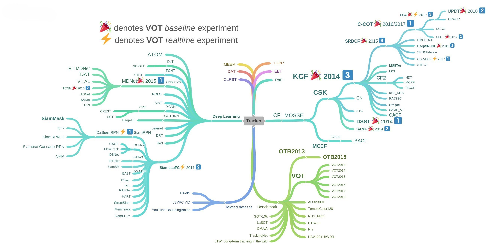
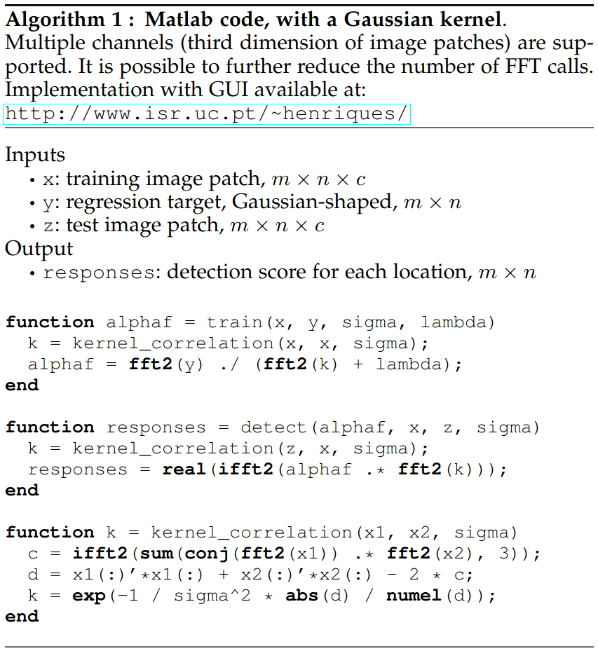
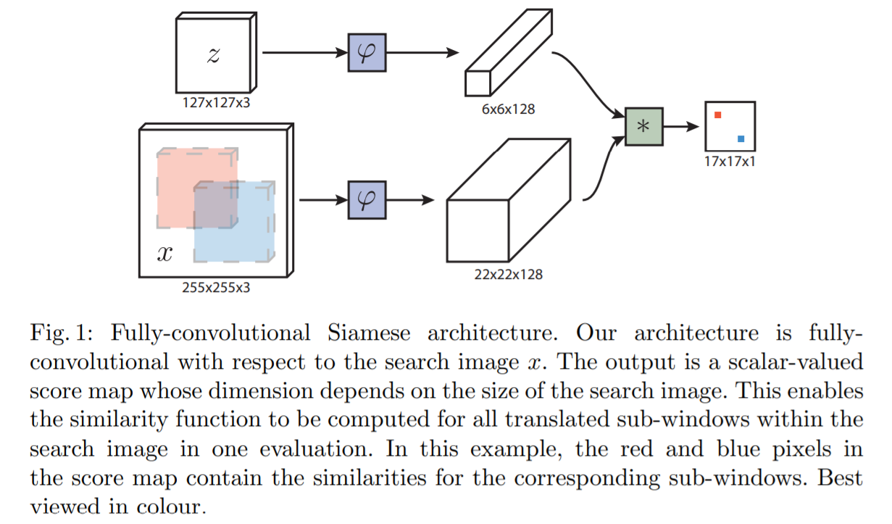
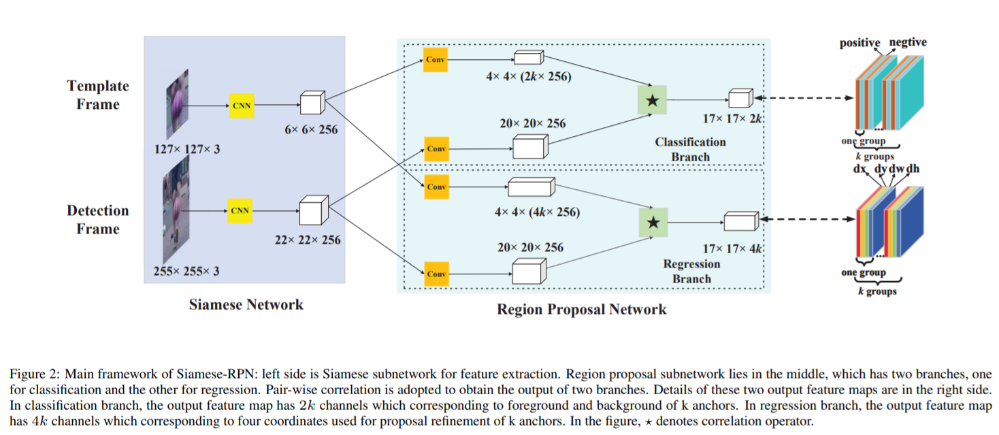
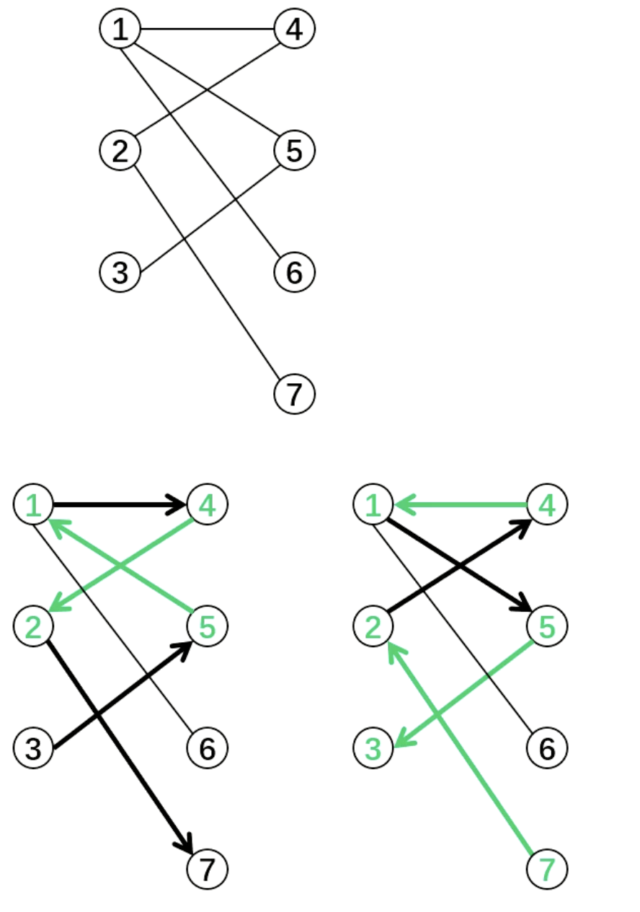

# 目标跟踪

## 概述

目标跟踪任务分类： 

1. 单目标跟踪：给定一个目标，跟踪这个目标的位置。 

2. 多目标跟踪：跟踪多个目标的位置。 

3. Person Re-ID：行人重识别，是利用计算机视觉技术判断图像或者视频序列中是否存在特定行人的技术。广泛被认为是一个图像检索的子问题。给定一个监控行人图像，检索跨设备下的该行人图像。旨在弥补固定的摄像头的视觉局限，并可与行人检测/行人跟踪技术相结合。 

4. MTMCT：多目标多摄像头跟踪（Multi-Target Multi-Camera Tracking），跟踪多个摄像头拍摄的多个人。 

5. 姿态跟踪：追踪人的姿态。 

目标跟踪任务按照计算类型又可以分为以下两类： 

1. 在线跟踪：在线跟踪需要实时处理任务，通过过去和现在帧来推断未来帧中物体的位置。 

2. 离线跟踪：离线跟踪是离线处理任务，可以通过过去、现在和未来帧来推断物体的位置，因此准确率会比在线跟踪高。 

目标跟踪困难点： 

1. 姿态变化：姿态变化是目标跟踪中常见的干扰问题。运动目标发生姿态变化时，会导致它的特征以及外观模型发生改变，容易导致跟踪失败。例如：体育比赛中的运动员、马路上的行人。 

2. 尺度变化：尺度的自适应也是目标跟踪中的关键问题。当目标尺度缩小时，由于跟踪框不能自适应跟踪，会将很多背景信息包含在内，导致目标模型的更新错误；当目标尺度增大时，由于跟踪框不能将目标完全包括在内，跟踪框内目标信息不全，也会导致目标模型的更新错误。因此，实现尺度自适应跟踪是十分必要的。 

3. 遮挡与消失：目标在运动过程中可能出现被遮挡或者短暂的消失情况。当这种情况发生时，跟踪框容易将遮挡物以及背景信息包含在跟踪框内，会导致后续帧中的跟踪目标漂移到遮挡物上面。若目标被完全遮挡时，由于找不到目标的对应模型，会导致跟踪失败。 

4. 图像模糊：光照强度变化，目标快速运动，低分辨率等情况会导致图像模型，尤其是在运动目标与背景相似的情况下更为明显。因此，选择有效的特征对目标和背景进行区分非常必要。 

目标跟踪算法按模式分类： 

1. 生成式模型：建立目标模型或者提取目标特征，在后续帧中进行相似特征搜索，逐步迭代实现目标定位（光流算法、滤波算法、MeanShift算法等）。 

2. 鉴别式模型：将目标模型和背景信息同时考虑在内，通过对比目标模型和背景信息的差异，将目标模型提取出来，从而得到当前帧中的目标位置（ML、DL等）。 

目标跟踪算法的发展历程： 

经典跟踪算法 -> 核相关的滤波算法 -> 深度学习算法 

经典跟踪算法： 

1. 光流法（Optical Flow） 
   
   对视频序列中目标外观的像素进行操作，利用视频序列在相邻帧之间的像素关系，寻找像素的位移变化来判断目标的运动状态，实现对运动目标的跟踪。所谓光流就是瞬时速率，在时间间隔很小（比如视频的连续前后两帧之间）时，也等同于目标点的位移。 

2. MeanShift（均值漂移） 
   
   通过计算漂移向量，来更新目标的位置。 
   
   通俗地讲，任选一个点，然后以这个点为球心，h为半径做一个高维球，因为有d维，d可能大于2，所以是高维球。落在这个球内的所有点和球心都会产生一个向量（以球心为起点落在球内的点为终点的向量）。然后把这些向量都加起来，结果就是漂移（MeanShift）向量。再将漂移向量与原球心坐标相加得到新的球心坐标，再以h为半径做一个高维球，计算漂移向量，然后更新球心坐标。反复迭代，直至达到终止条件。

3. 粒子滤波（Partical Filter） 
   
   是一种基于蒙特卡洛方法的粒子分布统计，从后验概率中抽取的随机粒子来表达其分布。粒子滤波是指通过寻找一组在状态空间传播的随机样本对概率密度函数进行近似，以样本均值代替积分运算，从而获得状态最小方差分布的过程。这里的样本即指粒子，当样本数量N→∞时可以逼近任何形式的概率密度分布。 
   
   粒子滤波的优点：尽管算法中的概率分布只是真实分布的一种近似，但由于非参数化的特点，它摆脱了解决非线性滤波问题时随机量必须满足高斯分布的制约，能表达比高斯模型更广泛的分布，也对变量参数的非线性特性有更强的建模能力。因此，粒子滤波能够比较精确地表达基于观测量和控制量的后验概率分布，可以用于解决SLAM问题。粒子滤波在非线性、非高斯系统表现出来的优越性，决定了它的应用范围非常广泛。另外，粒子滤波的多模态处理能力，也是它应用广泛的原因之一。 
   
   粒子滤波的缺点：需要用大量的样本数量才能很好地近似系统的后验概率密度，有效减少样本数量的自适应采样策略是该算法的优化重点。另外，重采样阶段会造成样本有效性和多样性的损失，导致样本贫化现象，保持粒子的有效性和多样性，克服样本贫化，也是该算法的优化重点。

经典目标跟踪算法缺陷： 

1. 没有将背景信息考虑在内，导致在目标遮挡，光照变化以及运动模糊等干扰下容易出现跟踪失败。 

2. 跟踪算法执行速度慢，无法满足实时性的要求。

基于核相关的滤波算法 ：

将通信领域的相关滤波（衡量两个信号的相似程度）引入到了目标跟踪中。一些基于相关滤波的跟踪算法（MOSSE、CSK、KCF、BACF、SAMF等）也随之产生，速度可以达到数百帧每秒，可以广泛地应用于实时跟踪系统中。其中，不乏一些跟踪性能优良的跟踪器，如SAMF、BACF在OTB数据集和VOT2015竞赛中取得优异成绩。

深度学习算法 ：

随着深度学习方法的广泛应用，人们开始考虑将其应用到目标跟踪中。人们开始使用深度特征并取得了很好的效果。之后，人们开始考虑用深度学习建立全新的跟踪框架，进行目标跟踪。 

把深度学习模型提取到的目标特征，直接应用到经典或者核相关的滤波跟踪框架里面，从而得到更好的跟踪结果（DeepSORT、DeepSRDCF等）。在大量训练数据的前提下，深度学习模型输出的特征表达要优于经典滤波器与传统特征描述子，但同时也带来了更大的计算量。



## 评价指标

### 单目标跟踪

#### VOT（Visual Object Tracking）

评价方法：VOT认为，实验数据不等同于实际表现，为了更加精准地测出tracker的实际表现，应该通过一种算法判定，什么情况下，tracker的实际表现可以视作相同（tracker equivalence）。 

数据集：VOT认为，数据集仅规模大是完全不行的，一个可靠的数据集应能够测试出tracker在不同条件下的表现，如部分遮挡、光照变化等。因此，VOT提出，应该对每一个序列都标注出该序列的视觉属性（visual attributes），以对应不同的条件。除此之外，VOT认为序列中的每一帧都需要进行视觉属性的标注，即使是同一序列，不同帧的视觉属性也不同，这么做可以对tracker进行更精准的评价。 

评价系统：在VOT提出之前，比较流行的评价系统是让tracker在序列的第一帧进行初始化，之后让tracker一直跑到最后一帧。然而tracker可能会因为一某些因素在开始的几帧就跟丢，所以最终评价系统只利用了序列的很小一部分，造成浪费。而VOT提出，评价系统应该在tracker跟丢的时候检测到错误，并在错误发生的5帧之后对tracker重新初始化，这样可以充分利用数据集。之所以是5帧而不是立即初始化，是因为错误发生之后立即初始化很可能再次跟踪失败，又因为视频中的遮挡一般不会超过5帧，所以会有这样的设定。这是VOT的一个特色机制，即重启（重新初始化）。但重启之后的一部分帧是不能用于评价的，这些帧被称作burn-in period，大量实验结果表明，burn-in period大约为初始化以及之后的10帧。 

Accuracy（用于评价tracker跟踪目标的准确性）：

某序列第$t$帧的accuracy定义为（IoU）：

$\phi_t=\frac{A^G_t\cap A^T_t}{A^G_t\cup A^T_t}$

其中，$A^G_t$代表第$t$帧的ground truth，$A^T_t$代表第$t$帧tracker预测的bounding box。

更详细的，定义$\Phi_t(i,k)$为第$i$个tracker在第$k$次重复中（tracker会在一个序列上重复测试多次）第$t$帧上的accuracy，设重复次数为$N_{rep}$。所以，第i个tracker在第$t$帧上的accuracy定义为：

$\Phi_t(i)=\frac{1}{N_{rep}}\sum\limits^{N_{rep}}_{k=1}\Phi_t(i,k)$

第i个tracker在某序列中的average accuracy定义为：

$\rho_A(i)=\frac{1}{N_{valid}}\sum\limits^{N_{valid}}_{t=1}\Phi_t(i)$

其中，$N_{valid}$代表有效帧的数量，除了burn-in period之外的帧均为有效帧。

Robustness（用于评价tracker跟踪目标的稳定性）：

定义$F(i,k)$为第i个tracker在第$k$次重复中发生错误（跟丢）的次数。所以，定义第$i$个tracker在某序列中的average robustness定义为：

$\rho_R(i)=\frac{1}{N_{rep}}\sum\limits^{N_{rep}}_{k=1}F(i,k)$

### 多目标跟踪

#### MOT（Multiple Object Tracking）

MOTA（Multiple Object Tracking Accuracy）：某个序列中多目标跟踪的准确率。

$MOTA=1-\frac{\sum_t(FN_t+FP_t+IDSW_t)}{\sum_tGT_t}$

其中，$FN_t$是在第$t$帧中没有匹配到tracker预测的bounding box的ground truth数量。$FP$是在第$t$帧中没有匹配到ground truth的bounding box数量。$IDSW_t$是第$t$帧中发生ID Switch的次数，即匹配错误的ground truth - bounding box对数。

MOTP（Multiple Object Tracking Precision）：某个序列中多目标跟踪的精确率。

$MOTP=\frac{\sum_{t,i}d_{t,i}}{\sum_tC_t}$

其中，$d_{t,i}$表示第$t$帧的第$i$个bounding box与匹配到的ground truth之间的距离（这里使用IoU计算）。$C_t$表示第$t$帧匹配正确的ground truth - bounding box对数。

MT（Mostly Tracked）：在某个序列中至少80%的时间内都与trakcer预测的bounding box匹配成功的ground truth数量，占所有ground truth的比例。注意，计算MT和ML时，只要有tracker预测的bounding box与ground truth匹配上，无论tracker的ID是否发生变化，即视为匹配成功。 

ML（Mostly Lost）：在某个序列中不超过20%的时间内没有匹配到tracker预测的bounding box的ground truth数量，占所有ground truth的比例。 

FP（False Positives）：误报的总数，没有匹配到ground truth的bounding box数量，一般在某一帧内统计。 

FN（False Negatives）：未命中的目标总数（ground truth），没有匹配到bounding box的ground truth数量，一般在某一帧内统计。 

ID_SW（ID Switch）：发生ID切换的次数，匹配错误的ground truth - bounding box对数，一般在某一帧内统计。

## KCF

Kernelized Correlation Filters：基于核相关的目标跟踪滤波算法。

KCF是一种机器学习鉴别式的跟踪方法，核心思想： 利用第$i$帧的图像$I_i$和目标位置$P_i$初始化滤波器（回归器），利用第$i+1$帧的图像$I_{i+1}$作为滤波器的输入，计算第$I_{i+1}$帧图像中响应（相关性）最大的位置$P_{i+1}$（在目标位置$P_i$附近采样，预测每个采样位置的响应值，取响应值最大的采样位置作为$P_{i+1}$）。 

### 循环位移与循环矩阵

KCF中，每个的采样样本$X$均由目标样本$x$循环位移得到（$x$是目标位置的roi区域），将这个过程表示为$X=C(x)$。

例如，左乘循环矩阵$P$后，$x$的所有列向量向右循环移动：

$P=\begin{bmatrix}0&0&0&\cdots&1\\1&0&0&\cdots&0\\0&1&0&\cdots&0\\\vdots&\vdots&\ddots&\ddots&\vdots\\0&0&\cdots&1&0\end{bmatrix}$

令$Q=P^T$，右乘$Q$后，$x$的所有列向量向下循环移动：

$P=\begin{bmatrix}0&1&\cdots&0&0\\0&0&\cdots&0&0\\\vdots&\vdots&\ddots&\vdots&\vdots\\0&0&\cdots&0&1\\1&0&\cdots&0&0\end{bmatrix}$

```python
x = np.array([[1, 11, 111], 
              [2, 22, 222], 
              [3, 33, 333]]) 
P = np.array([[0, 0, 1], 
              [1, 0, 0], 
              [0, 1, 0]]) 
Q = np.array([[0, 1, 0], 
              [0, 0, 1], 
              [1, 0, 0]]) 
Px = np.matmul(P, x) 
xQ = np.matmul(x, Q) 
print(np.transpose(Px, (1, 0))) 
```

循环位移后的采样样本：


### 岭回归

KCF采用岭回归（Ridge Regression）的方法，训练的目标是找到一个函数$f(z)=w^Tz$最小化样本$x_i$与其回归目标$y_i$的误差平方和。公式表示为：

$L=\min\limits_w\sum\limits_i(f(x_i)-y_i)^2+\lambda\Vert w\Vert^2$

其中，$\lambda$是正则化参数。

在频域中，当损失函数的值$L$为$0$时，求解$w$：

$w=(X^HX+\lambda I)^{-1}X^Hy$

根据循环矩阵能通过离散傅里叶变换（DFT，Discrete Fourier Transform）对角化，使得矩阵求逆转换为特征值求逆的性质，将$w$的求解转换到频域，应用DFT提高计算速度，从而求得响应最大的解。

循环矩阵$X$可以通过DFT对角化：

$X=F{\rm diag}(\hat x)F^H$

其中，$\hat x$是由$x$经过DFT得到，$\hat x=\mathcal F(x)$，$F$是DFT矩阵（常量矩阵，与$x$无关），$\mathcal F(z)=\sqrt{n}Fz$。

于是：

$\begin{aligned}X^HX&=F{\rm diag(\hat x^*)}F^HF{\rm diag(\hat x)}F^H\\&=F{\rm diag(\hat x^*)}{\rm diag(\hat x)}F^H\\&=F{\rm diag(\hat x^*\odot\hat x)}F^H\end{aligned}$

代入得：

$\begin{aligned}w&=(X^HX+\lambda I)^{-1}X^Hy\\&=(F{\rm diag}(\hat x^*\odot\hat x)F^H+F{\rm diag}(\lambda)F^H)^{-1}X^Hy\\&=(F{\rm diag}(\hat x^*\odot\hat x+\lambda)F^H)^{-1}X^Hy\\&=(F{\rm diag}(\frac{\hat x^*}{\hat x^*\odot\hat x+\lambda})F^H)y\end{aligned}$

其中，$^*$为共轭复数，$^H$为共轭转置，$\odot$为逐元素相乘。

由$X=C(\mathcal F^{-1}(\hat x))$，可得：

$w=C(\mathcal F^{-1}(\frac{\hat x^*}{\hat x^*\odot\hat x+\lambda}))y$

$w$经过DFT得（循环位移$C$是线性变换）：

$\hat w=\mathcal F(w)=\mathcal F(C(\mathcal F^{-1}(\frac{\hat x^*}{\hat x^*\odot\hat x+\lambda})))\hat y={\rm diag}(\frac{\hat x^*}{\hat x^*\odot\hat x+\lambda})\hat y$

### 核技巧

引入核技巧来将问题扩展到非线性空间，回归系数$w$用$x$和对偶空间下的$\alpha$的线性组合表示如下：

$w=\sum\limits_i\alpha_i\varphi(x_i)$

回归问题就转为：

$f(z)=w^Tz=\sum\limits^n_{i=1}\alpha_i\kappa(z,x_i),\quad \varphi^T(x)\varphi(x')=\kappa(x,x')$

其中$\kappa$为核函数，如高斯核函数等。

使用核技巧的岭回归问题的解为（$w$由$\alpha$替代）：

$\alpha=(K+\lambda I)^{-1}y$

其中，$K$为核相关矩阵。事实上，$K$随循环位移而循环变化。因此，可以应用循环矩阵的对角化性质：

$\hat\alpha=\frac{\hat y}{\hat k^{xx}+\lambda}$

其中，$k^{xx}$是$K$的第一行（$K=C(k^{xx})$）。

### 算法流程

核心函数包含init函数（利用第一帧的图像和目标框初始化跟踪器）和update函数（利用后续帧的图像进行预测）。

1. 初始化
   
   输入：第一帧图像中的目标区域。
   
   特征提取：提取目标特征（如HOG等），得到特征$x$。
   
   响应图生成：创建高斯分布的响应图$y$，峰值位于目标中心。
   
   训练滤波器：在频域计算初始化滤波器模型参数$\alpha$与核相关矩阵$k^{xx}$。

2. 检测阶段
   
   输入：新一帧图像，以前一帧目标位置为中心裁剪搜索区域，提取特征$z$。
   
   核相关计算：计算$z$与初始目标特征$x$的核相关$k^{xz}$。
   
   响应图预测：在频域计算响应图$\hat f(z)=\mathcal F^{-1}(\hat k^{xz}\odot\hat\alpha)$。
   
   目标定位：响应图的峰值位置即为当前帧的目标位置。

3. 模型更新
   
   更新策略：采用线性插值更新模型参数，平衡历史信息与新观测。
   
   $\alpha_{new}=(1-\eta)\alpha_{prev}+\eta\alpha_{current}$
   
   $x_{new}=(1-\eta)x_{prev}+\eta x_{current}$
   
   其中，$\eta$是学习率，通常取$[0.01,0.1]$。



## SiamFC

SiamFC训练一个模型$f(z,x)$，来比较模板图像$z$和搜索图像$x$的相关性，如果两个图像的相关性越高，则得分越高。

SiamFC有两个核心函数，init函数和update函数，init函数输入exemplar image提取滤波器（模板图像的特征图），update函数输入search image提取搜索图像的特征图并与滤波器做互相关操作（将卷积核上下翻转、左右翻转，即旋转$180$度后，再做卷积），得到score map（score map中得分高的地方为目标物体的中心点位置）。 

SiamFC只能预测模板图像在搜索图像中的位置（利用score map找到中心点坐标），宽高则沿用模板图像的宽高（即$255\times255$的搜索图像中，模板图像的尺寸为$127\times127$）。

全卷积Siamese网络结构：



上图中，$z$是exemplar image（模板图像），$x$是search image（搜索图像），$\varphi$是transformation（deep conv-net $f$）。 

Siamese网络在由一个模板图像与大量搜索图像构成的数据集上训练得到，其损失函数为：

$\ell(x)=\log(1+\exp(-yv))$

其中，$v$是模型输出的score map中每个响应点的得分，$y$是对应的真值（$y\in\{-1,1\}$）。

对整个score map：

$L(y,v)=\frac{1}{\vert\mathcal D\vert}\sum\limits_{u\in\mathcal D}\ell(y[u],v[u])$

其中，$v:\mathcal D\to\mathbb R$。

## SiamRPN

SiamRPN基于SiamFC，引入了Faster R-CNN中的RPN模块，让跟踪器可以回归宽高。

网络结构：



RPN模块分为Classification分支和Regression分支，每个分支分别做互相关操作，得到对应的output：

$A^{cls}_{w\times h\times2k}=[\varphi(x)]_{cls}\star[\varphi(z)]_{cls}$

$A^{reg}_{w\times h\times4k}=[\varphi(x)]_{reg}\star[\varphi(z)]_{reg}$

Classification分支：

output（$17\times17\times2k$）：$k$代表$k$个目标，每个目标有$2$个通道（positive、negative）。 

Regression分支： 

output（$17\times17\times4k$）：$k$代表$k$个目标，每个目标有$4$个通道（${\rm d}x$、${\rm d}y$、${\rm d}w$、${\rm d}h$）。

损失函数：

$loss=L_{cls}+\lambda L_{reg}$

其中，$\lambda$是用来平衡$L_{cls}$和$L_{reg}$的超参数。$L_{cls}$是cross entropy loss，$L_{reg}$是：

$L_{cls}=\sum\limits^3_{i=0}smooth_{L_1}(\delta[i],\sigma)$

$smooth_{L_1}(x,\sigma)=\begin{cases}0.5\sigma^2x^2,\quad\vert x\vert\lt\frac{1}{\sigma^2}\\\vert x\vert-\frac{1}{2\sigma^2},\quad\vert x\vert\ge\frac{1}{\sigma^2}\end{cases}$

$\delta[0]=\frac{T_x-Ax}{A_w},\quad\delta[1]=\frac{T_y-A_y}{A_h}\\\delta[2]=\ln\frac{T_w}{A_w},\quad\delta[1]=\ln\frac{T_h}{A_h}$

其中，$A_x$、$A_y$、$A_w$、$A_h$是anchor box的中心点坐标和宽高，$T_x$、$T_y$、$T_w$、$T_h$是ground truth box的中心点坐标和宽高。

anchor与ground truth匹配：

与ground truth的IoU大于0.6的anchor与之匹配并标记为positive，与ground truth的IoU小于0.3的anchor不予匹配并标记为negative。同时，限制一个训练样本对（一个exemplar和多个search）中最多只有64个search样本（positive + negative），其中包含最多16个positive search样本。

## SORT

基于目标检测的多目标跟踪方法，将目标检测的结果，与卡尔曼滤波器的预测结果应用线性分配算法，对匹配成功的卡尔曼滤波器用目标检测结果进行更新校正。

### 卡尔曼滤波

目标运动方程：

$x_k=F_kx_{k-1}+B_ku_k+w_k$

其中，$x_k$是$k$时刻的状态向量（位置、速度等）；$F_k$是$k$时刻的状态转移矩阵；$u_k$表示$k$时刻的控制输入量（加速度等）；$w_k$是$k$时刻的过程噪声，假定其均值为$0$，协方差矩阵为$Q_k$，且服从高斯分布，$w_k\sim N(0,Q_k)$。

目标观测方程：

$z_k=H_kx_k+v_k$

其中，$H_k$是$k$时刻的观测矩阵，它把真实状态空间映射成观测空间；$v_k$是观测噪声，其均值为$0$，协方差矩阵为$R_k$，且服从高斯分布$v_k\sim N(0,R_k)$。

预测阶段：

$x_k=F_kx_{k-1}+B_ku_k$，预测状态向量

$P_k=F_kP_{k-1}F^T_k+Q_k$，预测状态向量的协方差矩阵

更新阶段：

$y_k=z_k-H_kx_k$，更新观测残差

$S_k=H_kP_kH^T_k+R_k$，更新观测残差协方差矩阵

$K_k=P_kH^T_kS^{-1}_k$，更新卡尔曼增益

$x_k=x_k+K_ky_k$，更新状态向量

$P_k=(I-K_kH_k)P_k$，更新状态向量的协方差矩阵

卡尔曼滤波是最优线性高斯系统的无偏估计，但必须给出初始状态$\{x_0,P_0\}$。

只要观测噪声协方差矩阵是正定的，卡尔曼滤波就是稳定的。

卡尔曼滤波达到稳态时，状态向量的协方差和卡尔曼增益都会收敛到一个稳定值。

### 匈牙利匹配

完美匹配：定义$X=\{x_1,x_2,…,x_n\}$与$Y=\{y_1,y_2,…,y_n\}$，一个完美匹配就是定义从$X$到$Y$的一个双射（一一映射）。 

最大匹配：实现尽可能多的匹配。 

完美匹配一定是最大匹配，但是最大匹配不一定是完美匹配。

二分图：设$G=(V,E)$是一个无向图，如果顶点$V$可分割为两个互不相交的子集$(A,B)$，并且图中的每条边$(i,j)$所关联的两个顶点$i$和$j$分别属于这两个不同的顶点集$A$和$B$，则称图$G$为一个二分图。

二分图的最大匹配：设$G$为二分图，若在$G$的子图$M$中，任意两条边都没有公共节点，则称$M$为二分图$G$的一组匹配。在二分图$G$中，包含边数最多的一组匹配被称为二分图$G$的最大匹配。 

交替路：从一个未匹配点出发，依次经过非匹配边、匹配边、非匹配边、...、形成的路径被称为交替路。 

增广路：从一个为未配点出发，走交替路，若能达到另一个未匹配点，则称这条交替路为增广路。如$3\to5\to1\to4\to2\to7$。 观察增广路，我们会发现：非匹配边比匹配边多一条。只要把增广路中的匹配边和非匹配边的身份交换，匹配的边数便可以比原来多一条。这里的增广路就是指能增加匹配边的一条路。 

匈牙利算法：通过遍历每个匹配方节点寻找增广路来增加匹配边，当找不到增广路时，达到最大匹配（可以用DFS、BFS实现）。



### 线性分配（Linear Assignment）

给定代价矩阵（$M\times N$），求解最小代价的最大匹配。 

算法流程： 

1. 对于矩阵的每一行，减去其中最小的元素。 

2. 对于矩阵的每一列，减去其中最小的元素。 

3. 用最少的水平线或垂直线覆盖矩阵中所有的0。 

4. 如果线的数量等于M与N的最小值，则找到了最优分配，算法结束，否则进入步骤5。 

5. 找到没有被任何线覆盖的最小元素，每个没被线覆盖的行减去这个元素，每个被线覆盖的列加上这个元素，返回步骤3。 

举个例子，假设现在有3个任务，要分别分配给3个人，每个人完成各个任务所需代价矩阵（cost matrix）如下所示（这个代价可以是金钱、时间等），怎样才能找到一个最优分配，使得完成所有任务花费的代价最小？

|          | Task_1 | Task_2 | Task_3 |
| -------- | ------ | ------ | ------ |
| Person_1 | 15     | 40     | 45     |
| Person_2 | 20     | 60     | 35     |
| Person_3 | 20     | 40     | 25     |

1. 每一行最小的元素分别为15、20、20，减去得到：
   
   |          | Task_1 | Task_2 | Task_3 |
   | -------- | ------ | ------ | ------ |
   | Person_1 | 0      | 25     | 30     |
   | Person_2 | 0      | 40     | 15     |
   | Person_3 | 0      | 20     | 5      |

2. 每一列最小的元素分别为0、20、5，减去得到：
   
   |          | Task_1 | Task_2 | Task_3 |
   | -------- | ------ | ------ | ------ |
   | Person_1 | 0      | 5      | 25     |
   | Person_2 | 0      | 20     | 10     |
   | Person_3 | 0      | 0      | 0      |

3. 用最少的水平线或垂直线覆盖所有的0，得到线的数量为2，小于3，进入下一步；

4. 现在没被覆盖的最小元素是5，没被覆盖的行（第一和第二行）减去5，得到：
   
   |          | Task_1 | Task_2 | Task_3 |
   | -------- | ------ | ------ | ------ |
   | Person_1 | -5     | 0      | 20     |
   | Person_2 | -5     | 15     | 5      |
   | Person_3 | 0      | 0      | 0      |
   
   被覆盖的列（第一列）加上5，得到：
   
   |          | Task_1 | Task_2 | Task_3 |
   | -------- | ------ | ------ | ------ |
   | Person_1 | 0      | 0      | 20     |
   | Person_2 | 0      | 15     | 5      |
   | Person_3 | 5      | 0      | 0      |

5. 跳转到步骤3，用最少的水平线或垂直线覆盖所有的0，得到线的数量为3，满足条件，算法结束。显然，将任务2分配给第1个人、任务1分配给第2个人、任务3分配给第3个人时，总的代价最小（0+0+0=0）：
   
   |          | Task_1 | Task_2 | Task_3 |
   | -------- | ------ | ------ | ------ |
   | Person_1 | 0      | 0      | 20     |
   | Person_2 | 0      | 15     | 5      |
   | Person_3 | 5      | 0      | 0      |
   
   所以原矩阵的最小总代价为（40+20+25=85）：
   
   |          | Task_1 | Task_2 | Task_3 |
   | -------- | ------ | ------ | ------ |
   | Person_1 | 15     | 40     | 45     |
   | Person_2 | 20     | 60     | 35     |
   | Person_3 | 20     | 40     | 25     |

### SORT（Detection-Based Tracking）

SORT: Simple Online and Realtime Tracking 

维护两个序列：跟踪序列(Trks)、检测序列（Dets）。 

核心思想：在匹配成功的条件下，用检测框更新跟踪框，只有连续多次匹配成功的跟踪框才被确认（输出给下游）。 

比DeepSORT算法精度低，但帧率高。
