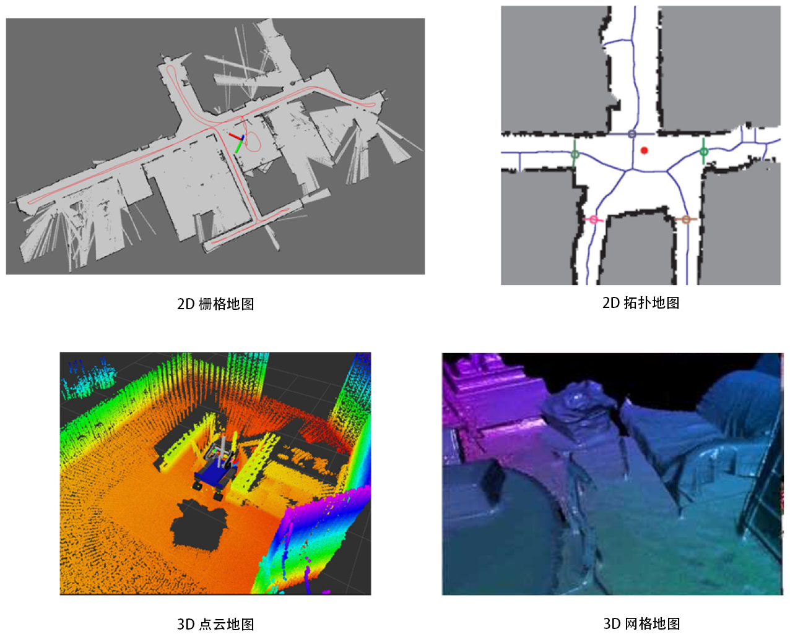
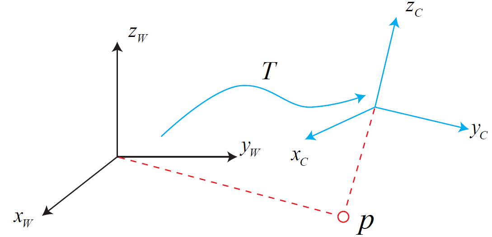
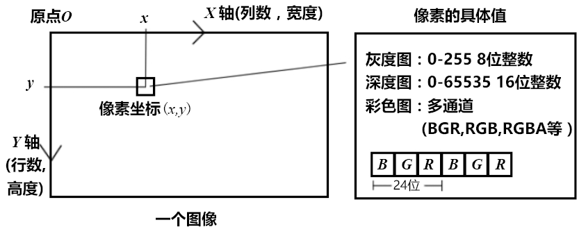
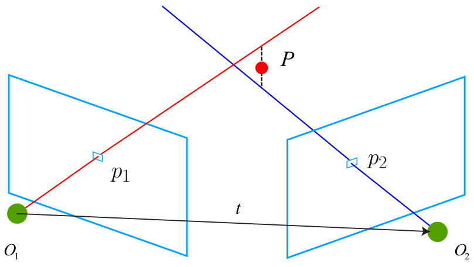
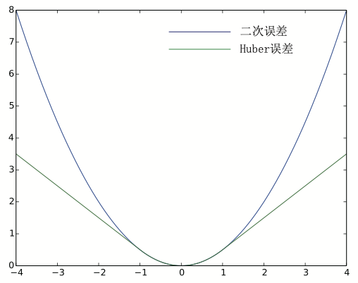

# slambook

## 初识SLAM

### 经典视觉SLAM框架

经典的视觉SLAM框架由以下几个模块构成：


视觉SLAM流程分为以下几步：

1. 传感器信息读取。在视觉SLAM中主要为相机图像信息的读取和预处理。如果在机器人中，还可能有码盘、惯性传感器等信息的读取和同步。
2. 视觉里程计（Visual Odometry，VO）。视觉里程计任务是估算相邻图像间相机的运动，以及局部地图的样子。VO又称为前端（Front End）。
3. 后端优化（Optimization）。后端接受不同时刻视觉里程计测量的相机位姿，以及回环检测的信息，对它们进行优化，得到全局一致的轨迹和地图。由于接在VO之后，又称为后端（Back End）。
4. 回环检测（Loop Closing）。回环检测判断机器人是否曾经到达过先前的位置。如果检测到回环，它会把信息提供给后端进行处理。
5. 建图（Mapping）。它根据估计的轨迹，建立与任务要求对应的地图。

经典的视觉SLAM框架是过去十几年内，研究者们总结的成果。这个框架本身，以及它所包含的算法已经基本定型，并且在许多视觉程序库和机器人程序库中已经提供。依靠这些算法，我们能够构建一个视觉SLAM系统，使之在正常的工作环境里实时进行定位与建图。因此，如果把工作环境限定在静态、刚体，光照变化不明显、没有人为干扰的场景，那么，这个SLAM系统是相当成熟的了。

#### 视觉里程计

视觉里程计关心相邻图像之间的相机运动，最简单的情况当然是两张图像之间的运动关系。例如，当我们看到下图时，会自然地反应出右图应该是左图向左旋转一定角度的结果（在视频情况下感觉会更加自然）。我们不妨思考一下：我自己是怎么知道"向左旋转"这件事情的呢？人类早已习惯于用眼睛探索世界，估计自己的位置，但又往往难以用理性的语言描述我们的直觉。看到下图时，我们会自然地看到，这个场景中离我们近的是吧台，远处是墙壁和黑板。当相机往左转动时，吧台离我们近的部分出现在视野中，而右侧远处的柜子则移出了视野。通过这些信息，我们判断相机应该是往左旋转了。

但是，能否确定旋转了多少度，平移了多少厘米？我们就很难给出一个确切的答案了。因为我们的直觉对这些具体的数字并不敏感。但是，在计算机中，又必须精确地测量这段运动信息。所以我们要问：计算机是如何通过图像确定相机的运动呢？


在计算机视觉领域，人类在直觉上看来十分自然的事情，在计算机视觉中却非常的困难。图像在计算机里只是一个数值矩阵。这个矩阵里表达着什么东西，计算机毫无概念（这也正是现在机器学习要解决的问题）。而视觉SLAM中，我们只能看到一个个像素，知道它们是某些空间点在相机的成像平面上投影的结果。所以，为了定量地估计相机运动，必须在了解相机与空间点的几何关系之后进行。

VO能够通过相邻帧间的图像估计相机运动，并恢复场景的空间结构。叫它为"里程计"是因为它和实际的里程计一样，只计算相邻时刻的运动，而和再往前的过去的信息没有关联。在这一点上，VO就像一种只有很短时间记忆的物种一样。

现在，假定我们已有了一个视觉里程计，估计了两张图像间的相机运动。那么，只要把相邻时刻的运动串起来，就构成了机器人的运动轨迹，从而解决了定位问题。另一方面，我们根据每个时刻的相机位置，计算出各像素对应的空间点的位置，就得到了地图。

我们说，视觉里程计确实是SLAM 的关键问题，我们也会花大量的篇幅来介绍它。然
而，仅通过视觉里程计来估计轨迹，将不可避免地出现累计漂移（Accumulating Drift）。这
是由于视觉里程计（在最简单的情况下）只估计两个图像间运动造成的。每次估计都带有一定的误差，而由于里程计的工作方式，先前时刻的误差将会传递到下一时刻，导致经过一段时间之后，估计的轨迹将不再准确。比方说，机器人先向左转90度，再向右转了90度。由于误差，我们把第一个90度估计成了89度。那我们就会尴尬地发现，向右转之后机器人的估计位置并没有回到原点。更糟糕的是，即使之后的估计再准确，与真实值相比，都会带上这-1度的误差。


这也就是所谓的漂移（Drift）。它将导致我们无法建立一致的地图。你会发现原本直的走廊变成了斜的，而原本90度的直角变成了歪的。为了解决漂移问题，我们还需要两种技术：后端优化和回环检测。回环检测负责把"机器人回到原始位置"的事情检测出来，而后端优化则根据该信息，校正整个轨迹的形状。

#### 后端优化

笼统地说，后端优化主要指处理SLAM过程中噪声的问题。虽然我们很希望所有的数据都是准确的，然而现实中，再精确的传感器也带有一定的噪声。便宜的传感器测量误差较大，昂贵的则较小，有的传感器还会受磁场、温度的影响。所以，除了解决“如何从图像估计出相机运动”之外，我们还要关心这个估计带有多大的噪声，这些噪声是如何从上一时刻传递到下一时刻的、而我们又对当前的估计有多大的自信。后端优化要考虑的问题，就是如何从这些带有噪声的数据中，估计整个系统的状态，以及这个状态估计的不确定性有多大，这称为最大后验概率估计（Maximum-a-Posteriori，MAP）。这里的状态既包括机器人自身的轨迹，也包含地图。

相对的，视觉里程计部分，有时被称为"前端"。在SLAM框架中，前端给后端提供待优化的数据，以及这些数据的初始值。而后端负责整体的优化过程，它往往面对的只有数据，不必关心这些数据到底来自什么传感器。在视觉SLAM中，前端和计算机视觉研究领域更为相关，比如图像的特征提取与匹配等，后端则主要是滤波与非线性优化算法。

从历史意义上来说，现在我们称之为后端优化的部分，很长一段时间直接被称为"SLAM研究"。早期的SLAM问题是一个状态估计问题，正是后端优化要解决的东西。在最早提出SLAM的一系列论文中，当时的人们称它为"空间状态不确定性的估计"（Spatial Uncertainty）。虽然有一些晦涩，但也确实反映出了SLAM问题的本质：对运动主体自身和周围环境空间不确定性的估计。为了解决SLAM，我们需要状态估计理论，把定位和建图的不确定性表达出来，然后采用滤波器或非线性优化，去估计状态的均值和不确定性（方差）。

#### 回环检测

回环检测，又称闭环检测（Loop Closure Detection），主要解决位置估计随时间漂移的问题。怎么解决呢？假设实际情况下，机器人经过一段时间运动后回到了原点，但是由于漂移，它的位置估计值却没有回到原点。怎么办呢？我们想，如果有某种手段，让机器人知道"回到了原点"这件事，或者把"原点"识别出来，我们再把位置估计值"拉"过去，就可以消除漂移了。这就是所谓的回环检测。

回环检测与"定位"和"建图"二者都有密切的关系。事实上，我们认为，地图存在的主要意义，是为了让机器人知晓自己到达过的地方。为了实现回环检测，我们需要让机器人具有识别曾到达过的场景的能力。它的实现手段有很多。例如，我们可以在机器人下方设置一个标志物（如一张二维码图片）。只要它看到了这个标志，就知道自己回到了原点。但是，该标志物实质上是一种环境中的传感器，对应用环境提出了限制（万一不能贴二维码怎么办呢？）。我们更希望机器人能使用携带的传感器，也就是图像本身，来完成这一任务。例如，我们可以判断图像间的相似性，来完成回环检测。这一点和人是相似的。当我们看到两张相似图片时，容易辨认它们来自同一个地方。如果回环检测成功，可以显著地减小累积误差。所以视觉回环检测，实质上是一种计算图像数据相似性的算法。由于图像的信息非常丰富，使得正确检测回环的难度也降低了不少。

在检测到回环之后，我们会把"A与B是同一个点"这样的信息告诉后端优化算法。然后，后端根据这些新的信息，把轨迹和地图调整到符合回环检测结果的样子。这样，如果我们有充分而且正确的回环检测，就可以消除累积误差，得到全局一致的轨迹和地图。

#### 建图

建图（Mapping）是指构建地图的过程。地图是对环境的描述，但这个描述并不是固定的，需要视SLAM的应用而定。



对于家用扫地机器人来说，这种主要在低矮平面里运动的机器人，只需要一个二维的地图，标记哪里可以通过，哪里存在障碍物，就够它在一定范围内导航了。而对于一个相机，它有六自由度的运动，我们至少需要一个三维的地图。有些时候，我们想要一个漂亮的重建结果，不仅是一组空间点，还需要带纹理的三角面片。另一些时候，我们又不关心地图的样子，只需要知道"A点到B点可通过，而B到C不行"这样的事情。甚至，有时我们不需要地图，或者地图可以由其他人提供，例如行驶的车辆往往可以得到已经绘制好的当地地图。

对于地图，我们有太多的想法和需求。因此，相比于前面提到的视觉里程计、回环检测和后端优化，建图并没有一个固定的形式和算法。一组空间点的集合也可以称为地图，一个漂亮的3D模型亦是地图，一个标记着城市、村庄、铁路、河道的图片亦是地图。地图的形式随SLAM的应用场合而定。大体上讲，它们可以分为度量地图与拓扑地图两种。

##### 度量地图（Metric Map）

度量地图强调精确地表示地图中物体的位置关系，通常我们用稀疏（Sparse）与稠密（Dense）对它们进行分类。稀疏地图进行了一定程度的抽象，并不需要表达所有的物体。例如，我们选择一部分具有代表意义的东西，称之为路标（Landmark），那么一张稀疏地图就是由路标组成的地图，而不是路标的部分就可以忽略掉。相对的，稠密地图着重于建模所有看到的东西。对于定位来说，稀疏路标地图就足够了。而用于导航时，我们往往需要稠密的地图（否则撞上两个路标之间的墙怎么办？）。稠密地图通常按照某种分辨率，由许多个小块组成。二维度量地图是许多个小格子（Grid），三维则是许多小方块（Voxel）。一般地，一个小块含有占据、空闲、未知三种状态，以表达该格内是否有物体。当我们查询某个空间位置时，地图能够给出该位置是否可以通过的信息。这样的地图可以用于各种导航算法，如A*、D*等等，为机器人研究者们所重视。但是我们也看到，这种地图需要存储每一个格点的状态，耗费大量的存储空间，而且多数情况下地图的许多细节部分是无用的。另一方面，大规模度量地图有时会出现一致性问题。很小的一点转向误差，可能会导致两间屋子的墙出现重叠，使得地图失效。

##### 拓扑地图（Topological Map）

相比于度量地图的精确性，拓扑地图则更强调地图元素之间的关系。拓扑地图是一个图（Graph），由节点和边组成，只考虑节点间的连通性，例如A、B点是连通的，而不考虑如何从A点到达B点的过程。它放松了地图对精确位置的需要，去掉地图的细节问题，是一种更为紧凑的表达方式。然而，拓扑地图不擅长表达具有复杂结构的地图。如何对地图进行分割形成结点与边，又如何使用拓扑地图进行导航与路径规划，仍是有待研究的问题。

### SLAM问题的数学表述

假设小萝卜正携带着某种传感器在未知环境里运动，怎么用数学语言描述这件事呢？首先，由于相机通常是在某些时刻采集数据的，所以我们也只关心这些时刻的位置和地图。这就把一段连续时间的运动变成了离散时刻$t=1,...,K$当中发生的事情。在这些时刻，用$x$表示小萝卜自身的位置。于是各时刻的位置就记为$x_1,...,x_K$，它们构成了小萝卜的轨迹。地图方面，我们设地图是由许多个路标（Landmark）组成的，而每个时刻，传感器会测量到一部分路标点，得到它们的观测数据。不妨设路标点一共有$N$个，用$y_1,...,y_N$表示它们。

在这样设定中，"小萝卜携带着传感器在环境中运动"，由如下两件事情描述：

1. 什么是运动？我们要考虑从$k=1$时刻到k时刻，小萝卜的位置$x$是如何变化的。
2. 什么是观测？假设小萝卜在$k$时刻，于$x_k$处探测到了某一个路标$y_j$，我们要考虑这件事情是如何用数学语言来描述的。

先来看运动。通常，机器人会携带一个测量自身运动的传感器，比如说码盘或惯性传感器。这个传感器可以测量有关运动的读数，但不一定直接是位置之差，还可能是加速度、角速度等信息。然而，无论是什么传感器，我们都能使用一个通用的、抽象的数学模型：

$x_k=f(x_{k-1},u_k,w_k)$

这里$u_k$是运动传感器的读数（有时也叫输入），$w_k$为噪声。注意到，我们用一个一般函数$f$来描述这个过程，而不具体指明$f$的作用方式。这使得整个函数可以指代任意的运动传感器，成为一个通用的方程，而不必限定于某个特殊的传感器上。我们把它称为运动方程。

与运动方程相对应，还有一个观测方程。观测方程描述的是，当小萝卜在$x_k$位置上看到某个路标点$y_j$，产生了一个观测数据$z_{k,j}$。同样，我们用一个抽象的函数$h$来描述这个关系：

$z_{k,j}=h(y_j,x_k,v_{k,j})$

这里$v_{k,j}$是这次观测里的噪声。由于观测所用的传感器形式更多，这里的观测数据$z$以及观测方程$h$也许多不同的形式。

根据小萝卜的真实运动和传感器的种类，存在着若干种参数化方式（Parameterization）。什么叫参数化呢？举例来说，假设小萝卜在平面中运动，那么，它的位姿由两个位置和一个转角来描述，即$x_k=\begin{bmatrix}x&y&\theta\end{bmatrix}^T_k$。同时，运动传感器能够测量到小萝卜在每两个时间间隔位置和转角的变化量$u_k=\begin{bmatrix}\Delta x&\Delta y&\Delta\theta\end{bmatrix}^T_k$，那么，此时运动方程就可以具体化为：

$\begin{bmatrix}x\\y\\\theta\end{bmatrix}_k=\begin{bmatrix}x\\y\\\theta\end{bmatrix}_{k-1}+\begin{bmatrix}\Delta x\\\Delta y\\\Delta\theta\end{bmatrix}_k+w_k$

这是简单的线性关系。不过，并不是所有的传感器都直接能测量出位移和角度变化，所以也存在着其它形式更加复杂的运动方程，那时我们可能需要进行动力学分析。关于观测方程，比方说小萝卜携带着一个二维激光传感器。我们知道激光传感器观测一个2D路标点时，能够测到两个量：路标点与小萝卜本体之间的距离$r$和夹角$\phi$。我们记路标点为$y=\begin{bmatrix}p_x&p_y\end{bmatrix}^T$（为保持简洁，省略了下标），观测数据为$z=\begin{bmatrix}r&\phi\end{bmatrix}^T$ ，那么观测方程就具体化为：

$\begin{bmatrix}r\\\phi\end{bmatrix}=\begin{bmatrix}\sqrt{(p_x-x)^2+(p_y-y)^2}\\\arctan(\frac{p_y-y}{p_x-x})\end{bmatrix}+v$

考虑视觉SLAM时，传感器是相机，那么观测方程就是"对路标点拍摄后，得到了图像中的像素"的过程。这个过程牵涉到相机模型的描述。

可见，针对不同的传感器，这两个方程有不同的参数化形式。如果我们保持通用性，把它们取成通用的抽象形式，那么SLAM过程可总结为两个基本方程：

$\begin{cases}x_k=f(x_{k-1},u_k,w_k)\\z_{k,j}=h(y_j,x_k,v_{k,j})\end{cases}$

这两个方程描述了最基本的SLAM问题：当我们知道运动测量的读数$u$，以及传感器的读数$z$时，如何求解定位问题（估计$x$）和建图问题（估计$y$）。这时，我们把SLAM问题建模成了一个状态估计问题：如何通过带有噪声的测量数据，估计内部的、隐藏着的状态变量。

状态估计问题的求解，与两个方程的具体形式，以及噪声服从哪种分布有关。我们按照运动和观测方程是否为线性，噪声是否服从高斯分布进行分类，分为线性/非线性和高斯/非高斯系统。其中线性高斯系统（Linear Gaussian，LG系统）是最简单的，它的无偏的最优估计可以由卡尔曼滤波器（Kalman Filter，KF）给出。而在复杂的非线性非高斯系统（Non-Linear Non-Gaussian，NLNG系统）中，我们会使用以扩展卡尔曼滤波器（Extended Kalman Filter，EKF）和非线性优化两大类方法去求解它。直至21世纪早期，以EKF为主的滤波器方法占据了SLAM中的主导地位。我们会在工作点处把系统线性化，并以预测——更新两大步骤进行求解。最早的实时视觉SLAM系统即是基于EKF开发的。随后，为了克服EKF的缺点（例如线性化误差和噪声高斯分布假设），人们开始使用粒子滤波器（Particle Filter）等其它滤波器，乃至使用非线性优化的方法。时至今日，主流视觉SLAM使用以图优化（Graph Optimization）为代表的优化技术进行状态估计。我们认为优化技术已经明显优于滤波器技术，只要计算资源允许，我们通常都偏向于使用优化方法。

## 三维空间的刚体运动

视觉SLAM的基本问题之一：一个刚体在三维空间中的运动是如何描述的。它是由一次旋转加一次平移组成。平移确实没有太大问题，但旋转的处理是件麻烦事。以下将介绍旋转矩阵、四元数、欧拉角的意义，以及它们是如何运算和转换的。

#### 旋转矩阵

##### 点和向量，坐标系

我们日常生活的空间是三维的，因此我们生来就习惯于三维空间的运动。三维空间由三个轴组成，所以一个空间点的位置可以由三个坐标指定。不过，我们现在要考虑刚体，它不光有位置，还有自身的姿态。相机也可以看成三维空间的刚体，于是位置是指相机在空间中的哪个地方，而姿态则是指相机的朝向。结合起来，我们可以说，"相机正处于空间$(0,0,0)$点处，朝向正前方"这样的话。但是这种自然语言很繁琐，我们更喜欢用数学语言来描述它。

我们从最基本的开始讲起：点和向量。点的几何意义很容易理解。向量是什么呢？它是线性空间中的一个元素，可以把它想象成从原点指向某处的一个箭头。需要提醒的是，请不要把向量与它的坐标两个概念混淆。一个向量是空间当中的一样东西，比如说$a$。这里$a$并不是和若干个实数相关联的。只有当我们指定这个三维空间中的某个坐标系时，才可以谈论该向量在此坐标系下的坐标，也就是找到若干个实数对应这个向量。例如，三维空间中的某个向量的坐标可以用$\mathbb R^3$当中的三个数来描述。某个点的坐标也可以用$\mathbb R^3$来描述。怎么描述的呢？如果我们确定一个坐标系，也就是一个线性空间的基$\begin{bmatrix}e_1&e_2&e_3\end{bmatrix}$，那就可以谈论向量$a$在这组基下的坐标了：

$a=\begin{bmatrix}e_1&e_2&e_3\end{bmatrix}\begin{bmatrix}a_1\\a_2\\a_3\end{bmatrix}=a_1e_1+a_2e_2+a_3e_3$

所以这个坐标的具体取值，和向量本身有关，也和坐标系的选取有关。坐标系通常由三个正交的坐标轴组成（尽管也可以有非正交的，但实际中很少见）。例如，我们给定$x$和$y$轴时，$z$就可以通过右手（或左手）法则由$x\times y$定义出来。根据定义方式的不同，坐标系又分为左手系和右手系。左手系的第三个轴与右手系相反。就经验来讲，人们更习惯使用右手系，尽管也有一部分程序库仍使用左手系。

对于$a,b\in\mathbb R^3$，内积可以写成：

$a\cdot b=a^Tb=\sum\limits^3_{i=1}a_ib_i=\vert a\vert\vert b\vert\cos\langle a,b\rangle$

内积可以描述向量间的投影关系。而外积是这个样子：

$a\times b=\begin{bmatrix}i&j&k\\a_1&a_2&a_3\\b_1&b_2&b_3\end{bmatrix}=\begin{bmatrix}a_2b_3-a_3b_2\\a_3b_1-a_1b_3\\a_1b_2-a_2b_1\end{bmatrix}=\begin{bmatrix}0&-a_3&a_2\\a_3&0&-a_1\\-a_2&a_1&0\end{bmatrix}b\triangleq a^{\wedge} b$

外积的方向垂直于这两个向量，大小为$\vert a\vert\vert b\vert\sin\langle a,b\rangle$，是两个向量张成的四边形的有向面积。对于外积，我们引入了$^{\wedge}$符号，把$a$写成一个矩阵。事实上是一个反对称矩阵（Skew-symmetric），你可以将$^{\wedge}$记成一个反对称符号。这样就把外积$a\times b$，写成了矩阵与向量的乘法$a^{\wedge}b$，把它变成了线性运算。外积只对三维向量存在定义，我们还能用外积表示向量的旋转。

考虑两个不平行的向量$a$、$b$，我们要描述从$a$到$b$之间是如何旋转的，如下图所示。我们可以用一个向量来描述三维空间中两个向量的旋转关系。在右手法则下，我们用右手的四个指头从$a$转向$b$，其大拇指朝向就是旋转向量的方向，事实上也是$a\times b$的方向。它的大小则由$a$和$b$的夹角决定。通过这种方式，我们构造了从$a$到$b$的一个旋转向量。这个向量同样位于三维空间中，在此坐标系下，可以用三个实数来描述它。


##### 坐标系间的欧氏变换

与向量间的旋转类似，我们同样可以描述两个坐标系之间的旋转关系，再加上平移，统称为坐标系之间的变换关系。在机器人的运动过程中，常见的做法是设定一个惯性坐标系（或者叫世界坐标系），可以认为它是固定不动的，例如下图中的$x_W-y_W-z_W$定义的坐标系。同时，相机或机器人则是一个移动坐标系，例如$x_C-y_C-z_C$定义的坐标系。我们会问：相机视野中某个向量$p$，它的坐标为$p_c$，而从世界坐标系下看，它的坐标$p_w$。这两个坐标之间是如何转换的呢？这时，就需要先得到该点针对机器人坐标系坐标值，再根据机器人位姿转换到世界坐标系中，这个转换关系由一个矩阵$T$来描述，如下图所示。



相机运动是一个刚体运动，它保证了同一个向量在各个坐标系下的长度和夹角都不会发生变化。这种变换称为欧氏变换。想象你把手机抛到空中，在它落地摔碎之前，只可能有空间位置和姿态的不同，而它自己的长度、各个面的角度等性质不会有任何变化。这样一个欧氏变换由一个旋转和一个平移两部分组成。首先来考虑旋转。我们设某个单位正交基$\begin{bmatrix}e1&e2&e3\end{bmatrix}$经过一次旋转，变成了$\begin{bmatrix}e'_1&e'_2&e'_3\end{bmatrix}$。那么，对于同一个向量$a$（注意该向量并没有随着坐标系的旋转而发生运动），它在两个坐标系下的坐标为$\begin{bmatrix}a_1&a_2&a_3\end{bmatrix}^T$和$\begin{bmatrix}a'_1&a'_2&a'_3\end{bmatrix}^T$ 。根据坐标的定义，有：

$\begin{bmatrix}e_1&e_2&e_3\end{bmatrix}\begin{bmatrix}a_1\\a_2\\a_3\end{bmatrix}=\begin{bmatrix}e'_1&e'_2&e'_3\end{bmatrix}\begin{bmatrix}a'_1\\a'_2\\a'_3\end{bmatrix}$

为了描述两个坐标之间的关系，我们对上面等式左右同时左乘$\begin{bmatrix}e^T_1&e^T_2&e^T_3\end{bmatrix}^T$，那么左边的系数变成了单位矩阵，所以：

$\begin{bmatrix}a_1\\a_2\\a_3\end{bmatrix}=\begin{bmatrix}e^T_1e'_1&e^T_1e'_2&e^T_1e'_3\\e^T_2e'_1&e^T_2e'_2&e^T_2e'_3\\e^T_3e'_1&e^T_3e'_2&e^T_3e'_3\end{bmatrix}\begin{bmatrix}a'_1\\a'_2\\a'_3\end{bmatrix}\triangleq Ra'$

我们把中间的矩阵拿出来，定义成一个矩阵$R$。这个矩阵由两组基之间的内积组成，刻画了旋转前后同一个向量的坐标变换关系。只要旋转是一样的，那么这个矩阵也是一样的。可以说，矩阵$R$描述了旋转本身。因此它又称为旋转矩阵。

旋转矩阵有一些特别的性质。事实上，它是一个行列式为1的正交矩阵。反之，行列式为1的正交矩阵也是一个旋转矩阵。所以，我们可以把旋转矩阵的集合定义如下：

$SO(n)=\{R\in\mathbb R^{n\times n}|RR^T=I,\det(R)=1\}$

$SO(n)$是特殊正交群（Special Orthogonal Group）的意思。我们把解释"群"的内容留到下一讲。这个集合由n维空间的旋转矩阵组成，特别的，$SO(3)$就是三维空间的旋转了。通过旋转矩阵，我们可以直接谈论两个坐标系之间的旋转变换，而不用再从基开始谈起了。换句话说，旋转矩阵可以描述相机的旋转。

由于旋转矩阵为正交阵，它的逆（即转置）描述了一个相反的旋转。按照上面的定义方式，有：

$a'=R^{-1}a=R^Ta$

显然$R^T$刻画了一个相反的旋转。

在欧氏变换中，除了旋转之外还有一个平移。考虑世界坐标系中的向量$a$，经过一次旋转（用$R$描述）和一次平移$t$后，得到了$a$，那么把旋转和平移合到一起，有：

$a'=Ra+t$

其中，$t$称为平移向量。相比于旋转，平移部分只需把这个平移量加到旋转之后的坐标上，
显得非常简洁。通过上式，我们用一个旋转矩阵$R$和一个平移向量$t$完整地描述了一个欧氏空间的坐标变换关系。

##### 变换矩阵与齐次坐标

上式完整地表达了欧氏空间的旋转与平移，不过还存在一个小问题：这里的变换关系不是一个线性关系。假设我们进行了两次变换：$R_1$、$t_1$和$R_2$、$t_2$，满足：

$b=R_1a+t_1,\quad c=R_2b+t_2$

但是从$a$到$c$的变换为：

$c=R_2(R_1a+t_1)+t_2$

这样的形式在变换多次之后会过于复杂。因此，我们要引入齐次坐标和变换矩阵重写式：

$\begin{bmatrix}a'\\1\end{bmatrix}=\begin{bmatrix}R&t\\0^T&1\end{bmatrix}\begin{bmatrix}a\\1\end{bmatrix}\triangleq T\begin{bmatrix}a\\1\end{bmatrix}$

这是一个数学技巧：我们把一个三维向量的末尾添加$1$，变成了四维向量，称为齐次坐标。对于这个四维向量，我们可以把旋转和平移写在一个矩阵里面，使得整个关系变成了线性关系。该式中，矩阵$T$称为变换矩阵（Transform Matrix）。我们暂时用$\tilde a$表示$a$的齐次坐标。

稍微来说一下齐次坐标。它是射影几何里的概念。通过添加最后一维，我们用四个实数描述了一个三维向量，这显然多了一个自由度，但允许我们把变换写成线性的形式。在齐次坐标中，某个点$x$的每个分量同乘一个非零常数$k$后，仍然表示的是同一个点。因此，一个点的具体坐标值不是唯一的。如$\begin{bmatrix}1&1&1&1\end{bmatrix}^T$和$\begin{bmatrix}2&2&2&2\end{bmatrix}^T$是同一个点。但当最后一项不为零时，我们总可以把所有坐标除以最后一项，强制最后一项为$1$，从而得到一个点唯一的坐标表示（也就是转换成非齐次坐标）：

$\tilde x=\begin{bmatrix}x&y&z&w\end{bmatrix}^T=\begin{bmatrix}\frac{x}{y}&\frac{y}{w}&\frac{z}{w}&1\end{bmatrix}^T$

这时，忽略掉最后一项，这个点的坐标和欧氏空间就是一样的。依靠齐次坐标和变换矩阵，两次变换的累加就可以有很好的形式：

$\tilde b=T_1\tilde a,\tilde c=T_2\tilde b\Rightarrow\tilde c=T_2T_1\tilde a$

但是区分齐次和非齐次坐标的符号令我们厌烦。在不引起歧义的情况下，以后我们就直接把它写成$b=Ta$的样子，默认其中是齐次坐标了。

关于变换矩阵$T$，它具有比较特别的结构：左上角为旋转矩阵，右侧为平移向量，左下角为$0$向量，右下角为$1$。这种矩阵又称为特殊欧氏群（Special Euclidean Group）：

$SE(3)=\left\{T=\begin{bmatrix}R&t\\0^T&1\end{bmatrix}\in\mathbb R^{4\times4}\middle| R\in SO(3),t\in\mathbb R^3\right\}$

与$SO(3)$一样，求解该矩阵的逆表示一个反向的变换：

$T^{-1}=\begin{bmatrix}R^T&-R^Tt\\0^T&1\end{bmatrix}$

最后，为了保持符号的简洁，在不引起歧义的情况下，我们以后不区别齐次坐标与普通的坐标的符号，默认我们使用的是符合运算法则的那一种。例如，当我们写$Ta$时，使用的是齐次坐标（不然没法计算）。而写$Ra$时，使用的是非齐次坐标。如果写在一个等式中，我们就假设齐次坐标到普通坐标的转换，是已经做好了的——因为齐次坐标和非齐次坐标之间的转换事实上非常容易。

#### 旋转向量和欧拉角

##### 旋转向量

有了旋转矩阵来描述旋转，有了变换矩阵描述一个六自由度的三维刚体运动，是不是已经足够了呢？但是，矩阵表示方式至少有以下几个缺点：

1. $SO(3)$的旋转矩阵有九个量，但一次旋转只有三个自由度。因此这种表达方式是冗余的。同理，变换矩阵用十六个量表达了六自由度的变换。那么，是否有更紧凑的表示呢？

2. 旋转矩阵自身带有约束：它必须是个正交矩阵，且行列式为$1$。变换矩阵也是如此。当
   我们想要估计或优化一个旋转矩阵/变换矩阵时，这些约束会使得求解变得更困难。

因此，我们希望有一种方式能够紧凑地描述旋转和平移。例如，用一个三维向量表达旋转，用六维向量表达变换。我们介绍了如何用外积表达两个向量的旋转关系。对于坐标系的旋转，我们知道，任意旋转都可以用一个旋转轴和一个旋转角来刻画。于是，我们可以使用一个向量，其方向与旋转轴一致，而长度等于旋转角。这种向量，称为旋转向量（或轴角，Axis-Angle）。这种表示法只需一个三维向量即可描述旋转。同样，对于变换矩阵，我们使用一个旋转向量和一个平移向量即可表达一次变换。这时的维数正好是六维。

事实上，旋转向量就是李代数。旋转向量和旋转矩阵之间是如何转换的呢？假设有一个旋转轴为$n$，角度为$\theta$的旋转，显然，它对应的旋转向量为$n$。由旋转向量到旋转矩阵的过程由罗德里格斯公式（Rodrigues’s Formula ）表明，
由于推导过程比较复杂，我们不作描述，只给出转换的结果：

$R=\cos\theta I+(1-\cos\theta)nn^T+\sin\theta n^{\wedge}$

符号$^{\wedge}$是向量到反对称矩阵的转换符。反之，我们也可以计算从一个旋转矩阵到旋转向量的转换。对于转角，有：

$\begin{aligned}{\rm tr}(R)&=\cos\theta{\rm tr}(nn^T)+\sin\theta{\rm tr}(n^{\wedge})\\&=3\cos\theta+(1-\cos\theta)\\&=1+2\cos\theta\end{aligned}$

因此：

$\theta=\arccos(\frac{{\rm tr}(R)-1}{2})$

关于转轴$n$，由于旋转轴上的向量在旋转后不发生改变，说明：

$Rn=n$

因此，转轴$n$是矩阵$R$特征值$1$对应的特征向量。求解此方程，再归一化，就得到了旋转轴。

##### 欧拉角

无论是旋转矩阵、旋转向量，虽然它们能描述旋转，但对我们人类是非常不直观的。当我们看到一个旋转矩阵或旋转向量时，很难想象出来这个旋转究竟是什么样的。当它们变换时，我们也不知道物体是向哪个方向在转动。而欧拉角则提供了一种非常直观的方式来描述旋转——它使用了三个分离的转角，把一个旋转分解成三次绕不同轴的旋转。当然，由于分解方式有许多种，所以欧拉角也存在着不同的定义方法。比如说，当我先绕$X$轴旋转，再绕$Y$轴，最后绕$Z$轴，就得到了一个$XYZ$轴的旋转。同理，可以定义$ZYZ$、$ZYX$等等旋转方式。如果讨论更细一些，还需要区分每次旋转是绕固定轴旋转的，还是绕旋转之后的轴旋转的，这也会给出不一样的定义方式。

你或许在航空、航模中听说过"俯仰角"、"偏航角"这些词。欧拉角当中比较常用的一种，便是用"偏航-俯仰-滚转"（yaw-pitch-roll）三个角度来描述一个旋转的。由于它等价于$ZYX$轴的旋转，我们就以$ZYX$为例。假设一个刚体的前方（朝向我们的方向）为$X$轴，右侧为$Y$轴，上方为$Z$轴，如下图。那么，$ZYX$转角相当于把任意旋转分解成以下三个轴上的转角：

1. 绕物体的$Z$轴旋转，得到偏航角yaw；
2. 绕旋转之后的$Y$轴旋转，得到俯仰角pitch；
3. 绕旋转之后的$X$轴旋转，得到滚转角roll。

此时，我们可以使用$\begin{bmatrix}r&p&y\end{bmatrix}^T$这样一个三维的向量描述任意旋转。这个向量十分的直
观，我们可以从这个向量想象出旋转的过程。其它的欧拉角亦是通过这种方式，把旋转分
解到三个轴上，得到一个三维的向量，只不过选用的轴，以及选用的顺序不一样。这里介
绍的$rpy$角是比较常用的一种，只有很少的欧拉角种类会有$rpy$那样脍炙人口的名字。不
同的欧拉角是按照旋转轴的顺序来称呼的。例如，$rpy$角的旋转顺序是$ZYX$。同样，也有$XYZ$、$ZYZ$这样欧拉角，但是它们就没有专门的名字了。值得一提的是，大部分领域在使用欧拉角时有各自的坐标方向和顺序上的习惯，不一定和我们这里说的相同。

欧拉角的一个重大缺点是会碰到著名的万向锁问题（Gimbal Lock）：在俯仰角为$90^{\circ}$时，第一次旋转与第三次旋转将使用同一个轴，使得系统丢失了一个自由度（由三次旋转变成了两次旋转）。这被称为奇异性问题，在其它形式的欧拉角中也同样存在。理论上可以证明，只要我们想用三个实数来表达三维旋转时，都会不可避免地碰到奇异性问题。由于这种原理，欧拉角不适于插值和迭代，往往只用于人机交互中。我们也很少在SLAM程序中直接使用欧拉角表达姿态，同样不会在滤波或优化中使用欧拉角表达旋转（因为它具有奇异性）。不过，若你想验证自己算法是否有错时，转换成欧拉角能够快速辨认结果的正确与否。

#### 四元数

##### 四元数的定义

旋转矩阵用九个量描述三自由度的旋转，具有冗余性；欧拉角和旋转向量是紧凑的，但具有奇异性。事实上，我们找不到不带奇异性的三维向量描述方式。这有点类似于，当我们想用两个坐标表示地球表面时（如经度和纬度），必定存在奇异性（纬度为$90^{\circ}$时经度无意义）。三维旋转是一个三维流形，想要无奇异性地表达它，用三个量是不够的。

回忆我们以前学习过的复数。我们用复数集$\mathbb C$表示复平面上的向量，而复数的乘法则能表示复平面上的旋转：例如，乘上复数$i$相当于逆时针把一个复向量旋转$90^{\circ}$。类似
的，在表达三维空间旋转时，也有一种类似于复数的代数：四元数（Quaternion）。四元数
是Hamilton找到的一种扩展的复数. 它既是紧凑的，也没有奇异性。如果说缺点的话，四
元数不够直观，其运算稍为复杂一些。

一个四元数$q$拥有一个实部和三个虚部，像这样：

$q=q_0+q_1i+q_2j+q_3k$

其中$i$、$j$、$k$为四元数的三个虚部。这三个虚部满足关系式：

$\begin{cases}i^2=j^2=k^2=-1\\ij=k,ji=-k\\jk=i,kj=-i\\ki=j,ik=-j\end{cases}$

由于它的这种特殊表示形式，有时人们也用一个标量和一个向量来表达四元数：

$q=\begin{bmatrix}s&v\end{bmatrix},\quad s=q_0\in\mathbb R,v=\begin{bmatrix}q_1&q_2&q_3\end{bmatrix}^T\in\mathbb R^3$

这里，$s$称为四元数的实部，而$v$称为它的虚部。如果一个四元数虚部为$0$，称之为实四元数。反之，若它的实部为$0$，称之为虚四元数。

这和复数非常相似。考虑到三维空间需要三个轴，四元数也有三个虚部，那么，一个虚四元数能不能对应到一个空间点呢？事实上我们就是这样做的。同理，我们知道一个模长为$1$的复数，可以表示复平面上的纯旋转（没有长度的缩放），那么，三维空间中的旋转是否能用单位四元数表达呢？答案也是肯定的。

我们能用单位四元数表示三维空间中任意一个旋转，不过这种表达方式和复数有着微妙的不同。在复数中，乘以$i$意味着旋转$90^{\circ}$。这是否意味着四元数中，乘$i$就是绕$i$轴旋转$90^{\circ}$？那么，$ij=k$是否意味着，先绕$i$转$90^{\circ}$，再绕$j$转$90^{\circ}$，就等于绕$k$转$90^{\circ}$？实际情况并不是这样。正确的事情应该是，乘以$i$应该对应着旋转$180^{\circ}$，这样才能保证$ij=k$的性质。而$i^2=-1$，意味着绕$i$轴旋转$360^{\circ}$后，你得到了一个相反的东西。这个东西要旋转两周才会和它原先的样子相等。

这似乎有些玄妙了，完整的解释需要引入太多额外的东西，我们还是冷静一下回到眼前。至少，我们知道单位四元数能够表达三维空间的旋转。这种表达方式和旋转矩阵、旋转向量有什么关系呢？我们不妨先来看旋转向量。假设某个旋转是绕单位向量$n=\begin{bmatrix}n_x&n_y&n_z\end{bmatrix}^T$进行了角度为$\theta$的旋转，那么这个旋转的四元数形式为：

$q=\begin{bmatrix}\cos{\frac{\theta}{2}}&n_x\sin{\frac{\theta}{2}}&n_y\sin{\frac{\theta}{2}}&n_z\sin{\frac{\theta}{2}}\end{bmatrix}^T$

反之，我们亦可从单位四元数中计算出对应旋转轴与夹角：

## 相机与图像

### 相机模型

相机将三维世界中的坐标点（单位为米）映射到二维图像平面（单位为像素）的过程能够用一个几何模型进行描述。这个模型有很多种，其中最简单的称为针孔模型。针孔模型是很常用，而且有效的模型，它描述了一束光线通过针孔之后，在针孔背面投影成像的关系。同时，由于相机镜头上的透镜的存在，会使得光线投影到成像平面的过程中会产生畸变。因此，我们使用针孔和畸变两个模型来描述整个投影过程。

#### 针孔相机模型

在初中物理课堂上，我们可能都见过一个蜡烛投影实验：在一个暗箱的前方放着一支点燃的蜡烛，蜡烛的光透过暗箱上的一个小孔投影在暗箱的后方平面上，并在这个平面上形成了一个倒立的蜡烛图像。在这个过程中，小孔模型能够把三维世界中的蜡烛投影到一个二维成像平面。同理，我们可以用这个简单的模型来解释相机的成像过程。如下图所示。


现在来对这个简单的针孔模型进行几何建模。设$O-x-y-z$为相机坐标系，习惯上我们让$z$轴指向相机前方，$x$向右，$y$向下。$O$为摄像机的光心，也是针孔模型中的针孔。现实世界的空间点$P$，经过小孔$O$投影之后，落在物理成像平面$O'-x'- y'$上，成像点为$P'$。设$P$的坐标为$\begin{bmatrix}X&Y&Z\end{bmatrix}^T$，$P'$为$\begin{bmatrix}X'&Y'&Z'\end{bmatrix}^T$，并且设物理成像平面到小孔的距离为$f$（焦距）。那么，根据三角形相似关系，有：

$\frac{Z}{f}=-\frac{X}{X'}=-\frac{Y}{Y'}$

其中负号表示成的像是倒立的。为了简化模型，我们把可以成像平面对称到相机前方，和三维空间点一起放在摄像机坐标系的同一侧，如下图中间的样子所示。这样做可以把公式中的负号去掉，使式子更加简洁：

$\frac{Z}{f}=\frac{X}{X'}=\frac{Y}{Y'}$


整理得：

$X'=f\frac{X}{Z}$

$Y'=f\frac{Y}{Z}$

为什么我们可以看似随意地把成像平面挪到前方呢？这只是我们处理真实世界与相机投影的数学手段，并且，大多数相机输出的图像并不是倒像——相机自身的软件会帮你翻转这张图像，所以你看到的一般是正着的像，也就是对称的成像平面上的像。所以，尽管从物理原理来说，小孔成像应该是倒像，但由于我们对图像作了预处理，所以理解成在对称平面上的像，并不会带来什么坏处。于是，在不引起歧义的情况下，我们也不加限制地称后一种情况为针孔模型。

上式描述了点$P$和它的像之间的空间关系。不过，在相机中，我们最终获得的是一个个的像素，这需要在成像平面上对像进行采样和量化。为了描述传感器将感受到的光线转换成图像像素的过程，我们设在物理成像平面上固定着一个像素平面$o-u-v$。我们在像素平面得到了$P'$的像素坐标：$\begin{bmatrix}u&v\end{bmatrix}^T$。

像素坐标系通常的定义方式是：原点$o'$位于图像的左上角，$u$轴向右与$x$轴平行，$v$轴向下与$y$轴平行。像素坐标系与成像平面之间，相差了一个缩放和一个原点的平移。我们设像素坐标在$u$轴上缩放了$\alpha$倍，在$v$上缩放了$\beta$倍。同时，原点平移了$\begin{bmatrix}c_x&c_y\end{bmatrix}^T$。那么，$P'$的坐标与像素坐标$\begin{bmatrix}u&v\end{bmatrix}^T$的关系为：

$\begin{cases}u=\alpha X'+c_x\\v=\beta Y'+c_y\end{cases}$

代入得（把$f$合并成$f_x$，把$f$合并成$f_y$）：

$\begin{cases}u=f_x\frac{X}{Z}+c_x\\v=f_y\frac{Y}{Z}+c_y\end{cases}$

其中，$f$的单位为米，$\alpha$、$\beta$的单位为像素每米，所以$f_x$、$f_y$的单位为像素。把该式写
成矩阵形式，会更加简洁，不过左侧需要用到齐次坐标：

$\begin{bmatrix}u\\v\\1\end{bmatrix}=\frac{1}{Z}\begin{bmatrix}f_x&0&c_x\\0&f_y&c_y\\0&0&1\end{bmatrix}\begin{bmatrix}X\\Y\\Z\end{bmatrix}\triangleq\frac{1}{Z}KP$

我们按照传统的习惯，把$Z$挪到左侧：

$Z\begin{bmatrix}u\\v\\1\end{bmatrix}=\begin{bmatrix}f_x&0&c_x\\0&f_y&c_y\\0&0&1\end{bmatrix}\begin{bmatrix}X\\Y\\Z\end{bmatrix}\triangleq KP$

该式中，我们把中间的量组成的矩阵称为相机的内参数矩阵（Camera Intrinsics）$K$。通常认为，相机的内参在出厂之后是固定的，不会在使用过程中发生变化。有的相机生产厂商会告诉你相机的内参，而有时需要你自己确定相机的内参，也就是所谓的标定。

除了内参之外，自然还有相对的外参。考虑到在上式中，我们使用的是$P$在相机坐标系下的坐标。由于相机在运动，所以$P$的相机坐标应该是它的世界坐标（记为$P_w$），根据相机的当前位姿，变换到相机坐标系下的结果。相机的位姿由它的旋转矩阵$R$和平移向量$t$来描述。那么有：

$ZP_{uv}=Z\begin{bmatrix}u\\v\\1\end{bmatrix}=K(RP_w+t)=KTP_w$

注意后一个式子隐含了一次齐次坐标到非齐次坐标的转换。它描述了$P$的世界坐标到像素坐标的投影关系。其中，相机的位姿$R$、$t$又称为相机的外参数（Camera Extrinsics）。相比于不变的内参，外参会随着相机运动发生改变，同时也是SLAM中待估计的目标，代表着机器人的轨迹。

上式两侧都是齐次坐标。因为齐次坐标乘上非零常数后表达同样的含义，所以可以简单地把$Z$去掉：

$P_{uv}=KTP_w$

但这样等号意义就变了，成为在齐次坐标下相等的概念，相差了一个非零常数。为了避免麻烦，我们还是从传统意义下来定义书写等号。
我们还是提一下隐含着的齐次到非齐次的变换吧。可以看到，右侧的$TP_w$表示把一个世界坐标系下的齐次坐标，变换到相机坐标系下。为了使它与$K$相乘，需要取它的前三维组成向量——因为$TP_w$最后一维为1。此时，对于这个三维向量，我们还可以按照齐次坐标的方式，把最后一维进行归一化处理，得到了$P$在相机归一化平面上的投影：

$\tilde P_c\begin{bmatrix}X\\Y\\Z\end{bmatrix}=(TP_w)_{(1:3)},\quad P_c=\begin{bmatrix}\frac{X}{Z}\\\frac{Y}{Z}\\1\end{bmatrix}$

这时$P_c$可以看成一个二维的齐次坐标，称为归一化坐标。它位于相机前方$z=1$处的平面上。该平面称为归一化平面。由于$P_c$经过内参之后就得到了像素坐标，所以我们可以把像素坐标$\begin{bmatrix}u&v\end{bmatrix}^T$，看成对归一化平面上的点进行量化测量的结果。

#### 畸变

为了获得好的成像效果，我们在相机的前方加了透镜。透镜的加入对成像过程中光线的传播会产生新的影响：一是透镜自身的形状对光线传播的影响，二是在机械组装过程中，透镜和成像平面不可能完全平行，这也会使得光线穿过透镜投影到成像面时的位置发生变化。

由透镜形状引起的畸变称之为径向畸变。在针孔模型中，一条直线投影到像素平面上还是一条直线。可是，在实际拍摄的照片中，摄像机的透镜往往使得真实环境中的一条直线在图片中变成了曲线。越靠近图像的边缘，这种现象越明显。由于实际加工制作的透镜往往是中心对称的，这使得不规则的畸变通常径向对称。它们主要分为两大类，桶形畸变和枕形畸变，如下图所示。


桶形畸变是由于图像放大率随着离光轴的距离增加而减小，而枕形畸变却恰好相反。在这两种畸变中，穿过图像中心和光轴有交点的直线还能保持形状不变。

除了透镜的形状会引入径向畸变外，在相机的组装过程中由于不能使得透镜和成像面严格平行也会引入切向畸变。如下图所示。


为更好地理解径向畸变和切向畸变，我们用更严格的数学形式对两者进行描述。我们知道平面上的任意一点$p$可以用笛卡尔坐标表示为$\begin{bmatrix}x&y\end{bmatrix}^T$，也可以把它写成极坐标的形式$\begin{bmatrix}r&\theta\end{bmatrix}^T$，其中$r$表示点$p$离坐标系原点的距离，$\theta$表示和水平轴的夹角。径向畸变可看成坐标点沿着长度方向发生了变化$\delta r$，也就是其距离原点的长度发生了变化。切向畸变可以看成坐标点沿着切线方向发生了变化，也就是水平夹角发生了变化$\delta\theta$。

对于径向畸变，无论是桶形畸变还是枕形畸变，由于它们都是随着离中心的距离增加而增加。我们可以用一个多项式函数来描述畸变前后的坐标变化：这类畸变可以用和距中心距离有关的二次及高次多项式函数进行纠正：

$x_{corrected}=x(1+k_1r^2+k_2r^4+k_3r^6)$

$y_{corrected}=y(1+k_1r^2+k_2r^4+k_3r^6)$

其中$\begin{bmatrix}x&y\end{bmatrix}^T$是未纠正的点的坐标，$\begin{bmatrix}x_{corrected}&y_{corrected}\end{bmatrix}^T$是纠正后的点的坐标，注意它们
都是归一化平面上的点，而不是像素平面上的点。

在上式描述的纠正模型中，对于畸变较小的图像中心区域，畸变纠正主要是$k_1$起作用。而对于畸变较大的边缘区域主要是$k_2$起作用。普通摄像头用这两个系数就能很好的纠正径向畸变。对畸变很大的摄像头，比如鱼眼镜头，可以加入$k_3$畸变项对畸变进行纠正。

另一方面，对于切向畸变，可以使用另外的两个参数$p_1$、$p_2$来进行纠正：

$x_{corrected}=x+2p_1xy+p_2(r^2+2x^2)$

$y_{corrected}=y+p_1(r^2+2y^2)+2p_2xy$

因此，联合径向畸变和切向畸变，对于相机坐标系中的一点$P(X,Y,Z)$，我们能够通过五个畸变系数找到这个点在像素平面上的正确位置：

1. 将三维空间点投影到归一化图像平面。设它的归一化坐标为$\begin{bmatrix}x&y\end{bmatrix}^T$。

2. 对归一化平面上的点进行径向畸变和切向畸变纠正。
   
   $\begin{cases}x_{corrected}=x(1+k_1r^2+k_2r^4+k_3r^6)+2p_1xy+p_2(r^2+2x^2)\\y_{corrected}=y(1+k_1r^2+k_2r^4+k_3r^6)+p_1(r^2+2y^2)+2p_2xy\end{cases}$

3. 将纠正后的点通过内参数矩阵投影到像素平面，得到该点在图像上的正确位置。
   
   $\begin{cases}u=f_xx_{corrected}+c_x\\v=f_yy_{corrected}+c_y\end{cases}$

在上面的纠正畸变的过程中，我们使用了五个畸变项。实际应用中，可以灵活选择纠正模型，比如只选择$k_1$、$p_1$、$p_2$这三项等。

我们对相机的成像过程使用针孔模型进行了建模，也对透镜引起的径向畸变和切向畸变进行了描述。实际的图像系统中，学者们提出了有很多其它的模型，比如相机的仿射模型和透视模型等，同时也存在很多其它类型的畸变。考虑到视觉SLAM中，一般都使用普通的摄像头，针孔模型以及径向畸变和切向畸变模型已经足够。

值得一提的是，存在两种去畸变处理（Undistort，或称畸变校正）做法。我们可以选择先对整张图像进行去畸变，得到去畸变后的图像，然后讨论此图像上的点的空间位置。或者，我们也可以先考虑图像中的某个点，然后按照去畸变方程，讨论它去畸变后的空间位置。二者都是可行的，不过前者在视觉SLAM中似乎更加常见一些。所以，当一个图像去畸变之后，我们就可以直接用针孔模型建立投影关系，而不用考虑畸变了。

最后，我们小结一下单目相机的成像过程：

1. 首先，世界坐标系下有一个固定的点$P$，世界坐标为$P_w$；
2. 由于相机在运动，它的运动由R、t或变换矩阵$T\in SE(3)$描述。$P$的相机坐标为：$\tilde P_c=RP_w+t$
3. 这时的$\tilde P_c$仍有$X$、$Y$、$Z$三个量，把它们投影到归一化平面$Z=1$上，得到$P$的归一化相机坐标：$P_c = \begin{bmatrix}\frac{X}{Z}&\frac{Y}{Z}&1\end{bmatrix}^T$。
4. 最后，$P$的归一化坐标经过内参后，对应到它的像素坐标：$P_{uv}=KP_c$。

#### 双目相机模型

针孔相机模型描述了单个相机的成像模型。然而，仅根据一个像素，我们是无法确定这个空间点的具体位置的。这是因为，从相机光心到归一化平面连线上的所有点，都可以投影至该像素上。只有当$P$的深度确定时（比如通过双目或RGB-D相机），我们才能确切地知道它的空间位置。


测量像素距离（或深度）的方式有很多种，像人眼就可以根据左右眼看到的景物差异（或称视差）来判断物体与我们的距离。双目相机的原理亦是如此。通过同步采集左右相机的图像，计算图像间视差，来估计每一个像素的深度。


双目相机一般由左眼和右眼两个水平放置的相机组成。当然也可以做成上下两个目，但我们见到的主流双目都是做成左右的。在左右双目的相机中，我们可以把两个相机都看作针孔相机。它们是水平放置的，意味两个相机的光圈中心都位于$x$轴上。它们的距离称为双目相机的基线（Baseline，记作$b$），是双目的重要参数。

现在，考虑一个空间点$P$，它在左眼和右眼各成一像，记作$P_L$、$P_R$。由于相机基线的存在，这两个成像位置是不同的。理想情况下，由于左右相机只有在$x$轴上有位移，因此$P$的像也只在$x$轴（对应图像的$u$轴）上有差异。我们记它在左侧的坐标为$u_L$，右侧坐标为$u_R$。那么，它们的几何关系如上图右侧所示。根据三角形$P-P_L-P_R$和$P-O_L-O_R$的相似关系，有：

$\frac{z-f}{z}=\frac{b-u_L+u_R}{b}$

稍加整理，得：

$z=\frac{fb}{d},\quad d=u_L-u_R$

这里$d$为左右图的横坐标之差，称为视差（Disparity）。根据视差，我们可以估计一个像素离相机的距离。视差与距离成反比：视差越大，距离越近­。同时，由于视差最小为一个像素，于是双目的深度存在一个理论上的最大值，由$f_b$确定。我们看到，当基线越长时，双目最大能测到的距离就会变远；反之，小型双目器件则只能测量很近的距离。

虽然由视差计算深度的公式很简洁，但视差$d$本身的计算却比较困难。我们需要确切地知道左眼图像某个像素出现在右眼图像的哪一个位置（即对应关系），这件事亦属于"人类觉得容易而计算机觉得困难"的事务。当我们想计算每个像素的深度时，其计算量与精度都将成为问题，而且只有在图像纹理变化丰富的地方才能计算视差。由于计算量的原因，双目深度估计仍需要使用GPU或FPGA来计算。

#### RGB-D相机模型

相比于双目相机通过视差计算深度的方式，RGB-D相机的做法更为"主动"一些，它能够主动测量每个像素的深度。目前的RGB-D相机按原理可分为两大类：

1. 通过红外结构光（Structured Light）来测量像素距离的。例子有Kinect 1代、Project Tango 1代、Intel RealSense等；
   
   

2. 通过飞行时间法（Time-of-flight，ToF）原理测量像素距离的。例子有Kinect 2代和
   一些现有的ToF传感器等。

无论是结构光还是ToF、RGB-D相机都需要向探测目标发射一束光线（通常是红外光）。在结构光原理中，相机根据返回的结构光图案，计算物体离自身的距离。而在ToF中，相机向目标发射脉冲光，然后根据发送到返回之间的光束飞行时间，确定物体离自身的距离。ToF原理和激光传感器十分相似，不过激光是通过逐点扫描来获取距离，而ToF相机则可以获得整个图像的像素深度，这也正是RGB-D相机的特点。所以，如果你把一个RGB-D相机拆开，通常会发现除了普通的摄像头之外，至少会有一个发射器和一个接收器。

在测量深度之后，RGB-D相机通常按照生产时的各个相机摆放位置，自己完成深度与彩色图像素之间的配对，输出一一对应的彩色图和深度图。我们可以在同一个图像位置，读取到色彩信息和距离信息，计算像素的3D相机坐标，生成点云（Point Cloud）。对RGB-D数据，既可以在图像层面进行处理，亦可在点云层面处理。

RGB-D相机能够实时地测量每个像素点的距离。但是，由于这种发射-接受的测量方式，使得它使用范围比较受限。用红外进行深度值测量的RGB-D相机，容易受到日光或其它传感器发射的红外光干扰，因此不能在室外使用，同时使用多个时也会相互干扰。对于透射材质的物体，因为接受不到反射光，所以无法测量这些点的位置。此外，RGB-D相机在成本、功耗方面，都有一些劣势。

### 图像

相机加上镜头，把三维世界中的信息转换成了一个由像素组成的照片，随后存储在计算机中，作为后续处理的数据来源。在数学中，图像可以用一个矩阵来描述；而在计算机中，它们占据一段连续的磁盘或内存空间，可以用二维数组来表示。这样一来，程序就不必区别它们处理的是一个数值矩阵，还是有实际意义的图像了。

#### 计算机中图像的表示

我们从最简单的图像——灰度图开始说起。在一张灰度图中，每个像素位置$(x,y)$对应到一个灰度值$I$，所以一张宽度为$w$，高度为$h$的图像，数学形式可以记成一个矩阵：

$I(x,y)\in\mathbb R^{w\times h}$

然而，计算机并不能表达整个实数空间，所以我们只能在某个范围内，对图像进行量化。例如常见的灰度图中，我们用0-255之间整数（即一个unsigned char，一个字节）来表达图像的灰度大小。那么，一张宽度为640、高度为480分辨率的灰图度就可以这样表示：

```cpp
unsigned char image[480][640];
```

图像以一个二维数组形式存储。它的第一个下标则是指数组的行，而第二个下标是列。在图像中，数组的行数对应图像的高度，而列数对应图像的宽度。

图像自然是由像素组成的。当我们访问某一个像素时，需要指明它所处的坐标，请看下图：



上图左边显示了传统像素坐标系的定义方式。一个像素坐标系原点位于图像的左上角，$X$轴向右，$Y$轴向下（也就是前面所说的$u$、$v$坐标）。如果它还有第三个轴的话，根据右手法则，$Z$轴应该是向前的。这种定义方式是与相机坐标系一致的。我们平时说的图像的宽度和列数，对应着$X$轴；而图像的行数或高度，则对应着它的$Y$轴。

根据这种定义方式，如果我们讨论一个位于$(x,y)$处的像素，那么它在程序中的访问方式应该是：

```cpp
unsigned char pixel = image[y][x];
```

它对应着灰度值$I(x,y)$的读数。请注意这里的$x$和$y$的顺序。

一个灰度像素可以用八位整数记录，也就是一个0-255之间的值。当我们要记录的信息更多时，一个字节恐怕就不够了。例如，在RGB-D相机的深度图中，记录了各个像素离相机的距离。这个距离通常是毫米为单位，而RGB-D相机的量程通常在十几米范围左右，超过了255的最大值范围。这时，人们会采用十六位整数（C++中的unsigned short）来记录一个深度图的信息，也就是位于0至65536之间的值。换算成毫米的话，最大可以表示65米，足够一个RGB-D相机使用了。

彩色图像的表示则需要通道（channel）的概念。在计算机中，我们用红色、绿色和蓝色这三种颜色的组合来表达任意一种色彩。于是对于每一个像素，就要记录它的R、G、B三个数值，每一个数值就称为一个通道。例如，最常见的彩色图像有三个通道，每个通道都由8位整数表示。在这种规定下，一个像素占据了24位空间。

通道的数量，顺序都是可以自由定义的。在OpenCV的彩色图像中，通道的默认顺序是B、G、R。也就是说，当我们得到一个24位的像素时，前8位表示蓝色数值，中间8位为绿色，最后8位为红色。同理，亦可使用R、G、B的顺序表示一个彩色图。如果我们还想表达图像的透明度时，就使用R、G、B、A四个通道来表示它。

## 非线性优化

经典SLAM模型的运动方程和观测方程中，位姿可以由变换矩阵来描述，然后用李代数进行优化。观测方程由相机成像模型给出，其中内参是随相机固定的，而外参则是相机的位姿。这就是经典SLAM模型在视觉情况下的具体表达。

然而，由于噪声的存在，运动方程和观测方程的等式必定不是精确成立的。尽管相机可以非常好地符合针孔模型，但遗憾的是，我们得到的数据通常是受各种未知噪声影响的。即使我们有着高精度的相机，运动方程和观测方程也只能近似的成立。所以，与其假设数据必须符合方程，不如来讨论，如何在有噪声的数据中进行准确的状态估计。

大多现代视觉SLAM算法都不需要那么高成本的传感器，甚至也不需要那么昂贵的处理器来计算这些数据，这全是算法的功劳。由于在SLAM问题中，同一个点往往会被一个相机在不同的时间内多次观测，同一个相机在每个时刻观测到的点也不止一个。这些因素交织在一起，使我们拥有了更多的约束，最终能够较好地从噪声数据中恢复出我们需要的东西。

### 状态估计问题

#### 最大后验与最大似然

经典SLAM模型由一个状态方程和一个运动方程构成：

$\begin{cases}x_k=f(x_{k-1,u_k})+w_k\\z_{k,j}=h(y_j,x_k)+v_{k,j}\end{cases}$

$x_k$是相机位姿，可以用变换矩阵或李代数表示。 

假设$x_k$处对路标$y_i$进行了一次观测，对应到图像上的像素位置$z_{k,j}$，那么观测方程可以表示成：

$sz_{k,j}=K\exp(\xi^{\wedge})y_j$

$K$为相机内参，$s$为像素点的距离。同时这里的$z_{k,j}$和$y_j$都必须以齐次坐标来描述，且中间有一次齐次到非齐次的转换。 

考虑数据受噪声影响后，在运动和观测方程中，我们通常假设两个噪声项$w_k$、$v_{k,j}$满足零均值的高斯分布：

$w_k\sim N(0,R_k),v_{k,j}\sim N(0,Q_{k,j})$

在这些噪声的影响下，我们希望通过带噪声的数据$z$和$u$，推断位姿$x$和地图$y$（以及它们的概率分布），这构成了一个状态估计问题。由于在SLAM过程中，这些数据是随着时间逐渐到来的，所以在历史上很长一段时间内，研究者们使用滤波器，尤其是扩展卡尔曼滤波器（EKF）求解它。卡尔曼滤波器关心当前时刻的状态估计$x_k$，而对之前的状态则不多考虑；相对的，近年来普遍使用的非线性优化方法，使用所有时刻采集到的数据进行状态估计，并被认为优于传统的滤波器，成为当前视觉SLAM的主流方法。 

在非线性优化中，我们把所有待估计的变量放在一个"状态变量"中：

$x=\{x_1,...,x_N,y_1,...,y_M\}$

对机器人状态的估计，就是求已知输入数据$u$和观测数据$z$的条件下，计算状态$x$的条件概率分布$P(x|z,u)$。类似于$x$，这里$u$和$z$也是对所有数据的统称。特别地，当我们没有测量运动的传感器，只有一张张的图像时，即只考虑观测方程带来的数据时，相当于估计$P(x|z)$的条件概率分布。如果忽略图像在时间上的联系，把它们看作一堆彼此没有关系的图片，该问题也称为Structure from Motion（SfM），即如何从许多图像中重建三维空间结构。在这种情况下，SLAM可以看作是图像具有时间先后顺序的，需要实时求解一个SfM问题。为了估计状态变量的条件分布，利用贝叶斯法则，有：

$P(x|z)=\frac{P(z|x)P(x)}{P(z)}\propto P(z|x)P(x)$

贝叶斯法则左侧通常称为后验概率。它右侧的$P(z|x)$称为似然，另一部分$P(x)$称为先验。直接求后验分布是困难的，但是求一个状态最优估计，使得在该状态下，后验概率最大化（Maximize a Posterior，MAP），则是可行的：

$x^*_{MAP}=\argmax P(x|z)=\argmax P(z|x)P(x)$

请注意贝叶斯法则的分母部分与待估计的状态$x$无关，因而可以忽略。贝叶斯法则告诉我们，求解最大后验概率，相当于最大化似然和先验的乘积。进一步，我们当然也可以说，对不起，我不知道机器人位姿大概在什么地方，此时就没有了先验。那么，可以求解$x$的最大似然估计（Maximize Likelihood Estimation，MLE）：

$x^*_{MLE}=\argmax P(z|x)$

直观地说，似然是指"在现在的位姿下，可能产生怎样的观测数据"。由于我们知道观测数据，所以最大似然估计，可以理解成：在什么样的状态下，最可能产生现在观测到的数据。这就是最大似然估计的直观意义。

#### 最小二乘的引出

那么如何求最大似然估计呢？在高斯分布的假设下，最大似然能够有较简单的形式。回顾观测模型，对于某一次观测：

$z_{k,j}=h(y_j,x_k)+v_{k,j}$

假设噪声项：

$v_k\sim N(0,Q_{k,j})$

观测数据的条件概率为：

$P(z_{j,k}|x_k,y_j)=N(h(y_j,x_k),Q_{k,j})$

它依然是一个高斯分布。为了计算使它最大化的$x_k$、$y_j$，我们往往使用最小化负对数的方式，来求一个高斯分布的最大似然。 

高斯分布在负对数下有较好的数学形式。考虑一个任意的高维高斯分布$x\sim N(\mu,\Sigma)$，它的概率密度函数展开形式为：

$P(x)=\frac{1}{\sqrt{(2\pi)^N\det(\Sigma)}}\exp(-\frac{1}{2}(x-\mu)^T\Sigma^{-1}(x-\mu))$

取它的负对数，则变为：

$-\ln(P(x))=\frac{1}{2}\ln((2\pi)^N\det(\Sigma))+\frac{1}{2}(x-\mu)^T\Sigma^{-1}(x-\mu)$

对原分布求最大化相当于对负对数求最小化。在最小化上式的$x$时，第一项与$x$无关，可以略去。于是，只要最小化右侧的二次型项，就得到了对状态的最大似然估计。代入SLAM的观测模型，相当于我们在求：

$x^*=\argmin((z_{k,j}-h(x_k,y_j))^TQ^{-1}_{k,j}(z_{k,j}-h(x_k,y_j)))$

我们发现，该式等价于最小化噪声项（即误差）的平方。因此，对于所有的运动和任意的观测，我们定义数据与估计值之间的误差：

$e_{v,k}=x_k-f(x_{k-1},u_k)$

$e_{y,j,k}=z_{k,j}-h(x_k,y_j)$

并求该误差的平方之和：

$J(x)=\sum\limits_ke^T_{v,k}R^{-1}_ke_{v,k}+\sum\limits_k\sum\limits_je^T_{y,k,j}Q^{-1}_{k,j}e_{y,k,j}$

这就得到了一个总体意义下的最小二乘问题（Least Square Problem）。我们明白它的最优解等价于状态的最大似然估计。直观来讲，由于噪声的存在，当我们把估计的轨迹与地图代入SLAM的运动、观测方程中时，它们并不会完美的成立。这时候怎么办呢？我们把状态的估计值进行微调，使得整体的误差下降一些。当然这个下降也有限度，它一般会到达一个极小值。这就是一个典型非线性优化的过程。 

我们发现SLAM中的最小二乘问题具有一些特定的结构： 

- 首先，整个问题的目标函数由许多个误差的（加权的）平方和组成。虽然总体的状态变量维数很高，但每个误差项都是简单的，仅与一两个状态变量有关。例如运动误差只与$x_{k−1}$、$x_k$有关，观测误差只与$x_k$、$y_j$有关。每个误差项是一个小规模的约束，我们之后会谈论如何对它们进行线性近似，最后再把这个误差项的小雅可比矩阵块放到整体的雅可比矩阵中。由于这种做法，我们称每个误差项对应的优化变量为参数块（Parameter Block）。整体误差由很多小型误差项之和组成的问题，其增量方程的求解会具有一定的稀疏性，使得它们在大规模时亦可求解。 

- 其次，如果使用李代数表示，则该问题是无约束的最小二乘问题。但如果用旋转矩阵（变换矩阵）描述位姿，则会引入旋转矩阵自身的约束（旋转矩阵必须是正交阵且行列式为$1$）。额外的约束会使优化变得更困难。这体现了李代数的优势。 

- 最后，我们使用了平方形式（二范数）度量误差，它是直观的，相当于欧氏空间中距离的平方。但它也存在着一些问题，并且不是唯一的度量方式。我们亦可使用其它的范数构建优化问题。

### 非线性最小二乘

先来考虑一个简单的最小二乘问题：

$\min\limits_x\frac{1}{2}\Vert f(x)\Vert^2_2,\quad x\in\mathbb R^m$

$f$是任意一个非线性函数，我们假设它有$m$维：

$f(x)\in\mathbb R^m$

如果$f$是个数学形式上很简单的函数，那问题也许可以用解析形式来求。令目标函数的导数为零，然后求解$x$的最优值，就和一个求二元函数的极值一样：

$\frac{{\rm d}f}{{\rm d}x}=0$

解此方程，就得到了导数为零处的极值。它们可能是极大、极小或鞍点处的值，只要挨个儿比较它们的函数值大小即可。但是，这个方程是否容易求解呢？这取决于f导函数的形式。在SLAM中，我们使用李代数来表示机器人的旋转和位移。尽管我们在李代数章节讨论了它的导数形式，但这不代表我们就能够顺利求解上式这样一个复杂的非线性方程。 

对于不方便直接求解的最小二乘问题，我们可以用迭代的方式，从一个初始值出发，不断地更新当前的优化变量，使目标函数下降。具体步骤可列写如下：

1. 给定某个初始值$x_0$。

2. 对于第$k$次迭代，寻找一个增量$\Delta x_k$，使得$\Vert f(x_k+\Delta x_k)\Vert^2_2$达到极小值。

3. 若$\Delta x_k$足够小，则停止。

4. 否则，令$x_{k+1}=x_k+\Delta x_k$，返回$2$。

这让求解导函数为零的问题，变成了一个不断寻找梯度并下降的过程。直到某个时刻增量非常小，无法再使函数下降。此时算法收敛，目标达到了一个极小，我们完成了寻找极小值的过程。在这个过程中，我们只要找到迭代点的梯度方向即可，而无需寻找全局导函数为零的情况。 

接下来的问题是，增量$\Delta{x_k}$如何确定？实际上，研究者们已经花费了大量精力探索增量的求解方式。以下介绍两类办法，它们用不同的手段来寻找这个增量。目前这两种方法在视觉SLAM的优化问题上也被广泛采用，大多数优化库都可以使用它们。

#### 一阶和二阶梯度法

求解增量最直观的方式是将目标函数在x附近进行泰勒展开：

$\Vert f(x+\Delta x)\Vert^2_2\approx\Vert f(x)\Vert^2_2+J(x)\Delta x+\frac{1}{2}\Delta x^TH\Delta x$

这里$J$是$\Vert f(x)\Vert^2_2$关于$x$的导数（雅可比矩阵），而$H$则是二阶导数（Hessian矩阵）。我们可以选择保留泰勒展开的一阶或二阶项，对应的求解方法则为一阶梯度或二阶梯度法。如果保留一阶梯度，那么增量的方向为：

$\Delta x^*=-J^T(x)$

它的直观意义非常简单，只要我们沿着反向梯度方向前进即可。当然，我们还需要该方向上取一个步长$\lambda$，求得最快的下降方式。这种方法被称为最速下降法。 

另一方面，如果保留二阶梯度信息，那么增量方程为：

$\Delta x*=\argmax\Vert f(x)\Vert^2_2+J(x)\Delta x+\frac{1}{2}\Delta x^TH\Delta x$

求右侧等式关于$\Delta x$的导数并令它为零，就得到了增量的解：

$H\Delta x=-J^T$

该方法称又为牛顿法。我们看到，一阶和二阶梯度法都十分直观，只要把函数在迭代点附近进行泰勒展开，并针对更新量作最小化即可。由于泰勒展开之后函数变成了多项式，所以求解增量时只需解线性方程即可，避免了直接求导函数为零这样的非线性方程的困难。 

不过，这两种方法也存在它们自身的问题。最速下降法过于贪心，容易走出锯齿路线，反而增加了迭代次数。而牛顿法则需要计算目标函数的$H$矩阵，这在问题规模较大时非常困难，我们通常倾向于避免$H$的计算。所以，接下来介绍两类更加实用的方法：高斯-牛顿法和列文伯格-马夸尔特方法。

#### Gauss-Newton

Gauss Newton是最优化算法里面最简单的方法之一。它的思想是将$f(x)$进行一阶的泰勒展开（请注意不是目标函数$f(x)^2$）：

$f(x+\Delta x)\approx f(x)+J(x)\Delta x$

这里$J(x)$为$f(x)$关于$x$的导数，实际上是一个$m\times n$的矩阵，也是一个雅可比矩阵。根据前面的框架，当前的目标是为了寻找下降矢量$\Delta x$，使得$\Vert f(x)\Vert^2_2$达到最小。为了求$\Delta x$，我们需要解一个线性的最小二乘问题：

$\Delta x^*=\argmin\limits_{\Delta x}\frac{1}{2}\Vert f(x)+J(x)\Delta x\Vert^2$

这个方程与之前有什么不一样呢？根据极值条件，将上述目标函数对$\Delta x$求导，并令导数为零。由于这里考虑的是$\Delta x$的导数（而不是$x$），我们最后将得到一个线性的方程。为此，先展开目标函数的平方项：

$\begin{aligned}\frac{1}{2}\Vert f(x)+J(x)\Delta x\Vert^2&=\frac{1}{2}(f(x)+J(x)\Delta x)^T(f(x)+J(x)\Delta x)\\&=\frac{1}{2}(\Vert f(x)\Vert^2_2+2f(x)^TJ(x)\Delta x+\Delta x^TJ(x)^TJ(x)\Delta x)\end{aligned}$

求上式关于$\Delta x$的导数，并令其为$0$：

$2J(x)^Tf(x)+2J(x)^TJ(x)\Delta x=0$

可以得到如下方程组：

$J(x)^TJ(x)\Delta x=-J(x)^Tf(x)$

注意，我们要求解的变量是$\Delta x$，因此这是一个线性方程组，我们称它为增量方程，也可以称为高斯牛顿方程（Gauss-Newton equations）或者正规方程（Normal equations）。我们把左边的系数定义为$H$，右边定义为$g$，那么上式变为：

$H\Delta x=g$

这里把左侧记作$H$是有意义的。对比牛顿法可见，Gauss-Newton用$J^TJ$作为牛顿法中二阶Hessian矩阵的近似，从而省略了计算H的过程。求解增量方程是整个优化问题的核心所在。如果我们能够顺利解出该方程，那么Gauss-Newton的算法步骤可以写成：

1. 给定初始值$x_0$。

2. 对于第$k$次迭代，求出当前的雅可比矩阵$J(x_k)$和误差$f(x_k)$。

3. 求解增量方程：$H\Delta x_k=g$。

4. 若$\Delta x_k$足够小，则停止。否则，令$x_{k+1}=x_k+\Delta x_k$。

从算法步骤中可以看到，增量方程的求解占据着主要地位。原则上，它要求我们所用的近似$H$矩阵是可逆的（而且是正定的），但实际数据中计算得到的$J^TJ$却只有半正定性。也就是说，在使用Gauss-Newton方法时，可能出现$J^TJ$为奇异矩阵或者病态（ill-condition）的情况，此时增量的稳定性较差，导致算法不收敛。更严重的是，就算我们假设$H$非奇异也非病态，如果我们求出来的步长$\Delta x$太大，也会导致我们采用的局部近似不够准确，这样一来我们甚至都无法保证它的迭代收敛，哪怕是让目标函数变得更大都是有可能的。 

尽管Gauss-Newton法有这些缺点，但是它依然值得我们去学习，因为在非线性优化里，相当多的算法都可以归结为Gauss-Newton法的变种。这些算法都借助了Gauss-Newton法的思想并且通过自己的改进修正Gauss-Newton法的缺点。例如一些线搜索方法（line search method），这类改进就是加入了一个标量\alpha，在确定了进一步找到$\alpha$使得$\Vert f(x+\alpha\Delta x)\Vert^2$达到最小，而不是像Gauss-Newton法那样简单地令$\alpha=1$。 

Levenberg-Marquadt方法在一定程度上修正了这些问题，一般认为它比Gauss-Newton更为鲁棒。尽管它的收敛速度可能会比Gauss-Newton更慢，被称之为阻尼牛顿法（Damped Newton Method），但是在SLAM里面却被大量应用。

#### Levenberg-Marquadt

由于Gauss-Newton方法中采用的近似二阶泰勒展开只能在展开点附近有较好的近似效果，所以我们很自然地想到应该给/Delta{x}添加一个信赖区域（Trust Region），不能让它太大而使得近似不准确。非线性优化种有一系列这类方法，这类方法也被称之为信赖区域方法（Trust Region Method）。在信赖区域里边，我们认为近似是有效的；出了这个区域，近似可能会出问题。 

那么如何确定这个信赖区域的范围呢？一个比较好的方法是根据我们的近似模型跟实际函数之间的差异来确定这个范围：如果差异小，我们就让范围尽可能大；如果差异大，我们就缩小这个近似范围。因此，考虑使用$\rho=\frac{f(x+\Delta x)-f(x)}{J(x)\Delta x}$来判断泰勒近似是否够好。$\rho$的分子是实际函数下降的值，分母是近似模型下降的值。如果$\rho$接近于$1$，则近似是好的。如果$\rho$太小，说明实际减小的值远少于近似减小的值，则认为近似比较差，需要缩小近似范围。反之，如果$\rho$比较大，则说明实际下降的比预计的更大，我们可以放大近似范围。于是，我们构建一个改良版的非线性优化框架，该框架会比Gauss Newton有更好的效果：

1. 给定初始值$x_0$，以及初始优化半径$\mu$。

2. 对于第$k$次迭代，求解：$\min\limits_{\Delta x_k}\frac{1}{2}\Vert f(x_k)+J(x_k)\Delta x_k\Vert^2,\quad s.t.\ \Vert D\Delta x_k\Vert^2\leq \mu$。这里$\mu$是信赖区域的半径，$D$将在后文说明。

3. 计算$\rho$。

4. 若$\rho\gt\frac{3}{4}$，则$\mu=2\mu$；

5. 若$\rho\lt\frac{3}{4}$，则$\mu=0.5\mu$；

6. 如果$\mu$大于某阈值，认为近似可行。令$x_{k+1}=x_k+\Delta x_k$。

7. 判断算法是否收敛。如果不收敛则返回2，否则结束。

这里近似范围扩大的倍数和阈值都是经验值，可以替换成别的数值。我们把增量限定于一个半径为$\mu$的球中，认为只在这个球内才是有效的。带上$D$之后，这个球可以看成一个椭球。在Levenberg提出的优化方法中，把$D$取成单位阵$I$，相当于直接把$\Delta x$约束在一个球中。随后，Marqaurdt提出将$D$取成非负数对角阵——实际中通常用$J^TJ$的对角元素平方根，使得在梯度小的维度上约束范围更大一些。 

不论如何，在L-M优化中，我们都需要步骤2中的子问题来获得梯度。这个子问题是带不等式约束的优化问题，我们用Lagrange乘子将它转化为一个无约束优化问题：

$(H+\lambda D^TD)\Delta x=g$

可以看到，增量方程相比于Gauss-Newton，多了一项$\lambda{D^TD}$。如果考虑它的简化形式，即$D=I$，那么相当于求解：

$(H+\lambda I)\Delta x=g$

我们看到，当参数$\lambda$比较小时，$H$占主要地位，这说明二次近似模型在该范围内是比较好的，L-M方法更接近于G-N法。另一方面，当$\lambda$比较大时，$\lambda I$占据主要地位，L-M更接近于一阶梯度下降法（即最速下降），这说明附近的二次近似不够好。L-M的求解方式，可在一定程度上避免线性方程组的系数矩阵的非奇异和病态问题，提供更稳定更准确的增量$\Delta$。

### Ceres

Ceres库面向通用的最小二乘问题的求解，作为用户，我们需要做的就是定义优化问题，然后设置一些选项，输入进Ceres求解即可。Ceres求解的最小二乘问题最一般的形式如下（带边界的核函数最小二乘）：

$\min\limits_x\frac{1}{2}\sum\limits_i\rho_i(\Vert f_i(x_{i_1},x_{i_1})\Vert^2),\quad s.t.\ l_j\leq x_j\leq u_j$

可以看到，目标函数由许多平方项，经过一个核函数$\rho(\cdot)$之后，求和组成。在最简单的情况下，取$\rho$为恒等函数，则目标函数即为许多项的平方和。在这个问题中，优化变量为$x_1,...,x_n$，$f_i$称为代价函数（Cost function），在SLAM中亦可理解为误差项。$l_j$和$u_j$为第$j$个优化变量的上限和下限。在最简单的情况下，取$l_j=-\infty,u_j=\infty$（不限制优化变量的边界），并且取$\rho$为恒等函数时，就得到了无约束的最小二乘问题。

在Ceres中，我们将定义优化变量$x$和每个代价函数$f_i$，再调用Ceres进行求解。我们可以选择使用G-N或者L-M进行梯度下降，并设定梯度下降的条件，Ceres会在优化之后，将最优估计值返回给我们。下面，我们通过一个曲线拟合的实验，来实际操作一下Ceres，理解优化的过程。

```cpp
#include <iostream>
#include <opencv2/core/core.hpp>
#include <ceres/ceres.h>
#include <chrono>

using namespace std;

// 代价函数的计算模型
struct CURVE_FITTING_COST {
    CURVE_FITTING_COST(double x, double y) : _x(x), _y(y) {}
    // 残差的计算
    template <typename T>
    bool operator() (
        const T* const abc,  // 模型参数, 有3维
        T* residual  // 残差
    ) const {
        residual[0] = T(_y) - ceres::exp (abc[0] * T(_x) * T(_x) + abc[1] * T(_x) + abc[2]);  // y-exp(ax^2+bx+c)
        return true;
    }
    const double _x, _y;    // x, y数据
};

int main(int argc, char** argv) {
    double a = 1.0, b = 2.0, c = 1.0;  // 真实参数值
    int N = 100;  // 数据点
    double w_sigma = 1.0;  // 噪声Sigma值
    cv::RNG rng;  // OpenCV随机数产生器
    double abc[3] = { 0, 0, 0 };  // abc参数的估计值
    vector<double> x_data, y_data;  // 数据
    cout << "generating data: " << endl;
    for(int i = 0; i < N; i++) {
        double x = i / 100.0;
        x_data.push_back(x);
        y_data.push_back(
            exp(a * x * x + b * x + c) + rng.gaussian(w_sigma)
        );
        cout << x_data[i] << " " << y_data[i] << endl;
    }
    // 构建最小二乘问题
    ceres::Problem problem;
    for(int i = 0; i < N; i++) {
        problem.AddResidualBlock (  // 向问题中添加误差项
        // 使用自动求导, 模板参数: 误差类型, 输出维度, 输入维度, 维数要与前面struct中一致
            new ceres::AutoDiffCostFunction<CURVE_FITTING_COST, 1, 3>( 
                new CURVE_FITTING_COST(x_data[i], y_data[i])
            ),
            nullptr,  // 核函数, 这里不使用, 为空
            abc  // 待估计参数
        );
    }
    // 配置求解器
    ceres::Solver::Options options;  // 这里有很多配置项可以填
    options.linear_solver_type = ceres::DENSE_QR;  // 增量方程如何求解
    options.minimizer_progress_to_stdout = true;  // 输出到cout
    ceres::Solver::Summary summary;  // 优化信息
    chrono::steady_clock::time_point t1 = chrono::steady_clock::now();
    ceres::Solve (options, &problem, &summary);  // 开始优化
    chrono::steady_clock::time_point t2 = chrono::steady_clock::now();
    chrono::duration<double> time_used = chrono::duration_cast<chrono::duration<double>>(t2 - t1);
    cout << "solve time cost = " << time_used.count() << " seconds. " << endl;
    // 输出结果
    cout << summary.BriefReport() << endl;
    cout << "estimated a,b,c = ";
    for(auto a : abc) cout << a << " ";
    cout << endl;
    return 0;
}
```

### g2o

图优化，是把优化问题表现成图（Graph）的一种方式。这里的图是图论意义上的图。一个图由若干个顶点（Vertex），以及连接着这些节点的边（Edge）组成。进而，用顶点表示优化变量，用边表示误差项。于是，对任意一个上述形式的非线性最小二乘问题，我们可以构建与之对应的一个图。


上图是一个简单的图优化例子。我们用三角形表示相机位姿节点，用圆形表示路标点，它们构成了图优化的顶点；同时，蓝色线表示相机的运动模型，红色虚线表示观测模型，它们构成了图优化的边。此时，虽然整个问题的数学形式仍是式那样，但现在我们可以直观地看到问题的结构了。如果我们希望，也可以做去掉孤立顶点或优先优化边数较多（或按图论的术语，度数较大）的顶点这样的改进。但是最基本的图优化，是用图模型来表达一个非线性最小二乘的优化问题。而我们可以利用图模型的某些性质，做更好的优化。
g2o为SLAM提供了图优化所需的内容。下面我们来演示一下g2o的使用方法。

为了使用g2o，首先要做的是将曲线拟合问题抽象成图优化。这个过程中，只要记住节点为优化变量，边为误差项即可。因此，曲线拟合的图优化问题可以画成下图的形式。


在曲线拟合问题中，整个问题只有一个顶点：曲线模型的参数$a,b,c$；而每个带噪声的数据点，构成了一个个误差项，也就是图优化的边。但这里的边与我们平时想的边不太一样，它们是一元边（Unary Edge），即只连接一个顶点——因为我们整个图只有一个顶点。所以在上图中，我们就只能把它画成自己连到自己的样子了。事实上，图优化中一条边可以连接一个、两个或多个顶点，这主要反映在每个误差与多少个优化变量有关。在稍微有些玄妙的说法中，我们把它叫做超边（Hyper Edge），整个图叫做超图（Hyper Graph）。

弄清了这个图模型之后，接下来就是在g2o中建立该模型，进行优化了。作为g2o的用户，我们要做的事主要有以下几个步骤：

1. 定义顶点和边的类型；
2. 构建图；
3. 选择优化算法；
4. 调用g2o进行优化，返回结果。

```cpp
#include <iostream>
#include <g2o/core/base_vertex.h>
#include <g2o/core/base_unary_edge.h>
#include <g2o/core/block_solver.h>
#include <g2o/core/optimization_algorithm_levenberg.h>
#include <g2o/core/optimization_algorithm_gauss_newton.h>
#include <g2o/core/optimization_algorithm_dogleg.h>
#include <g2o/solvers/dense/linear_solver_dense.h>
#include <Eigen/Core>
#include <opencv2/core/core.hpp>
#include <cmath>
#include <memory>
#include <chrono>
using namespace std; 

// 曲线模型的顶点, 模板参数: 优化变量维度和数据类型
class CurveFittingVertex : public g2o::BaseVertex<3, Eigen::Vector3d> {
public:
    EIGEN_MAKE_ALIGNED_OPERATOR_NEW
    virtual void setToOriginImpl() {  // 重置
        _estimate << 0, 0, 0;
    }
    virtual void oplusImpl(const double* update) {  // 更新
        _estimate += Eigen::Vector3d(update);
    }
    // 存盘和读盘: 留空
    virtual bool read(istream& in) {}
    virtual bool write(ostream& out) const {}
};

// 误差模型 模板参数: 观测值维度, 类型, 连接顶点类型
class CurveFittingEdge : public g2o::BaseUnaryEdge<1, double, CurveFittingVertex> {
public:
    EIGEN_MAKE_ALIGNED_OPERATOR_NEW
    CurveFittingEdge(double x): BaseUnaryEdge(), _x(x) {}
    // 计算曲线模型误差
    void computeError() {
        const CurveFittingVertex* v = static_cast<const CurveFittingVertex*>(_vertices[0]);
        const Eigen::Vector3d abc = v->estimate();
        _error(0, 0) = _measurement - std::exp(abc(0, 0) * _x * _x + abc(1, 0) * _x + abc(2, 0));
    }
    virtual bool read(istream& in) {}
    virtual bool write(ostream& out) const {}
public:
    double _x;  // x值, y值为 _measurement
};

int main(int argc, char** argv) {
    double a = 1.0, b = 2.0, c = 1.0;         // 真实参数值
    int N = 100;                          // 数据点
    double w_sigma = 1.0;                 // 噪声Sigma值
    cv::RNG rng;                        // OpenCV随机数产生器
    double abc[3] = { 0, 0, 0 };            // abc参数的估计值

    vector<double> x_data, y_data;      // 数据

    cout << "generating data: " << endl;
    for(int i = 0; i < N; i++) {
        double x = i / 100.0;
        x_data.push_back(x);
        y_data.push_back (
            exp(a * x * x + b * x + c) + rng.gaussian(w_sigma)
        );
        cout << x_data[i] << " " << y_data[i] << endl;
    }

    // 构建图优化，先设定g2o
    typedef g2o::BlockSolver< g2o::BlockSolverTraits<3, 1> > Block;  // 每个误差项优化变量维度为3，误差值维度为1
    auto linearSolver = std::make_unique<g2o::LinearSolverDense<Block::PoseMatrixType>>(); // 线性方程求解器
    auto solver_ptr = std::make_unique<Block>(std::move(linearSolver));      // 矩阵块求解器
    // 梯度下降方法，从GN, LM, DogLeg 中选
    g2o::OptimizationAlgorithmLevenberg* solver = new g2o::OptimizationAlgorithmLevenberg(std::move(solver_ptr));
    // g2o::OptimizationAlgorithmGaussNewton* solver = new g2o::OptimizationAlgorithmGaussNewton( solver_ptr );
    // g2o::OptimizationAlgorithmDogleg* solver = new g2o::OptimizationAlgorithmDogleg( solver_ptr );
    g2o::SparseOptimizer optimizer;     // 图模型
    optimizer.setAlgorithm(solver);   // 设置求解器
    optimizer.setVerbose(true);       // 打开调试输出

    // 往图中增加顶点
    CurveFittingVertex* v = new CurveFittingVertex();
    v->setEstimate(Eigen::Vector3d(0, 0, 0));
    v->setId(0);
    optimizer.addVertex(v);

    // 往图中增加边
    for(int i = 0; i < N; i++) {
        CurveFittingEdge* edge = new CurveFittingEdge(x_data[i]);
        edge->setId(i);
        edge->setVertex(0, v);                // 设置连接的顶点
        edge->setMeasurement(y_data[i]);      // 观测数值
        edge->setInformation(Eigen::Matrix<double, 1, 1>::Identity() * 1 / (w_sigma * w_sigma)); // 信息矩阵：协方差矩阵之逆
        optimizer.addEdge(edge);
    }

    // 执行优化
    cout << "start optimization" << endl;
    chrono::steady_clock::time_point t1 = chrono::steady_clock::now();
    optimizer.initializeOptimization();
    optimizer.optimize(100);
    chrono::steady_clock::time_point t2 = chrono::steady_clock::now();
    chrono::duration<double> time_used = chrono::duration_cast<chrono::duration<double>>(t2 - t1);
    cout << "solve time cost = " << time_used.count() << " seconds. " << endl;

    // 输出优化值
    Eigen::Vector3d abc_estimate = v->estimate();
    cout << "estimated model: " << abc_estimate.transpose() << endl;

    return 0;
}
```

## 视觉里程计

### 直接法

#### 直接法的引入

特征点法在视觉里程计中占据主流地位，研究者们认识到它至少有以下几个缺点： 

1. 关键点的提取与描述子的计算非常耗时。实践当中，SIFT目前在CPU上是无法实时计算的，而ORB也需要近20毫秒的计算。如果整个SLAM以30毫秒/帧的速度运行，那么一大半时间都花在计算特征点上。 

2. 使用特征点时，忽略了除特征点以外的所有信息。一张图像有几十万个像素，而特征点只有几百个。只使用特征点丢弃了大部分可能有用的图像信息。 

3. 相机有时会运动到特征缺失的地方，往往这些地方没有明显的纹理信息。例如，有时我们会面对一堵白墙，或者一个空荡荡的走廓。这些场景下特征点数量会明显减少，我们可能找不到足够的匹配点来计算相机运动。 

我们看到使用特征点确实存在一些问题。有没有什么办法能够克服这些缺点呢？我们有以下几种思路： 

- 保留特征点，但只计算关键点，不计算描述子。同时，使用光流法（Optical Flow）来跟踪特征点的运动。这样可以回避计算和匹配描述子带来的时间，但光流本身的计算需要一定时间。 

- 只计算关键点，不计算描述子。同时，使用直接法（Direct Method）来计算特征点在下一时刻图像的位置。这同样可以跳过描述子的计算过程，而且直接法的计算更加简单。 

- 既不计算关键点、也不计算描述子，而是根据像素灰度的差异，直接计算相机运动。 

第一种方法仍然使用特征点，只是把匹配描述子替换成了光流跟踪，估计相机运动时仍使用对极几何、PnP或ICP算法。而在后两个方法中，我们会根据图像的像素灰度信息来计算相机运动，它们都称为直接法。 

使用特征点法估计相机运动时，我们把特征点看作固定在三维空间的不动点。根据它们在相机中的投影位置，通过最小化重投影误差（Reprojection error）来优化相机运动。在这个过程中，我们需要精确地知道空间点在两个相机中投影后的像素位置——这也就是我们为何要对特征进行匹配或跟踪的理由。同时，我们也知道，计算、匹配特征需要付出大量的计算量。相对的，在直接法中，我们并不需要知道点与点之间之间的对应关系，而是通过最小化光度误差（Photometric error）来求得它们。 

直接法是为了克服特征点法的上述缺点而存在的。直接法根据像素的亮度信息，估计相机的运动，可以完全不用计算关键点和描述子，于是，既避免了特征的计算时间，也避免了特征缺失的情况。只要场景中存在明暗变化（可以是渐变，不形成局部的图像梯度），直接法就能工作。根据使用像素的数量，直接法分为稀疏、稠密和半稠密三种。相比于特征点法只能重构稀疏特征点（稀疏地图），直接法还具有恢复稠密或半稠密结构的能力。 

历史上，虽然早期也有一些对直接法的使用，但直到RGB-D相机出现后，人们才发现直接法对RGB-D相机，进而对于单目相机，都是行之有效的方法。随着一些使用直接法的开源项目的出现（如SVO、LSD-SLAM等），它们逐渐地走上主流舞台，成为视觉里程计算法中重要的一部分。

#### 直接法的推导

考虑某个空间点$P$和两个时刻的相机。$P$的世界坐标为$\begin{bmatrix}X&Y&Z\end{bmatrix}$，它在两个相机上成像，记非齐次像素坐标为$p_1$、$p_2$ 。我们的目标是求第一个相机到第二个相机的相对位姿变换。我们以第一个相机为参照系，设第二个相机旋转和平移为$R$、$t$（对应李代数为$\xi$）。同时，两相机的内参相同，记为$K$。为清楚起见，我们列写完整的投影方程：

$p_1=\begin{bmatrix}u\\v\\1\end{bmatrix}_1=\frac{1}{Z_1}KP$

$p_2=\begin{bmatrix}u\\v\\1\end{bmatrix}_2=\frac{1}{Z_2}K(RP+t)=\frac{1}{Z_2}(\exp(\xi^{\wedge})P)_{1:3}$

其中$Z_1$是$P$的深度，$Z_2$是$P$在第二个相机坐标系下的深度，也就是$RP+t$的第三个坐标值。由于$\exp(\xi^{\wedge})$只能和齐次坐标相乘，所以我们乘完之后要取出前三个元素。


回忆特征点法中，由于我们通过匹配描述子，知道了$p_1$、$p_2$的像素位置，所以可以计算重投影的位置。但在直接法中，由于没有特征匹配，我们无从知道哪一个$p_2$与$p_1$对应着同一个点。直接法的思路是根据当前相机的位姿估计值，来寻找$p_2$的位置。但若相机位姿不够好，$p_2$的外观和$p_1$会有明显差别。于是，为了减小这个差别，我们优化相机的位姿，来寻找与$p_1$更相似的$p_2$。这同样可以通过解一个优化问题，但此时最小化的不是重投影误差，而是光度误差（Photometric Error），也就是$P$的两个像的亮度误差：

$e=I_1(p_1)-I_2(p_2)$

注意这里$e$是一个标量。同样的，优化目标为该误差的二范数，暂时取不加权的形式，为：

$\min\limits_{\xi}J(\xi)=\Vert e\Vert^2$

能够做这种优化的理由，仍是基于灰度不变假设。在直接法中，我们假设一个空间点在各个视角下，成像的灰度是不变的。我们有许多个（比如$N$个）空间点$P_i$，那么，整个相机位姿估计问题变为：

$\min\limits_{\xi}J(\xi)=\sum\limits^{N}_{i=1}e^T_ie_i,\quad e_i=I_1(p_1,i)-I_2(p_2,i)$

注意这里的优化变量是相机位姿$\xi$。为了求解这个优化问题，我们关心误差$e$是如何随着相机位姿$\xi$变化的，需要分析它们的导数关系。因此，使用李代数上的扰动模型。我们给$\exp(\xi)$左乘一个小扰动$\exp(\xi)$，得：

$\begin{aligned}e(\xi\oplus\delta\xi)&=I_1(\frac{1}{Z_1}KP)-I_2(\frac{1}{Z_2}K\exp(\delta\xi^{\wedge})\exp(\xi^{\wedge})P)\\&\approx I_1(\frac{1}{Z_1}KP)-I_2(\frac{1}{Z_2}K(1+\delta\xi^{\wedge})\exp(\xi^{\wedge})P)\\&=I_1(\frac{1}{Z_1}KP)-I_2(\frac{1}{Z_2}K\exp(\xi^{\wedge})P+\frac{1}{Z_2}K\delta\xi^{\wedge}\exp(\xi^{\wedge})P)\end{aligned}$

记：

$q=\delta\xi^{\wedge}\exp(\xi^{\wedge})P$

$u=\frac{1}{Z_2}Kq$

这里的$q$为$P$在扰动之后，位于第二个相机坐标系下的坐标，而$u$为它的像素坐标。利用一阶泰勒展开，有：

$\begin{aligned}e(\xi\oplus\delta\xi)&=I_1(\frac{1}{Z_1}KP)-I_2(\frac{1}{Z_2}K\exp(\xi^{\wedge})P+u)\\&\approx I_1(\frac{1}{Z_1}KP)-I_2(\frac{1}{Z_2}K\exp(\xi^{\wedge})P)-\frac{\partial I_2}{\partial u}\frac{u}{\partial q}\frac{\partial q}{\partial\delta\xi}\delta\xi\\&=e(\xi)-\frac{\partial I_2}{\partial u}\frac{u}{\partial q}\frac{\partial q}{\partial\delta\xi}\delta\xi\end{aligned}$

我们看到，一阶导数由于链式法则分成了三项，而这三项都是容易计算的：

1. $\frac{\partial I_2}{\partial u}$为$u$处的像素梯度；

2. $\frac{\partial u}{\partial q}$为投影方程关于相机坐标系下的三维点的导数。记$q=\begin{bmatrix}X&Y&Z\end{bmatrix}^T$，根据上一
   节的推导，导数为：
   
   $\frac{\partial u}{\partial q}=\begin{bmatrix}\frac{\partial u}{\partial X}&\frac{\partial u}{\partial Y}&\frac{\partial u}{\partial Z}\\\frac{\partial v}{\partial X}&\frac{\partial v}{\partial Y}&\frac{\partial v}{\partial Z}\end{bmatrix}=\begin{bmatrix}\frac{f_x}{Z}&0&-\frac{f_xX}{Z^2}\\0&\frac{f_y}{Z}&-\frac{f_yY}{Z^2}\end{bmatrix}$

3. $\frac{\partial q}{\partial\delta\xi}$为变换后的三维点对变换的导数：
   
   $\frac{\partial q}{\partial\delta\xi}=\begin{bmatrix}I&-q^{\wedge}\end{bmatrix}$

在实践中，由于后两项只与三维点q有关，而与图像无关，我们经常把它合并在一起：

$\frac{\partial u}{\partial\delta\xi}=\begin{bmatrix}\frac{f_x}{Z}&0&-\frac{f_xX}{Z^2}&-\frac{f_xXY}{Z^2}&f_x+\frac{f_xX^2}{Z^2}&-\frac{f_xY}{Z^2}\\0&\frac{f_y}{Z}&-\frac{f_yY}{Z^2}&-f_y-\frac{f_yY^2}{Z^2}&\frac{f_yXY}{Z^2}&\frac{f_yX}{Z}\end{bmatrix}$

于是，我们推导了误差相对于李代数的雅可比矩阵：

$J=-\frac{\partial I_2}{\partial u}\frac{\partial u}{\partial\delta\xi}$

对于$N$个点的问题，我们可以用这种方法计算优化问题的雅可比，然后使用G-N或L-M计算增量，迭代求解。至此，我们推导了直接法估计相机位姿的整个流程，下面我们通过程序来演示一下直接法是如何使用的。

#### 直接法的讨论

在上面的推导中，$P$是一个已知位置的空间点，它是怎么来的呢？在RGB-D相机下，我们可以把任意像素反投影到三维空间，然后投影到下一张图像中。如果在单目相机中，这件事情要更为困难，因为我们还需考虑由P的深度带来的不确定性。

根据$P$的来源，我们可以把直接法进行分类：

1. $P$来自于稀疏关键点，我们称之为稀疏直接法。通常我们使用数百个至上千个关键点，并且像L-K光流那样，假设它周围像素也是不变的。这种稀疏直接法不必计算描述子，并且只使用数百个像素，因此速度最快，但只能计算稀疏的重构。
2. $P$来自部分像素。如果像素梯度为零，整一项雅可比就为零，不会对计算运动增量有任何贡献。因此，可以考虑只使用带有梯度的像素点，舍弃像素梯度不明显的地方。这称之为半稠密（Semi-Dense）的直接法，可以重构一个半稠密结构。
3. $P$为所有像素，称为稠密直接法。稠密重构需要计算所有像素（一般几十万至几百万个），因此多数不能在现有的CPU上实时计算，需要GPU的加速。但是，如前面所讨论的，梯度不明显的点，在运动估计中不会有太大贡献，在重构时也会难以估计位置。

可以看到，从稀疏到稠密重构，都可以用直接法来计算。它们的计算量是逐渐增长的。稀疏方法可以快速地求解相机位姿，而稠密方法可以建立完整地图。具体使用哪种方法，需要视机器人的应用环境而定。特别地，在低端的计算平台上，稀疏直接法可以做到非常快速的效果，适用于实时性较高且计算资源有限的场合。

### 光流

直接法是从光流演变而来的。它们非常相似，具有相同的假设条件。光流描述了像素在图像中的运动，而直接法则附带着一个相机运动模型。

光流是一种描述像素随着时间，在图像之间运动的方法，如下图所示。随着时间的经过，同一个像素会在图像中运动，而我们希望追踪它的运动过程。计算部分像素运动的称为稀疏光流，计算所有像素的称为稠密光流。稀疏光流以Lucas-Kanade 光流为代表，并可以在SLAM中用于跟踪特征点位置。因此，本节主要介绍Lucas-Kanade光流，亦称LK光流。


#### Lucas-Kanade光流

在LK光流中，我们认为来自相机的图像是随时间变化的。图像可以看作时间的函数：$I(t)$。那么，一个在$t$时刻，位于$(x,y)$处的像素，它的灰度可以写成：$I(x,y,t)$。 

这种方式把图像看成了关于位置与时间的函数，它的值域就是图像中像素的灰度。现在考虑某个固定的空间点，它在t时刻的像素坐标为$(x,y)$。由于相机的运动，它的图像坐标将发生变化。我们希望估计这个空间点在其它时刻里图像的位置，这里要引入光流法的基本假设： 

灰度不变假设：同一个空间点的像素灰度值，在各个图像中是固定不变的。 

对于t时刻位于$(x,y)$处的像素，我们设t+dt时刻，它运动到$(x+{\rm d}x,y+{\rm d}y)$处。由于灰度不变，我们有：

$I(x+{\rm d}x,y+{\rm d}y,t+{\rm d}t)=I(x,y,t)$

灰度不变假设是一个很强的假设，实际当中很可能不成立。事实上，由于物体的材质不同，像素会出现高光和阴影部分；有时，相机会自动调整曝光参数，使得图像整体变亮或变暗。这些时候灰度不变假设都是不成立的，因此光流的结果也不一定可靠。然而，从另一方面来说，所有算法都是在一定假设下工作的。如果我们什么假设都不做，就没法设计实用的算法。所以，暂且让我们认为该假设成立，看看如何计算像素的运动。 

对左边进行泰勒展开，保留一阶项，得：

$I(x+{\rm d}x,y+{\rm d}y,t+{\rm d}t)\approx I(x,y,t)+\frac{\partial I}{\partial x}{\rm d}x+\frac{\partial I}{\partial y}{\rm d}y+\frac{\partial I}{\partial t}{\rm d}t$

因为我们假设了灰度不变，于是下一个时刻的灰度等于之前的灰度，从而：

$\frac{\partial I}{\partial x}{\rm d}x+\frac{\partial I}{\partial y}{\rm d}y+\frac{\partial I}{\partial t}{\rm d}t=0$

两边除以${\rm d}t$，得：

$\frac{\partial I}{\partial x}\frac{{\rm d}x}{{\rm d}t}+\frac{\partial I}{\partial y}\frac{{\rm d}y}{{\rm d}t}=-\frac{\partial I}{\partial t}$

其中$\frac{{\rm d}x}{{\rm d}t}$为像素在$x$轴上运动速度，而$\frac{{\rm d}y}{{\rm d}t}$为$y$轴速度，把它们记为$u$、$v$。同时$\frac{\partial I}{\partial x}$为图像在该点处$x$方向的梯度，另一项则是在$y$方向的梯度，记为$I_x$、$I_y$。把图像灰度对时间的变化量记为$I_t$，写成矩阵形式，有：

$\begin{bmatrix}I_x&I_y\end{bmatrix}\begin{bmatrix}u\\v\end{bmatrix}=-I_t$

我们想计算的是像素的运动$u$、$v$，但是该式是带有两个变量的一次方程，仅凭它无法计算出$u$、$v$。因此，必须引入额外的约束来计算$u$、$v$。在LK光流中，我们假设某一个窗口内的像素具有相同的运动。 

考虑一个大小为$w\times w$大小的窗口，它含有$w^2$数量的像素。由于该窗口内像素具有同样的运动，因此我们共有$w^2$个方程：

$\begin{bmatrix}I_x&I_y\end{bmatrix}_k\begin{bmatrix}u\\v\end{bmatrix}=-I_{tk},\quad k=1,...,w^2$

记：

$A=\begin{bmatrix}\begin{bmatrix}I_x&I_y\end{bmatrix}_1\\\vdots\\\begin{bmatrix}I_x&I_y\end{bmatrix}_k\end{bmatrix},\quad b=\begin{bmatrix}I_{t1}\\\vdots\\I_{tk}\end{bmatrix}$

于是整个方程为：

$A\begin{bmatrix}u\\v\end{bmatrix}=-b$

这是一个关于$u$、$v$的超定线性方程，传统解法是求最小二乘解：

$\begin{bmatrix}u\\v\end{bmatrix}^*=-(A^TA)^{-1}A^Tb$

这样就得到了像素在图像间的运动速度$u$、$v$。当t取离散的时刻而不是连续时间时，我们可以估计某块像素在若干个图像中出现的位置。由于像素梯度仅在局部有效，所以如果一次迭代不够好的话，我们会多迭代几次这个方程。在SLAM中，LK光流常被用来跟踪角点的运动。

### 特征点法

视觉SLAM主要分为视觉前端和优化后端。前端也称为视觉里程计（VO）。它根据相邻图像的信息，估计出粗略的相机运动，给后端提供较好的初始值。VO的实现方法，按是否需要提取特征，分为特征点法的前端以及不提特征的直接法前端。基于特征点法的前端，长久以来（直到现在）被认为是视觉里程计的主流方法。它运行稳定，对光照、动态物体不敏感，是目前比较成熟的解决方案。一个基于特征点法的视觉里程计通过提取、匹配图像特征点，然后估计两帧之间的相机运动和场景结构。

#### 特征点

VO的主要问题是如何根据图像来估计相机运动。然而，图像本身是一个由亮度和色彩组成的矩阵，如果直接从矩阵层面考虑运动估计，将会非常困难。所以，我们习惯于采用这样一种做法：首先，从图像中选取比较有代表性的点。这些点在相机视角发生少量变化后会保持不变，所以我们会在各个图像中找到相同的点。然后，在这些点的基础上，讨论相机位姿估计问题，以及这些点的定位问题。在经典SLAM模型中，把它们称为路标。而在视觉SLAM中，路标则是指图像特征（Features）。 

根据维基百科的定义，图像特征是一组与计算任务相关的信息，计算任务取决于具体的应用。简而言之，特征是图像信息的另一种数字表达形式。一组好的特征对于在指定任务上的最终表现至关重要，所以多年来研究者们花费了大量的精力对特征进行研究。数字图像在计算机中以灰度值矩阵的方式存储，所以最简单的，单个图像像素也是一种"特征"。但是，在视觉里程计中，我们希望特征点在相机运动之后保持稳定，而灰度值受光照、形变、物体材质的影响严重，在不同图像之间变化非常大，不够稳定。理想的情况是，当场景和相机视角发生少量改变时，我还能从图像中判断哪些地方是同一个点，因此仅凭灰度值是不够的，我们需要对图像提取特征点。 

特征点是图像里一些特别的地方。以下图为例。我们可以把图像中的角点、边缘和区块都当成图像中有代表性的地方。不过，我们更容易精确地指出，某两幅图像当中出现了同一个角点；同一个边缘则稍微困难一些，因为沿着该边缘前进，图像局部是相似的；同一个区块则是最困难的。我们发现，图像中的角点、边缘相比于像素区块而言更加"特别"，它们不同图像之间的辨识度更强。所以，一种直观的提取特征的方式就是在不同图像间辨认角点，确定它们的对应关系。在这种做法中，角点就是所谓的特征。


然而，在大多数应用中，单纯的角点依然不能满足很多我们的需求。例如，从远处看上去是角点的地方，当相机走近之后，可能就不显示为角点了。或者，当我旋转相机时，角点的外观会发生变化，我们也就不容易辨认出那是同一个角点。为此，计算机视觉领域的研究者们在长年的研究中，设计了许多更加稳定的局部图像特征，如著名的SIFT、SURF、ORB等。相比于朴素的角点，这些人工设计的特征点能够拥有如下的性质： 

1. 可重复性（Repeatability）：相同的"区域"可以在不同的图像中被找到。 

2. 可区别性（Distinctiveness）：不同的"区域"有不同的表达。 

3. 高效率（Efficiency）：同一图像中，特征点的数量应远小于像素的数量。 

4. 本地性（Locality）：特征仅与一小片图像区域相关。 

特征点由关键点（Key-point）和描述子（Descriptor）两部分组成。比方说，当我们谈论SIFT特征时，是指"提取SIFT关键点，并计算SIFT描述子"两件事情。关键点是指该特征点在图像里的位置，有些特征点还具有朝向、大小等信息。描述子通常是一个向量，按照某种人为设计的方式，描述了该关键点周围像素的信息。描述子是按照"外观相似的特征应该有相似的描述子"的原则设计的。因此，只要两个特征点的描述子在向量空间上的距离相近，就可以认为它们是同样的特征点。 

历史上，研究者提出过许多图像特征。它们有些很精确，在相机的运动和光照变化下仍具有相似的表达，但相应地需要较大的计算量。其中，SIFT（尺度不变特征变换，Scale-Invariant Feature Transform）当属最为经典的一种。它充分考虑了在图像变换过程中出现的光照、尺度、旋转等变化，但随之而来的是极大的计算量。由于整个SLAM过程中，图像特征的提取与匹配仅仅是诸多环节中的一个，到目前（2016年）为止，普通PC的CPU还无法实时地计算SIFT特征，进行定位与建图。所以在SLAM中我们甚少使用这种"奢侈"的图像特征。 

另一些特征，则考虑适当降低精度和鲁棒性，提升计算的速度。例如FAST关键点属于计算特别快的一种特征点（注意这里"关键点"的用词，说明它没有描述子）。而ORB（Oriented FAST and Rotated BRIEF）特征则是目前看来非常具有代表性的实时图像特征。它改进了FAST检测子不具有方向性的问题，并采用速度极快的二进制描述子BRIEF，使整个图像特征提取的环节大大加速。根据作者在论文中的测试，在同一幅图像中同时提取约1000个特征点的情况下，ORB约要花费15.3ms，SURF约花费217.3ms，SIFT约花费5228.7ms。由此可以看出ORB在保持了特征子具有旋转，尺度不变性的同 时，速度方面提升明显，对于实时性要求很高的SLAM来说是一个很好的选择。 

大部分特征提取都具有较好的并行性，可以通过GPU等设备来加速计算。经过GPU加速后的SIFT，就可以满足实时计算要求。但是，引入GPU将带来整个SLAM成本的提升。由此带来的性能提升，是否足以抵去付出的计算成本，需要系统的设计人员仔细考量。在目前的SLAM方案中，ORB是质量与性能之间较好的折中。

#### ORB特征

ORB特征亦由关键点和描述子两部分组成。它的关键点称为"Oriented FAST"，是一种改进的FAST角点，什么是FAST角点我们将在下文介绍。它的描述子称为BRIEF（Binary Robust Independent Elementary Features）。因此，提取ORB特征分为两个步骤： 

1. FAST角点提取：找出图像中的"角点"。相较于原版的FAST，ORB中计算了特征点的主方向，为后续的BRIEF描述子增加了旋转不变特性。 

2. BRIEF描述子：对前一步提取出特征点的周围图像区域进行描述。


##### FAST关键点

FAST是一种角点，主要检测局部像素灰度变化明显的地方，以速度快著称。它的思想是：如果一个像素与它邻域的像素差别较大（过亮或过暗）, 那它更可能是角点。相比于其它角点检测算法，FAST只需比较像素亮度的大小，十分快捷。它的检测过程如下： 

1. 在图像中选取像素$p$，假设它的亮度为$I_p$。 

2. 设置一个阈值$T$（比如$I_p$的$20\%$）。 

3. 以像素$p$为中心, 选取半径为$3$的圆上的$16$个像素点。 

4. 假如选取的圆上，有连续的$N$个点的亮度大于$I_p+T$或小于$I_p−T$，那么像素$p$可以被认为是特征点（$N$通常取$12$，即为FAST-12。其它常用的$N$取值为$9$和$11$，它们分别被称为FAST-9，FAST-11）。 

5. 循环以上四步，对每一个像素执行相同的操作。


在FAST-12算法中，为了更高效，可以添加一项预测试操作，以快速地排除绝大多数不是角点的像素。具体操作为，对于每个像素，直接检测邻域圆上的第$1$、$5$、$9$、$13$个像素的亮度。只有当这四个像素中有三个同时大于$I_p+T$或小于$I_p−T$时，当前像素才有可能是一个角点，否则应该直接排除。这样的预测试操作大大加速了角点检测。此外，原始的FAST角点经常出现"扎堆"的现象。所以在第一遍检测之后，还需要用非极大值抑制（Non-maximal suppression），在一定区域内仅保留响应极大值的角点，避免角点集中的问题。 

FAST特征点的计算仅仅是比较像素间亮度的差异，速度非常快，但它也有一些问题。首先，FAST特征点数量很大且不确定，而我们往往希望对图像提取固定数量的特征。因此，在ORB中，对原始的FAST算法进行了改进。我们可以指定最终要提取的角点数量$N$，对原始FAST角点分别计算Harris响应值，然后选取前$N$个具有最大响应值的角点，作为最终的角点集合。 

其次，FAST角点不具有方向信息。而且，由于它固定取半径为$3$的圆，存在尺度问题： 

远处看着像是角点的地方，接近后看可能就不是角点了。针对FAST角点不具有方向性和尺度的弱点，ORB添加了尺度和旋转的描述。尺度不变性由构建图像金字塔，并在金字塔的每一层上检测角点来实现。而特征的旋转是由灰度质心法（Intensity Centroid）实现的。 

质心是指以图像块灰度值作为权重的中心。其具体操作步骤如下：

1. 在一个小的图像块B中，定义图像块的矩为：
   
   $m_{pq}=\sum\limits_{x,y\in B}x^py^qI(x,y),\quad p,q=\{0,1\}$

2. 通过矩可以找到图像块的质心：
   
   $C=(\frac{m_{10}}{m_{00}},\frac{m_{01}}{m_{00}})$

3. 连接图像块的几何中心$O$与质心$C$，得到一个方向向量$OC$，于是特征点的方向可以定义为：
   
   $\theta=\arctan(\frac{m_{01}}{m_{10}})$

通过以上方法，FAST角点便具有了尺度与旋转的描述，大大提升了它们在不同图像之间表述的鲁棒性。所以在ORB中，把这种改进后的FAST称为Oriented FAST。 

BRIEF描述子： 

在提取Oriented FAST关键点后，我们对每个点计算其描述子。ORB使用改进的BRIEF特征描述。 

BRIEF是一种二进制描述子，它的描述向量由许多个$0$和$1$组成，这里的$0$和$1$编码了关键点附近两个像素（比如说$p$和$q$）的大小关系：如果$p$比$q$大，则取$1$，反之就取$0$。如果我们取了$128$个这样的$p$、$q$，最后就得到$128$维由$0$、$1$组成的向量。那么，$p$和$q$如何选取呢？在作者原始的论文中给出了若干种挑选方法，大体上都是按照某种概率分布，随机地挑选$p$和$q$的位置。BRIEF使用了随机选点的比较，速度非常快，而且由于使用了二进制表达，存储起来也十分方便，适用于实时的图像匹配。原始的BRIEF描述子不具有旋转不变性的，因此在图像发生旋转时容易丢失。而ORB在FAST特征点提取阶段计算了关键点的方向，所以可以利用方向信息，计算了旋转之后的"Steer BRIEF"特征，使ORB的描述子具有较好的旋转不变性。

由于考虑到了旋转和缩放，使得ORB在平移、旋转、缩放的变换下仍有良好的表现。 同时，FAST和BRIEF的组合也非常的高效，使得ORB特征在实时SLAM中非常受欢迎。 

##### 特征匹配

特征匹配是视觉SLAM中极为关键的一步，宽泛地说，特征匹配解决了SLAM中的数据关联问题（data association），即确定当前看到的路标与之前看到的路标之间的对应关系。通过对图像与图像，或者图像与地图之间的描述子进行准确的匹配，我们可以为后续的姿态估计，优化等操作减轻大量负担。然而，由于图像特征的局部特性，误匹配的情况广泛存在，而且长期以来一直没有得到有效解决，目前已经成为视觉SLAM中制约性能提升的一大瓶颈。部分原因是因为场景中经常存在大量的重复纹理，使得特征描述非常相似。在这种情况下，仅利用局部特征解决误匹配是非常困难的。


不过，让我们先来看正确匹配的情况，等做完实验再回头去讨论误匹配问题。考虑两个时刻的图像。如果在图像$I_t$中提取到特征点$x^m_t,\quad m=1,2,...,M$，在图像$I_t+1$中提取到特征点$x^n_{t+1},\quad n=1,2,...,N$，如何寻找这两个集合元素的对应关系呢？最简单的特征匹配方法就是暴力匹配（Brute-Force Matcher）。即对每一个特征点$x^m_t$，与所有的$x^n_{t+1}$测量描述子的距离，然后排序，取最近的一个作为匹配点。描述子距离表示了两个特征之间的相似程度，不过在实际运用中还可以取不同的距离度量范数。对于浮点类型的描述子，使用欧氏距离进行度量即可。而对于二进制的描述子（比如BRIEF这样的），我们往往使用汉明距离（Hamming distance）做为度量：两个二进制串之间的汉明距离，指的是它们不同位数的个数。 

然而，当特征点数量很大时，暴力匹配法的运算量将变得很大，特别是当我们想要匹配一个帧和一张地图的时候。这不符合我们在SLAM中的实时性需求。此时快速近似最近邻（FLANN）算法更加适合于匹配点数量极多的情况。

##### OpenCV API

`cv::ORB`

### 2D-2D: 对极几何

#### 对极约束

现在，假设我们从两张图像中，得到了一对配对好的特征点，如下图显示的那样。如果我们有若干对这样的匹配点，就可以通过这些二维图像点的对应关系，恢复出在两帧之间摄像机的运动。这里"若干对"具体是多少对呢？我们会在下文介绍。先来看看两个图像当中的匹配点有什么几何关系吧。

以下图为例，我们希望求取两帧图像$I_1$、$I_2$之间的运动，设第一帧到第二帧的运动为$R$、$t$。两个相机中心分别为$O_1$、$O_2$。现在，考虑$I_1$中有一个特征点$p_1$，它在$I_2$中对应着特征点$p_2$。我们知道这俩是通过特征匹配得到的。如果匹配正确，说明它们确实是同一个空间点在两个成像平面上的投影。这里我们需要一些术语来描述它们之间的几何关系。首先，连线$\overrightarrow{O_1p_1}$和连线$\overrightarrow{O_2p_2}$在三维空间中会相交于点$P$。这时候点$O_1$、$O_2$、$P$三个点可以确定一个平面，称为极平面（Epipolar plane）。$O_1O_2$连线与像平面$I_1$、$I_2$的交点分别为$e_1$、$e_2$。$e_1$、$e_2$称为极点（Epipoles），$O_1O_2$被称为基线（Baseline）。称极平面与两个像平面$I_1$、$I_2$之间的相交线$l_1$、$l_2$为极线（Epipolar line）。


直观上讲，从第一帧的角度上看，射线$\overrightarrow{O_1p_1}$是某个像素可能出现的空间位置，因为该射线上的所有点都会投影到同一个像素点。同时，如果不知道$P$的位置，那么当我们在第二个图像上看时，连线$\overrightarrow{e_2p_2}$（也就是第二个图像中的极线）就是$P$可能出现的投影的位置，也就是射线$\overrightarrow{O_1p_1}$在第二个相机中的投影。现在，由于我们通过特征点匹配，确定了$p_2$的像素位置，所以能够推断$P$的空间位置，以及相机的运动。要提醒读者的是，这都是多亏了正确的特征匹配。如果没有特征匹配，我们就没法确定$p_2$到底在极线的哪个位置了。那时，就必须在极线上搜索以获得正确的匹配。

现在，我们从代数角度来看一下这里出现的几何关系。在第一帧的坐标系下，设$P$的空间位置为：

$P=\begin{bmatrix}X&Y&Z\end{bmatrix}^T$

两个像素点$p_1$、$p_2$的像素位置为：

$s_1p_1=KP,\quad s_2p_2=k(RP+t)$

这里K为相机内参矩阵，$R$、$t$为两个坐标系的相机运动（如果我们愿意，也可以写成李代数形式）。如果使用齐次坐标，我们也可以把上式写成在乘以非零常数下成立的（up to a scale）等式：

$p_1=KP,\quad p_2=K(RP+t)$

现在，取：

$x_1=K^{-1}p_1,\quad x_2=K^{-1}p_2$

这里的$x_1$、$x_2$是两个像素点的归一化平面上的坐标。代入上式，得：

$x_2=Rx_1+t$

两边同时左乘$t^{\wedge}$。$^{\wedge}$相当于两侧同时与$t$做外积：

$t^{\wedge}x_x=t^{\wedge}Rx_1$

然后，两侧同时左乘$x^T_2$：

$x^T_2t^{\wedge}x_2=x^T_2t^{\wedge}Rx_1$

观察等式左侧，$t^{\wedge}x_2$是一个与$t$和$x_2$都垂直的向量。把它再和$x_2$做内积时，将得到$0$。因此，我们就得到了一个简洁的式子：

$x^T_2t^{\wedge}Rx_1=0$

重新代入$p_1$、$p_2$，有：

$p^T_2K^{-T}t^{\wedge}RK^{-1}p_1=0$

这两个式子都称为对极约束，它以形式简洁著名。它的几何意义是$O_1$、$P$、$O_2$三者共面。对极约束中同时包含了平移和旋转。我们把中间部分记作两个矩阵：基础矩阵（Fundamental Matrix）$F$和本质矩阵（Essential Matrix）$E$，可以进一步简化对极约束：

$E=t^{\wedge}R,\quad F=K^{-T}EK^{-1},\quad x^T_2Ex_1=p^T_2Fp_1=0$

对极约束简洁地给出了两个匹配点的空间位置关系。于是，相机位姿估计问题变为以下两步：

1. 根据配对点的像素位置，求出$E$或者$F$；
2. 根据$E$或者$F$，求出$R$、$t$。

由于$E$和$F$只相差了相机内参，而内参在SLAM中通常是已知的，所以实践当中往往使用形式更简单的$E$。

#### 本质矩阵

根据定义，本质矩阵$E=t^{\wedge}R$。它是一个$3\times3$的矩阵，内有$9$个未知数。那么，是不是任意一个$3\times3$的矩阵都可以被当成本质矩阵呢？从$E$的构造方式上看，有以下值得注意的地方：

- 本质矩阵是由对极约束定义的。由于对极约束是等式为零的约束，所以对E乘以任意非零常数后，对极约束依然满足。我们把这件事情称为E在不同尺度下是等价的。

- 根据$E=t^{\wedge}R$，可以证明，本质矩阵$E$的奇异值必定是$\begin{bmatrix}\sigma&\sigma&0\end{bmatrix}^T$的形式。这称为本质矩阵的内在性质。

- 另一方面，由于平移和旋转各有三个自由度，故$t^{\wedge}R$共有六个自由度。但由于尺度等价性，故$E$实际上有五个自由度。

$E$具有五个自由度的事实，表明我们最少可以用五对点来求解$E$。但是，$E$的内在性质是一种非线性性质，在求解线性方程时会带来麻烦，因此，也可以只考虑它的尺度等价性，使用八对点来估计E，这就是经典的八点法（Eight-point-algorithm）。
八点法只利用了$E$的线性性质，因此可以在线性代数框架下求解。下面我们来看八点法是如何工作的。

考虑一对匹配点，它们的归一化坐标为：$x_1=\begin{bmatrix}u_1&v_1&1\end{bmatrix}^T$，$x_2=\begin{bmatrix}u_2&v_2&1\end{bmatrix}^T $。根据对极约束，有：

$\begin{bmatrix}u_1&v_1&1\end{bmatrix}\begin{bmatrix}e_1&e_2&e_3\\e_4&e_5&e_6\\e_7&e_8&e_9\end{bmatrix}\begin{bmatrix}u_2\\v_2\\1\end{bmatrix}=0$

我们把矩阵$E$展开，写成向量的形式：

$e=\begin{bmatrix}e_1&e_2&e_3&e_4&e_5&e_6&e_7&e_8&e_9\end{bmatrix}^T$

那么对极约束可以写成与$e$有关的线性形式：

$\begin{bmatrix}u_1u_2&u_1v_1&u_1&v_1u_2&v_1v_2&v_1&u_2&v_2&1\end{bmatrix}\cdot e=0$

同理，对于其它点对也有相同的表示。我们把所有点都放到一个方程中，变成线性方程组（$u^i$、$v^i$表示第$i$个特征点，以此类推）：

$\begin{bmatrix}u^1_1u^1_2&u^1_1v^1_2&u^1_1&v^1_1u^1_2&v^1_1v^1_2&v^1_1&u^1_2&v^1_2&1\\u^2_1u^2_2&u^2_1v^2_2&u^2_1&v^2_1u^2_2&v^2_1v^2_2&v^2_1&u^2_2&v^2_2&1\\\vdots&\vdots&\vdots&\vdots&\vdots&\vdots&\vdots&\vdots&\vdots\\u^8_1u^8_2&u^8_1v^8_2&u^8_1&v^8_1u^8_2&v^8_1v^8_2&v^8_1&u^8_2&v^8_2&1\end{bmatrix}\begin{bmatrix}e_1\\e_2\\e_3\\e_4\\e_5\\e_6\\e_7\\e_8\\e_9\end{bmatrix}=0$

这八个方程构成了一个线性方程组。它的系数矩阵由特征点位置构成，大小为$8\times9$。$e$位于该矩阵的零空间中。如果系数矩阵是满秩的（即秩为$8$），那么它的零空间维数为$1$，也就是$e$构成一条线。这与$e$的尺度等价性是一致的。如果八对匹配点组成的矩阵满足秩为$8$的件，那么$E$的各元素就可由上述方程解得。

接下来的问题是如何根据已经估得的本质矩阵$E$，恢复出相机的运动$R$、$t$。这个过程是由奇异值分解（SVD）得到的。设$E$的SVD分解为：

$E=U\Sigma V^T$

其中$U$、$V$为正交阵，$\Sigma$为奇异值矩阵。根据$E$的内在性质，我们知道$\Sigma=diag(\sigma,\sigma,0)$。在SVD分解中，对于任意一个$E$，存在两个可能的$t$、$R$与它对应：

$t^{\wedge}_1=UR_Z(\frac{\pi}{2})\Sigma U^T,\quad R_1=UR^T_Z(\frac{\pi}{2})V^T$

$t^{\wedge}_2=UR_Z(\frac{\pi}{2})\Sigma U^T,\quad R_2=UR^T_Z(\frac{\pi}{2})V^T$

其中$R_Z(\frac{\pi}{2})$表示沿$Z$轴旋转$90$度得到的旋转矩阵。同时，由于$−E$和$E$等价，所以对任意一个$t$取负号，也会得到同样的结果。因此，从$E$分解到$t$、$R$时，一共存在四个可能的解。


上图形象地显示了分解本质矩阵得到的四个解。我们已知空间点在相机（蓝色线）上的投影（红点），想要求解相机的运动。在保持红点不变的情况下，可以画出四种可能的情况，不过幸运的是，只有第一种解中，$P$在两个相机中都具有正的深度。因此，只要把任意一点代入四种解中，检测该点在两个相机下的深度，就可以确定哪个解是正确的了。
如果利用$E$的内在性质，那么它只有五个自由度。所以最小可以通过五对点来求解相机运动。然而这种做法形式复杂，从工程实现角度考虑，由于平时通常会有几十对乃至上百对的匹配点，从八对减至五对意义并不明显。为保持简单，我们这里就只介绍基本的八点法了。

剩下的问题还有一个：根据线性方程解出的$E$，可能不满足$E$的内在性质，它的奇异值不一定为$\sigma$、$\sigma$、$0$的形式。这时，在做SVD时，我们会刻意地把Σ矩阵调整成上面的样子。通常的做法是，对八点法求得的$E$进行SVD分解后，会得到奇异值矩阵$\Sigma={\rm diag}(\sigma_1,\sigma_2,\sigma_3)$，不妨设$\sigma_1\geq\sigma_2\geq\sigma_3$。取：

$E=U{\rm diag}(\frac{\sigma_1+\sigma_2}{2},\frac{\sigma_1+\sigma_2}{2},0)V^T$

这相当于是把求出来的矩阵投影到了$E$所在的流形上。当然，更简单的做法是将奇异值矩阵取成${\rm diag}(1,1,0)$，因为$E$具有尺度等价性，这样做也是合理的。

#### 单应矩阵

除了基本矩阵和本质矩阵，我们还有一种称为单应矩阵（Homography）$H$的东西，它描述了两个平面之间的映射关系。若场景中的特征点都落在同一平面上（比如墙，地面等），则可以通过单应性来进行运动估计。这种情况在无人机携带的俯视相机，或扫地机携带的顶视相机中比较常见。

单应矩阵通常描述处于共同平面上的一些点，在两张图像之间的变换关系。考虑在图像$I_1$和$I_2$有一对匹配好的特征点$p_1$和$p_2$。这些特征点落在某平面上。设这个平面满足方程：

$n^TP+d=0$

整理得：

$-\frac{n^TP}{d}=1$

然后得：

$\begin{aligned}p_2&=K(RP+t)\\&=K(RP+t\cdot(-\frac{n^TP}{d}))\\&=K(R-\frac{tn^T}{d})P\\&=K(R-\frac{tn^T}{d})K^{-1}p_1\end{aligned}$

于是，我们得到了一个直接描述图像坐标$p_1$和$p_2$之间的变换，把中间这部分记为$H$，于是：

$p_2=Hp_1$

它的定义与旋转、平移以及平面的参数有关。与基础矩阵$F$类似，单应矩阵$H$也是一个$3\times3$的矩阵，求解时的思路也和$F$类似，同样地可以先根据匹配点计算$H$，然后将它分解以计算旋转和平移。把上式展开，得：

$\begin{bmatrix}u_2\\v_2\\1\end{bmatrix}=\begin{bmatrix}h_1&h_2&h_3\\h_4&h_5&h_6\\h_7&h_8&h_9\end{bmatrix}\begin{bmatrix}u_1\\v_1\\1\end{bmatrix}$

请注意这里的等号是在非零因子下成立的。我们在实际处理中，通常乘以一个非零因子使得$h_9 = 1$（在它取非零值时）。然后根据第三行，去掉这个非零因子，于是有：

$u_2=\frac{h_1u_1+h_2v_1+h_3}{h_7u_1+h_8v_1+h_9}$

$v_2=\frac{h_4u_1+h_5v_1+h_6}{h_7u_1+h_8v_1+h_9}$

整理得：

$h_1u_1+h_2v_1+h_3-h_7u_1u_2-h_8v_1u_2=u_2$

$h_4u_1+h_5v_1+h_6-h_7u_1v_2-h_8v_1v_2=v_2$

这样一组匹配点对就可以构造出两项约束（事实上有三个约束，但是因为线性相关，只取前两个），于是自由度为$8$的单应矩阵可以通过$4$对匹配特征点算出（注意：这些特征点不能有三点共线的情况），即求解以下的线性方程组（当$h_9=0$时，右侧为零）：

$\begin{bmatrix}u^1_1&v^1_1&1&0&0&0&-u^1_1u^1_2&-v^1_1u^1_2\\0&0&0&u^1_1&v^1_1&1&-u^1_1v^1_2&-v^1_1v^1_2\\u^2_1&v^2_1&1&0&0&0&-u^2_1u^2_2&-v^2_1u^2_2\\0&0&0&u^2_1&v^2_1&1&-u^2_1v^2_2&-v^2_1v^2_2\\u^3_1&v^3_1&1&0&0&0&-u^3_1u^3_2&-v^3_1u^3_2\\0&0&0&u^3_1&v^3_1&1&-u^3_1v^3_2&-v^3_1v^3_2\\u^4_1&v^4_1&1&0&0&0&-u^4_1u^4_2&-v^4_1u^4_2\\0&0&0&u^4_1&v^4_1&1&-u^4_1v^4_2&-v^4_1v^4_2\end{bmatrix}\begin{bmatrix}h_1\\h_2\\h_3\\h_4\\h_5\\h_6\\h_7\\h_8\end{bmatrix}=\begin{bmatrix}u^1_2\\v^1_2\\u^2_2\\v^2_2\\u^3_2\\v^3_2\\u^4_2\\v^4_2\end{bmatrix}$

这种做法把$H$矩阵看成了向量，通过解该向量的线性方程来恢复$H$，又称直接线性变换法（Direct Linear Transform）。与本质矩阵相似，求出单应矩阵以后需要对其进行分解，才可以得到相应的旋转矩阵$R$和平移向量$t$。分解的方法包括数值法与解析法。与本质矩阵的分解类似，单应矩阵的分解同样会返回四组旋转矩阵与平移向量，并且同时可以计算出它们分别对应的场景点所在平面的法向量。如果已知成像的地图点的深度全为正值（即在相机前方），则又可以排除两组解。最后仅剩两组解，这时需要通过更多的先验信息进行判断。通常我们可以通过假设已知场景平面的法向量来解决，如场景平面与相机平面平行，那么法向量$n$的理论值为$1^T$。

单应性在SLAM中具重要意义。当特征点共面，或者相机发生纯旋转的时候，基础矩阵的自由度下降，这就出现了所谓的退化（degenerate）。现实中的数据总包含一些噪声，这时候如果我们继续使用八点法求解基础矩阵，基础矩阵多余出来的自由度将会主要由噪声决定。为了能够避免退化现象造成的影响，通常我们会同时估计基础矩阵$F$和单应矩阵$H$，选择重投影误差比较小的那个作为最终的运动估计矩阵。

#### OpenCV API

计算基础矩阵：`cv::findFundamentalMat`。

计算本质矩阵：`cv::findEssentialMat`。

计算单应矩阵：`cv::findHomography`。

从本质矩阵中恢复旋转和平移信息：`cv::recoverPose`。

### 三角测量

#### 概述

之前，我们使用对极几何约束估计了相机运动，也讨论这种方法的局限性。在得到运动之后，我们需要用相机的运动估计特征点的空间位置。在单目SLAM中，仅通过单张图像无法获得像素的深度信息，我们需要通过三角测量/三角化（Triangulation）的方法来估计地图点的深度。

三角测量是指，通过在两处观察同一个点的夹角，确定该点的距离。三角测量最早由高斯提出并应用于测量学中，它在天文学、地理学的测量中都有应用。例如，我们可以通过不同季节观察到星星的角度，估计它离我们的距离。在SLAM中，我们主要用三角化来估计像素点的距离。



考虑图像$I_1$和$I_2$，以左图为参考，右图的变换矩阵为$T$。相机光心为$O_1$和$O_2$。在$I_1$中有特征点$p_1$，对应$I_2$中有特征点$p_2$。理论上直线$O_1p_1$与$O_2p_2$在场景中会相交于一点$P$，该点即是两个特征点所对应的地图点在三维场景中的位置。然而由于噪声的影响，这两条直线往往无法相交。因此，可以通过最二小乘去求解。

按照对极几何中的定义，设$x_1$、$x_2$为两个特征点的归一化坐标，那么它们满足：

$s_1x_1=s_2Rx_2+t$

现在我们已经知道了$R$、$t$，想要求解的是两个特征点的深度$s_1$、$s_2$。当然这两个深度是可以分开求的，比方说先来看$s_2$ 。如果我要算$s_2$，那么先对上式两侧左乘一个$x^{\wedge}_1$，得：

$s_1x^{\wedge}_1x_1=0=s_2x^{\wedge}_1Rx_2+x^{\wedge}_1t$

该式左侧为零，右侧可看成$s_2$的一个方程，可以根据它直接求得$s_2$。有了$s_2$、$s_1$也非常容易求出。于是，我们就得到了两个帧下的点的深度，确定了它们的空间坐标。当然，由于噪声的存在，我们估得的$R$、$t$，不一定精确使上式为零，所以更常见的做法求最小二乘解而不是零解。

#### OpenCV API

Reconstructs 3-dimensional points (in homogeneous coordinates) by using their observations with a stereo camera: `cv::triangulatePoints`.

## 3D-2D: PnP

PnP（Perspective-n-Point）是求解3D到2D点对运动的方法。它描述了当我们知道n个3D空间点以及它们的投影位置时，如何估计相机所在的位姿。2D-2D的对极几何方法需要八个或八个以上的点对（以八点法为例），且存在着初始化、纯旋转和尺度的问题。然而，如果两张图像中，其中一张特征点的3D位置已知，那么最少只需三个点对（需要至少一个额外点验证结果）就可以估计相机运动。特征点的3D位置可以由三角化，或者由RGB-D相机的深度图确定。因此，在双目或RGB-D的视觉里程计中，我们可以直接使用PnP估计相机运动。而在单目视觉里程计中，必须先进行初始化，然后才能使用PnP。3D-2D方法不需要使用对极约束，又可以在很少的匹配点中获得较好的运动估计，是最重要的一种姿态估计方法。

#### 直接线性变换

考虑某个空间点$P$，它的齐次坐标为$P=\begin{bmatrix}X&Y&Z&1\end{bmatrix}^T$。在图像$I_1$中，投影到特征点$x_1=\begin{bmatrix}u_1&v_1&1\end{bmatrix}^T$（以归一化平面齐次坐标表示）。此时相机的位姿$R$、$t$是未知的。与单应矩阵的求解类似，我们定义增广矩阵$[R|t]$为一个$3\times4$的矩阵，包含了旋转与平移信息。我们把它的展开形式列写如下：

$s\begin{bmatrix}u_1\\v_1\\1\end{bmatrix}=\begin{bmatrix}t_1&t_2&t_3&t_4\\t_5&t_6&t_7&t_8\\t_9&t_{10}&t_{11}&t_{12}\end{bmatrix}\begin{bmatrix}X\\Y\\Z\\1\end{bmatrix}$

用最后一行把$s$消去，得到两个约束：

$u_1=\frac{t_1X+t_2Y+t_3Z+t_4}{t_9X+t_{10}Y+t_{11}Z+t_{12}}\quad v_1=\frac{t_5X+t_6Y+t_7Z+t_8}{t_9X+t_{10}Y+t_{11}Z+t_{12}}$

为了简化表示，定义$T$的行向量：

$t_1=\begin{bmatrix}t_1&t_2&t_3&t_4\end{bmatrix}^T,\quad t_2=\begin{bmatrix}t_5&t_6&t_7&t_8\end{bmatrix}^T,\quad t_3=\begin{bmatrix}t_9&t_{10}&t_{11}&t_{12}\end{bmatrix}^T$

于是有：

$t^T_1P-t^T_3P_{u_1}=0$

$t^T_2P-t^T_3P_{v_1}=0$

请注意$t$是待求的变量，可以看到每个特征点提供了两个关于$t$的线性约束。假设一共有$N$个特征点，可以列出线性方程组：

$\begin{bmatrix}P^T_1&0&-u_1P^T_1\\0&P^T_1&-v_1P^T\\\vdots&\vdots&\vdots\\0&P^T_N&-u_NP^T_N\\P^T_N&0&-v_NP^T_N\end{bmatrix}\begin{bmatrix}t_1\\t_2\\t_3\end{bmatrix}=0$

由于$t$一共有$12$维，因此最少通过六对匹配点，即可实现矩阵$T$的线性求解，这种方法（也）称为直接线性变换（Direct Linear Transform，DLT）。当匹配点大于六对时，（又）可以使用SVD等方法对超定方程求最小二乘解。

在DLT求解中，我们直接将$T$矩阵看成了$12$个未知数，忽略了它们之间的联系。因为旋转矩阵$R\in SO(3)$，用DLT求出的解不一定满足该约束，它是一个一般矩阵。平移向量比较好办，它属于向量空间。对于旋转矩阵$R$，我们必须针对DLT估计的$T$的左边$3\times3$的矩阵块，寻找一个最好的旋转矩阵对它进行近似。这可以由QR分解完成，相当于把结果从矩阵空间重新投影到$SE(3)$流形上，转换成旋转和平移两部分。

需要解释的是，我们这里的$x_1$使用了归一化平面坐标，去掉了内参矩阵$K$的影响，这是因为内参$K$在SLAM中通常假设为已知。如果内参未知，那么我们也能用PnP去估计$K$、$R$、$t$三个量。然而由于未知量的增多，效果会差一些。

#### P3P

P3P是另一种解PnP的方法。它仅使用三对匹配点，对数据要求较少。


P3P需要利用给定的三个点的几何关系。它的输入数据为三对3D-2D匹配点。记3D点为$A$、$B$、$C$，2D点为$a$、$b$、$c$，其中小写字母代表的点为大写字母在相机成像平面上的投影，如上图所示。此外，P3P还需要使用一对验证点，以从可能的解出选出正确的那一个（类似于对极几何情形）。记验证点对为$D−d$，相机光心为$O$。请注意，我们知道的是$A$、$B$、$C$在世界坐标系中的坐标，而不是在相机坐标系中的坐标。一旦3D点在相机坐标系下的坐标能够算出，我们就得到了3D-3D的对应点，把PnP问题转换为了ICP问题。

首先，显然，三角形之间存在对应关系：

$\Delta Oab-\Delta OAB,\quad\Delta Obc-\Delta OBC,\quad\Delta Oac-\Delta OAC$

来考虑$Oab$和$OAB$的关系。利用余弦定理，有：

$OA^2+OB^2-2OA\cdot OB\cdot \cos\langle a,b\rangle=AB^2$

$OB^2+OC^2-2OB\cdot OC\cdot \cos\langle b,c\rangle=BC^2$

$OA^2+OC^2-2OA\cdot OC\cdot \cos\langle a,c\rangle=AC^2$

对上面三式全体除以$OC^2$，并且记$x=\frac{OA}{OC}$，$y=\frac{OB}{OC}$，得：

$x^2+y^2-2xy\cos\langle a,b\rangle=\frac{AB^2}{OC^2}$

$y^2+1^2-2y\cos\langle b,c\rangle=\frac{BC^2}{OC^2}$

$x^2+1^2-2x\cos\langle a,c\rangle=\frac{AC^2}{OC^2}$

记$v=\frac{AB^2}{OC^2}$，$uv=\frac{BC^2}{OC^2}$，$wv=\frac{AC^2}{OC^2}$，有：

$x^2+y^2-2xy\cos\langle a,b\rangle-v=0$

$y^2+1^2-2y\cos\langle b,c\rangle-uv=0$

$x^2+1^2-2x\cos\langle a,c\rangle-wv=0$

我们可以把第一个式子中的$v$放到等式一边，并代入第2、3两式，得：

$(1−u)y^2−ux^2−\cos\langle b,c\rangle y+2uxy\cos\langle a,b\rangle +1=0$

$(1−w)x^2−wy^2−\cos\langle a,c\rangle x+2wxy\cos\langle a,b\rangle +1=0$

注意这些方程中的已知量和未知量。由于我们知道2D点的图像位置，三个余弦角$\cos\langle a,b\rangle$、$\cos\langle b,c\rangle$、$\cos\langle a,c\rangle$是已知的。同时，$u=\frac{BC^2}{AB^2}$、$w=\frac{AC^2}{AB^2}$可以通过$A$、$B$、$C$在世界坐标系下的坐标算出，变换到相机坐标系下之后，并不改变这个比值。该式中的$x$、$y$是未知的，随着相机移动会发生变化。因此，该方程组是关于$x$、$y$的一个二元二次方程（多项式方程）。解析地求解该方程组是一个复杂的过程，需要用吴消元法。类似于分解$E$的情况，该方程最多可能得到四个解，但我们可以用验证点来计算最可能的解，得到$A$、$B$、$C$在相机坐标系下的3D坐标。然后，根据3D-3D的点对，计算相机的运动$R$、$t$。

从P3P的原理上可以看出，为了求解PnP，我们利用了三角形相似性质，求解投影点$a$、$b$、$c$在相机坐标系下的3D坐标，最后把问题转换成一个3D到3D的位姿估计问题。
带有匹配信息的3D-3D位姿求解非常容易，所以这种思路是非常有效的。其它的一些方法，例如EPnP，亦采用了这种思路。然而，P3P也存在着一些问题：

1. P3P只利用三个点的信息。当给定的配对点多于3组时，难以利用更多的信息。
2. 如果3D点或2D点受噪声影响，或者存在误匹配，则算法失效。

所以后续人们还提出了许多别的方法，如EPnP、UPnP等。它们利用更多的信息，而且用迭代的方式对相机位姿进行优化，以尽可能地消除噪声的影响。不过，相对于P3P来说，原理会更加复杂一些，所以我们建议读者阅读原始的论文，或通过实践来理解PnP过程。在SLAM当中，通常的做法是先使用P3P/EPnP等方法估计相机位姿，然后构建最小二乘优化问题对估计值进行调整（Bundle Adjustment）。

#### Bundle Adjustment

除了使用线性方法之外，我们可以把PnP问题构建成一个定义于李代数上的非线性最小二乘问题。前面说的线性方法，往往是先求相机位姿，再求空间点位置，而非线性优化则是把它们都看成优化变量，放在一起优化。这是一种非常通用的求解方式，我们可以用它对PnP或ICP给出的结果进行优化。在PnP中，这个Bundle Adjustment问题，是一个最小化重投影误差（Reprojection error）的问题。

考虑$n$个三维空间点$P$和它们的投影$p$，我们希望计算相机的位姿$R$、$t$，它的李代数表示为$\xi$。假设某空间点坐标为$P_i=\begin{bmatrix}X_i&Y_i&Z_i\end{bmatrix}^T$，其投影的像素坐标为$p_i=\begin{bmatrix}u_i&v_i\end{bmatrix}^T$。像素位置与空间点位置的关系如下：

$s_i\begin{bmatrix}u_i\\v_i\\1\end{bmatrix}=K\exp(\xi^{\wedge})\begin{bmatrix}X_i\\Y_i\\Z_i\\1\end{bmatrix}$

除了用$\xi$为李代数表示的相机姿态之外，别的都和前面的定义保持一致。写成矩阵形式就是：

$s_ip_i=K\exp(\xi^{\wedge})P_i$

这中间隐含着的齐次坐标到非齐次的转换，否则按矩阵的乘法来说，维度是不对的。现在，由于相机位姿未知以及观测点的噪声，该等式存在一个误差。因此，我们把误差求和，构建最小二乘问题，然后寻找最好的相机位姿，使它最小化：

$\xi^*=\argmin\limits_{\xi}\frac{1}{2}\sum\limits^n_{i=1}\Vert p_i-\frac{1}{s_i}K\exp(\xi^{\wedge})P_i\Vert^2_2$

该问题的误差项，是将像素坐标（观测到的投影位置）与3D点按照当前估计的位姿进行投影得到的位置相比较得到的误差，所以称之为重投影误差。使用齐次坐标时，这个误差有3维。不过，由于$p$最后一维为$1$，该维度的误差一直为零，因而我们更多时候使用非齐次坐标，于是误差就只有二维了。如下图所示，我们通过特征匹配，知道了$p_1$和$p_2$是同一个空间点P的投影，但是我们不知道相机的位姿。在初始值中，$P$的投影$\hat{p}_2$与实际的$p_2$之间有一定的距离。于是我们调整相机的位姿，使得这个距离变小。不过，由于这个调整需要考虑很多个点，所以最后每个点的误差通常都不会精确为零。


使用李代数，可以构建无约束的优化问题，很方便地通过G-N、L-M等优化算法进行求解。不过，在使用G-N和L-M之前，我们需要知道每个误差项关于优化变量的导数，也就是线性化：

$e(x+\Delta x)\approx e(x)+J\Delta x$

这里的$J$的形式是值得讨论的，甚至可以说是关键所在。我们固然可以使用数值导数，但如果能够推导解析形式时，我们会优先考虑解析导数。现在，当$e$为像素坐标误差（二维），$x$为相机位姿（六维）时，$J$将是一个$2\times6$的矩阵。我们来推导$J$的形式。

首先，记变换到相机坐标系下的空间点坐标为$P'$，并且把它前三维取出来：

$P'=(\exp(\xi^{\wedge})P)_{1:3}=\begin{bmatrix}X'&Y'&Z'\end{bmatrix}^T$

那么，相机投影模型相对于$P'$则为：

$su=KP'$

展开之：

$\begin{bmatrix}su\\sv\\s\end{bmatrix}=\begin{bmatrix}f_x&0&c_x\\0&f_y&c_y\\0&0&1\end{bmatrix}\begin{bmatrix}X'\\Y'\\Z'\end{bmatrix}$

利用第3行消去$s$（实际上就是$P'$的距离），得：

$u=f_x\frac{X'}{Z'}+c_x,\quad v=f_y\frac{Y'}{Z'}+c_y$

当我们求误差时，可以把这里的$u$、$v$与实际的测量值比较，求差。在定义了中间变量后，我们对$\xi^{\wedge}$左乘扰动量$\delta\xi$，然后考虑$e$的变化关于扰动量的导数。利用链式法则，可以列写下：

$\frac{\partial e}{\partial\delta\xi}=\lim\limits_{\delta\xi\rightarrow0}\frac{e(\delta\xi\oplus\xi)}{\delta\xi}=\frac{\partial e}{\partial P'}\frac{\partial P'}{\partial\delta\xi}$

这里的$\oplus$指李代数上的左乘扰动。$\frac{\partial e}{\partial P'}$是误差关于投影点的导数：

$\frac{\partial e}{\partial P'}=-\begin{bmatrix}\frac{\partial u}{\partial X'}&\frac{\partial u}{\partial Y'}&\frac{\partial u}{\partial Z'}\\\frac{\partial u}{\partial X'}&\frac{\partial v}{\partial Y'}&\frac{\partial v}{\partial Z'}\end{bmatrix}=-\begin{bmatrix}\frac{f_x}{Z'}&0&-\frac{f_xX'}{Z'^2}\\0&\frac{f_y}{Z'}&-\frac{f_yY'}{Z'^2}\end{bmatrix}$

$\frac{\partial P'}{\partial\delta\xi}$为变换后的点关于李代数的导数：

$\frac{\partial(TP)}{\partial\delta\xi}=(TP)^{\bigodot}=\begin{bmatrix}I&-P'^{\wedge}\\0^T&0^T\end{bmatrix}$

而在$P'$的定义中，我们取出了前三维，于是得：

$\frac{\partial P'}{\partial\delta\xi}=\begin{bmatrix}I&-P'^{\wedge}\end{bmatrix}$

将这两项相乘，就得到了$2\times6$的雅可比矩阵：

$\frac{\partial e}{\partial\delta\xi}=-\begin{bmatrix}\frac{f_x}{Z'}&0&-\frac{f_xX'}{Z'^2}&-\frac{f_xX'Y'}{Z'^2}&f_x+\frac{f_xX^2}{Z'^2}&-\frac{f_xY'}{Z'}\\0&\frac{f_y}{Z'}&-\frac{f_yY'}{Z'^2}&-f_y-\frac{f_yY'^2}{Z'^2}&\frac{f_yX'Y'}{Z'^2}&\frac{f_yX'}{Z'}\end{bmatrix}$

这个雅可比矩阵描述了重投影误差关于相机位姿李代数的一阶变化关系。我们保留了前面的负号，因为这是由于误差是由观测值减预测值定义的。它当然也可反过来，定义成"预测减观测"的形式。在那种情况下，只要去掉前面的负号即可。此外，如果$\mathfrak{se}(3)$的定义方式是旋转在前，平移在后时，只要把这个矩阵的前三列与后三列对调即可。

另一方面，除了优化位姿，我们还希望优化特征点的空间位置。因此，需要讨论$e$关于空间点$P$的导数。所幸这个导数矩阵相对来说容易一些。仍利用链式法则，有：

$\frac{\partial e}{\partial P}=\frac{\partial e}{\partial P'}\frac{\partial P'}{\partial P}$

第一项已在前面推导了，第二项，按照定义：

$P'=\exp(\xi^{\wedge})P=RP+t$

我们发现$P'$对$P$求导后只剩下$R$。于是：

$\frac{\partial e}{\partial P}=-\begin{bmatrix}\frac{f_x}{Z'}&0&-\frac{f_xX'}{Z'^2}\\0&\frac{f_y}{Z'}&-\frac{f_yY'}{Z'^2}\end{bmatrix}R$

于是，我们推导了观测相机方程关于相机位姿与特征点的两个导数矩阵。它们十分重要，能够在优化过程中提供重要的梯度方向，指导优化的迭代。

#### OpenCV API

调用OpenCV的PnP求解，可选择EPNP、DLS等方法：`cv::solvePnP`。

用Rodrigues公式转换为矩阵：`cv::Rodrigues`。

## 3D-3D: ICP

假设我们有一组配对好的3D点（比如我们对两个RGB-D图像进行了匹配）：

$P=\{p_1,...,p_n\},\quad P'=\{p'_1,...,p'_n\}$

现在，想要找一个欧氏变换$R$、$t$，使得：

$\forall i,p_i=Rp'_i+t$

这个问题可以用迭代最近点（Iterative Closest Point，ICP）求解。3D-3D位姿估计问题中，并没有出现相机模型，也就是说，仅考虑两组3D点之间的变换时，和相机并没有关系。因此，在激光SLAM中也会碰到ICP，不过由于激光数据特征不够丰富，我们无从知道两个点集之间的匹配关系，只能认为距离最近的两个点为同一个，所以这个方法称为迭代最近点。而在视觉中，特征点为我们提供了较好的匹配关系，所以整个问题就变得更简单了。在RGB-D SLAM中，可以用这种方式估计相机位姿。我们用ICP指代匹配好的两组点间运动估计问题。

和PnP类似，ICP的求解也分为两种方式：利用线性代数的求解（主要是SVD），以及利用非线性优化方式的求解（类似于Bundle Adjustment）。

### SVD方法

首先我们看以SVD为代表的代数方法。根据前面描述的ICP问题，我们先定义第$i$对点的误差项：

$e_i=p_i-(Rp'_i+t)$

然后，构建最小二乘问题，求使误差平方和达到极小的$R$、$t$：

$\min\limits_{R,t}J=\frac{1}{2}\sum\limits^n_{i=1}\Vert(p_i-(Rp'_i+t)\Vert^2_2$

下面我们来推导它的求解方法。首先，定义两组点的质心：

$p=\frac{1}{n}\sum\limits^n_{i=1}(p_i),\quad p'=\frac{1}{n}\sum\limits^n_{i=1}(p'_i)$

请注意质心是没有下标的。随后，在误差函数中，我们作如下的处理：

$\begin{aligned}\frac{1}{2}\sum\limits^n_{i=1}\Vert p_i-(Rp'_i+t)\Vert^2&=\frac{1}{2}\sum\limits^n_{i=1}\Vert p_i-Rp'_i-t-p+Rp'+p-Rp'\Vert^2\\&=\frac{1}{2}\sum\limits^n_{i=1}\Vert(p_i-p-R(p'_i-p'))+(p-Rp'-t)\Vert^2\\&=\frac{1}{2}\sum\limits^n_{i=1}(\Vert p_i-p-R(p'_i-p')\Vert^2+\Vert p-Rp'-t\Vert^2+2(p_i-p-R(p'_i-p'))^T(p-Rp'-t))\end{aligned}$

注意到交叉项部分中，$(p_i−p−R(p'_i−p'))$在求和之后是为零的，因此优化目标函数可以简化为：

$\min\limits_{R,t}J=\frac{1}{2}\sum\limits^n_{i=1}\Vert p_i-p-R(p'_i-p')\Vert^2+\Vert p-Rp'-t\Vert^2$

仔细观察左右两项，我们发现左边只和旋转矩阵$R$相关，而右边既有$R$也有$t$，但只和质心相关。只要我们获得了$R$，令第二项为零就能得到$t$。于是，ICP可以分为以下三个步骤求解：

1. 计算两组点的质心位置$p$、$p'$，然后计算每个点的去质心坐标：

2. 根据以下优化问题计算旋转矩阵：$R^*=\argmin\limits_R\frac{1}{2}\Vert q_i-Rq'_i\Vert^2$

3. 根据第二步的$R$，计算$t$：$t^*=p-Rp'$

关注$R$的计算。展开关于$R$的误差项，得：

$\frac{1}{2}\sum\limits^2_{i=1}\Vert q_i-Rq'_i\Vert^2=\frac{1}{2}\sum\limits^n_{i=1}(q^T_iq_i+q'^T_iR^TRq'_i-2q^T_iRq'_i)$

注意到第一项和$R$无关，第二项由于$R^TR=I$，亦与$R$无关。因此，实际上优化目标函数变为：

$\sum\limits^n_{i=1}-q^T_iRq'_i=\sum\limits^n_{i=1}-{\rm tr}(Rq'_iq^T_i)=-{\rm tr}(R\sum\limits^n_{i=1}q'_iq^T_i)$

为了解$R$，先定义矩阵：

$W=\sum\limits^n_{i=1}q_iq'^T_i$

$W$是一个$3\times3$的矩阵，对$W$进行SVD分解，得：

$W=U\Sigma V^T$

其中，$\Sigma$为奇异值组成的对角矩阵，对角线元素从大到小排列，而$U$和$V$为正交矩阵。当$W$满秩时，$R$为：

$R=UV^T$

解得$R$后，求解$t$即可。

### 非线性优化方法

求解ICP的另一种方式是使用非线性优化，以迭代的方式去找最优值。该方法和PnP非常相似。以李代数表达位姿时，目标函数可以写成：

$\min\limits_{\xi}=\frac{1}{2}\sum\limits^n_{i=1}\Vert(p_i-\exp(\xi^{\wedge})p'_i)\Vert^2_2$

单个误差项关于位姿导数使用李代数扰动模型即可：

$\frac{\partial e}{\partial\delta\xi}=-(\exp(\xi^{\wedge})p'_i)^{\odot}$

于是，在非线性优化中只需不断迭代，我们就能找到极小值。而且，可以证明，ICP问题存在唯一解或无穷多解的情况。在唯一解的情况下，只要我们能找到极小值解，那么这个极小值就是全局最优值，因此不会遇到局部极小而非全局最小的情况。这也意味着ICP求解可以任意选定初始值。这是已经匹配点时求解ICP的一大好处。

需要说明的是，我们这里讲的ICP，是指已经由图像特征给定了匹配的情况下，进行位姿估计的问题。在匹配已知的情况下，这个最小二乘问题实际上具有解析解，所以并没有必要进行迭代优化。ICP的研究者们往往更加关心匹配未知的情况。不过，在RGB-D SLAM中，由于一个像素的深度数据可能测量不到，所以我们可以混合着使用PnP和ICP优化：对于深度已知的特征点，用建模它们的3D-3D误差；对于深度未知的特征点，则建模3D-2D的重投影误差。于是，可以将所有的误差放在同一个问题中考虑，使得求解更加方便。

### Eigen API

SVD方法求解ICP：`Eigen::JacobiSVD`。

非线性优化方法求解ICP：

```cpp
// g2o edge
class EdgeProjectXYZRGBDPoseOnly : public g2o::BaseUnaryEdge<3, Eigen::Vector3d, g2o::VertexSE3Expmap> {
public:
    EIGEN_MAKE_ALIGNED_OPERATOR_NEW;
    EdgeProjectXYZRGBDPoseOnly(const Eigen::Vector3d& point) : _point(point) {}
    virtual void computeError() {
        const g2o::VertexSE3Expmap* pose = static_cast<const g2o::VertexSE3Expmap*>(_vertices[0]);
        // measurement is p, point is p'
        _error = _measurement - pose->estimate().map(_point);
    }
    virtual void linearizeOplus() {
        g2o::VertexSE3Expmap* pose = static_cast<g2o::VertexSE3Expmap *>(_vertices[0]);
        g2o::SE3Quat T(pose->estimate());
        Eigen::Vector3d xyz_trans = T.map(_point);
        double x = xyz_trans[0];
        double y = xyz_trans[1];
        double z = xyz_trans[2];
        _jacobianOplusXi(0,0) = 0;
        _jacobianOplusXi(0,1) = -z;
        _jacobianOplusXi(0,2) = y;
        _jacobianOplusXi(0,3) = -1;
        _jacobianOplusXi(0,4) = 0;
        _jacobianOplusXi(0,5) = 0;
        _jacobianOplusXi(1,0) = z;
        _jacobianOplusXi(1,1) = 0;
        _jacobianOplusXi(1,2) = -x;
        _jacobianOplusXi(1,3) = 0;
        _jacobianOplusXi(1,4) = -1;
        _jacobianOplusXi(1,5) = 0;
        _jacobianOplusXi(2,0) = -y;
        _jacobianOplusXi(2,1) = x;
        _jacobianOplusXi(2,2) = 0;
        _jacobianOplusXi(2,3) = 0;
        _jacobianOplusXi(2,4) = 0;
        _jacobianOplusXi(2,5) = -1;
    }
    bool read(istream& in) {}
    bool write(ostream& out) const {}
protected:
    Eigen::Vector3d _point;
}; 
```

## 后端

### 概述

前端视觉里程计能给出一个短时间内的轨迹和地图，但由于不可避免的误差累积，这个地图在长时间内是不准确的。所以，在视觉里程计的基础上，我们还希望构建一个尺度、规模更大的优化问题，以考虑长时间内的最优轨迹和地图。不过，考虑到精度与性能的平衡，实际当中存在着许多不同的做法。

#### 状态估计的概率解释

视觉里程计只有短暂的记忆，而我们希望整个运动轨迹在较长时间内都能保持最优的状态。我们可能会用最新的知识，更新较久远之前的状态。站在"久远的状态"的角度上看，仿佛是未来的信息告诉它"你应该在哪里"。所以，在后端优化中，我 们通常考虑一个更长时间内（或所有时间内）的状态估计问题，而且不仅使用过去的信息更新自己的状态，也会用未来的信息来更新自己，这种处理方式不妨称为"批量的"（Batch）。 否则，如果当前的状态只由过去的时刻决定，甚至只由前一个时刻决定，那不妨称为"渐进的"（Incremental）。 

我们已经知道SLAM过程可以由运动方程和观测方程来描述。那么，假设在$t=0$到$t=N$的时间内，我们有$x_0$到$x_N$那么多个位姿，并且有$y_1,...,y_M$那么多个路标。运动和观测方程为：

$\begin{cases}x_k=f(x_k,u_k)+w_k\\z_{k,j}=h(y_i,x_k)+v_{k,j}\end{cases}\quad k=1,...,N,j=1,...,M$

注意以下几点： 

1. 观测方程中，只有当$x_k$看到了$y_j$时，才会产生观测数据，否则就没有。事实上，在一个位置通常只能看到一小部分路标。而且，由于视觉SLAM特征点数量众多，所以实际当中观测方程数量会远远大于运动方程的数量。 

2. 我们可能没有测量运动的装置，所以也可能没有运动方程。在这个情况下，有若干种处理方式：认为确实没有运动方程，或假设相机不动，或假设相机匀速运动。这几种方式都是可行的。在没有运动方程的情况下，整个优化问题就只由许多个观测方程组成。这就非常类似于SfM（Structure from Motion）问题，相当于我们通过一组图像来恢复运动和结构。与SfM中不同的是，SLAM中的图像有时间上的先后顺序，而SfM中允许使用完全无关的图像。

我们知道每个方程都受噪声影响，所以要把这里的位姿$x$和路标$y$看成服从某种概率分布的随机变量，而不是单独的一个数。因此，我们关心的问题就变成了：当我拥有某些运动数据$u$和观测数据$z$时，如何来确定状态量$x$、$y$的分布？进而，如果得到了新来时刻的数据之后，那么它们的分布又将发生怎样的变化？在比较常见且合理的情况下，我们假设状态量和噪声项服从高斯分布，意味着在程序中，只需要储存它们的均值和协方差矩阵即可。均值可看作是对变量最优值的估计，而协方差矩阵则度量了它的不确定性。那么，问题转变为：当存在一些运动数据和观测数据时，我们如何去估计状态量的高斯分布？ 

我们依然设身处地地扮演一下小萝卜。只有运动方程时，相当于我们蒙着眼睛在一个未知的地方走路。尽管我们知道自己每一步走了多远，但是随着时间增长，我们将对自己的位置越来越不确定，内心也就越加不安。这说明在输入数据受噪声影响时，我们对位置方差的估计将越来越大。但是，当我们睁开眼睛时，由于能够不断地观测到外部场景，使得位置估计的不确定性变小了，我们就会越来越自信。如果用椭圆或椭球直观地表达协方差阵，那么这个过程有点像是在手机地图软件中走路的感觉。以下图为例，当没有观测数据时，这个圆会随着运动越来越大；而如果有正确观测的话，圆就会缩小至一定的大小，保持稳定。不确定性的直观描述：左侧，只有运动方程时，由于下一个时刻的位姿是在上一个时刻基础上添加了噪声，所以不确定性越来越大；右侧，存在路标点（红色）时，不确定性会明显减小。不过请注意这只是一个直观的示意图，并非实际数据。


上面的过程以比喻的形式解释了状态估计中的问题，下面我们要以定量的方式来看待它，使用最大似然估计，把状态估计转换为最小二乘的做法。首先，由于位姿和路标点都是待估计的变量，我们改变一下记号，令$x_k$为$k$时刻的所有未知量。它包含了当前时刻的相机位姿与$m$个路标点。在这种记号的意义下，写成：

$x_k\triangleq \{x_k,y_1,...,y_m\}$

同时，把$k$时刻的所有观测记作$z_k$。于是，运动方程与观测方程的形式可写得更加简洁。这里不会出现$y$，但我们心里要明白这时$x$中已经包含了之前的$y$了：

$\begin{cases}x_k=f(x_{k-1},u_k)+w_k\\z_k=h(x_k)+v_k\end{cases}\quad k=1,...,N$

现在考虑第$k$时刻的情况。我们希望用过去$0$到$k$中的数据，来估计现在的状态分布：$P(x_k|x_0,u_{1:k},z_{1:k})$。下标$0:k$表示从$0$时刻到$k$时刻的所有数据。请注意$z_k$来表达所有在k时刻的观测数据，注意它可能不止一个，只是这种记法更加方便。

下面我们来看如何对状态进行估计。按照Bayes法则，把$z_k$与$x_k$交换位置，有：

$P(x_k|x_0,u_{11:k},z_{1:k})\propto P(z_k|x_k)P(x_k|x_0,u_{1:k},z_{1:k-1})$

这里第一项称为似然，第二项称为先验。似然由观测方程给定，而先验部分，我们要明白当前状态$x_k$是基于过去所有的状态估计得来的。至少，它会受$x_{k−1}$影响，于是按照$x_{k−1}$时刻为条件概率展开：

$P(x_k|x_0,u_{1:k},z_{1:k-1})=\int P(x_k|x_{k-1},x_0,u_{1:k},z_{1:k-1})P(x_{k-1}|x_0,u_{i:k},z_{1:k-1}){\rm d}x_{k-1}$

如果我们考虑更久之前的状态，也可以继续对此式进行展开，但现在我们只关心$k$时刻和$k−1$时刻的情况。至此，我们给出了贝叶斯估计，虽然上式还没有具体的概率分布形式，所以我还没法实际地操作它。对这一步的后续处理，方法上产生了一些分歧。大体来说，存在若干种选择：其一是假设马尔可夫性，简单的一阶马氏性认为，$k$时刻状态只与$k−1$时刻状态有关，而与再之前的无关。如果做出这样的假设，我们就会得到以扩展卡尔曼滤波（EKF）为代表的滤波器方法。在滤波方法中，我们会从某时刻的状态估计，推导到下一个时刻。另外一种方法是依然考虑k时刻状态与之前所有状态的关系，此时将得到非线性优化为主体的优化框架。目前视觉SLAM主流为非线性优化方法。

#### 线性系统

我们首先来看滤波器模型。当我们假设了马尔可夫性，从数学角度会发生哪些变化呢？ 

首先，当前时刻状态只和上一个时刻有关，以上等式右侧第一部分可进一步简化：

$P(x_k|x_{k-1},x_0,u_{1:k},z_{1:k-1})=P(x_k|x_{k-1},u_k)$

这里，由于$k$时刻状态与$k−1$之前的无关，所以就简化成只与$x_{k−1}$和$u_k$有关的形式，与$k$时刻的运动方程对应。第二部分可简化为：

$P(x_{k-1}|x_0,u_{1:k},z_{1:k-1})=P(x_{k-1}|x_0,u_{1:k-1},z_{1:k-1})$

这是考虑到$k$时刻的输入量$u_k$与$k−1$时刻的状态无关，所以我们把$u_k$拿掉。可以看到，这一项实际是$k−1$时刻的状态分布。于是，这一系列方程说明了，我们实际在做的是"如何把$k−1$时刻的状态分布推导至k时刻"这样一件事。也就是说，在程序运行期间，我们只要维护一个状态量，对它进行不断地迭代和更新即可。进一步，如果假设状态量服从高斯分布，那我们只需考虑维护状态量的均值和协方差即可。 

我们从形式最简单的线性高斯系统开始，最后会得到卡尔曼滤波器。线性高斯系统是说，运动方程和观测方程可以由线性方程来描述：

$\begin{cases}x_k=A_kx_{k-1}+u_k+w_k\\z_k=C_kx_k+v_k\end{cases}\quad k=1,...,N$

并假设所有的状态和噪声均满足高斯分布。记这里的噪声服从零均值高斯分布：

$w_k\sim N(0,R)\quad v_k\sim N(0,Q)$

为了简洁，将R和Q的下标省略。现在，利用马尔可夫性，假设我们知道了$k−1$时刻的后验（在$k−1$时刻看来）状态估计：$\hat{x}_{k-1}$和它的协方差$\hat{P}_{k-1}$，现在要根据$k$时刻的输入和观测数据，确定$x_k$的后验分布。为区分推导中的先验和后验，我们在记号上作一点区别：以尖帽子$\hat{x}_{k}$表示后验，以横线$\overline{x}$表示先验分布。 

卡尔曼滤波器的第一步，通过运动方程确定x_k的先验分布。根据高斯分布的性质，显然有：

$P(x_k|x_0,u_{1:k},z_{1:k-1})=N(A_k\hat{x}_{k-1}+u_k,A_k\hat{P}_{k-1}A^T_k+R)$

这一步称为预测。它显示了如何从上一个时刻的状态，根据输入信息（但是有噪声），推断当前时刻的状态分布。这个分布也就是先验。记这里的：

$\hat{x}_k=A_k\hat{x}_{k-1}+u_k,\quad \overline{P}_k=A_k\hat{P}_{k-1}A^T_k+R$

这非常自然。另一方面，由观测方程，我们可以计算在某个状态下，应该产生怎样的观测数据：

$P(z_k|x_k)=N(C_kx_k,Q)$

为了得到后验概率，我们想要计算它们的乘积，也就是由贝叶斯公式。然而，虽然我们知道最后会得到一个关于$x_k$的高斯分布，但计算上是有点麻烦的，我们先把结果设为：

$x_k\sim N(C_kx_k,Q)$

那么：

$N(\hat{x}_k,\hat{P}_k)=N(C_kx_k,Q)\cdot N(\overline{x}_k,\overline{P}_k)$

既然我们已经知道等式两侧都是高斯分布，那就只需比较指数部分即可，而无须理会高斯分布前面的因子部分。指数部分很像是一个二次型的配方，我们来推导一下。首先把指数部分展开，有：

$(x_k-\hat{x}_k)^T\hat{P}^{-1}_k(x_k-\hat{x}_k)=(z_k-C_kx_k)^TQ^{-1}(z_k-C_kx_k)+(x_k-\overline{x}_k)^T\overline{P}^{-1}_k(x_k-\overline{x}_k)$

为了求左侧的$\hat{x}_k$和$\hat{P}_k$，我们把两边展开，并比较$x_k$的二次和一次系数。对于二次系数，有：

$\hat{P}^{-1}_k=C^T_kQ^{-1}C_k+\hat{P}^{-1}_k$

该式给出了协方差的计算过程。为了便于后边列写式子，定义一个中间变量：

$K=\hat{P}_kC^T_kQ^{-1}$

根据此定义，在上式左右各乘$\hat{P}_k$，有：

$I=\hat{P}_kC^{T}_kQ^{-1}C_k+\hat{P}_k\overline{P}^{-1}_k=KC_k+\hat{P}_k\overline{P}^{-1}_k$

于是有：

$\hat{P}_k=(I-KC_k)\overline{P}_k$

然后再比较一次项的系数，有：

$-2\hat{x}^T_k\hat{P}^{-1}_kx_k=-2z^T_kQ^{-1}C_kx_k-2\overline{x}^T_k\overline{P}^{-1}_kx_k$

整理（取系数并转置）得：

$\hat{P}^{-1}_k\hat{x}_k=C^T_kQ^{-1}z_k+\overline{P}^{-1}_k\overline{x}_k$

两侧乘以$\hat{P}_k$，得：

$\hat{x}_k=\hat{P}_kC^T_kQ^{-1}z_k+\hat{P}_k\overline{P}^{-1}_k\overline{x}_k=Kz_k+(I-KC_k)\overline{x}_k=\overline{x}_k+K(z_k-C_k\overline{x}_k)$

于是我们又得到了后验均值的表达。总而言之，上面的两个步骤可以归纳为"预测"（Predict）和"更新"（Update）两个步骤：

1. 预测：$\hat{x}_k=A_k\hat{x}_{k-1}+u_k,\quad \overline{P}_k=A_k\hat{P}_{k-1}A^T_k+R$

2. 更新：先计算$K$，它又称为卡尔曼增益：$K=\overline{P}_kC^T_k(C_k\overline{P}_kC^T_k+Q)^{-1}$
   
   然后计算后验概率的分布：$\hat{x}_k=\overline{x}_k+K(z_k-C_k\overline{x}_k),\quad \hat{P}_k=(I-KC_k)\overline{P}_k$

至此，我们推导了经典的卡尔曼滤波器的整个过程。事实上卡尔曼滤波器有若干种推导方式，而我们使用的是从概率角度出发的最大后验概率估计的形式。我们看到，在线性高斯系统中，卡尔曼滤波器构成了该系统中的最大后验概率估计。而且，由于高斯分布经过线性变换后仍服从高斯分布，所以整个过程中我们没有进行任何的近似。可以说，卡尔曼滤波器构成了线性系统的最优无偏估计。

#### 非线性系统和EKF

在理解卡尔曼滤波之后，我们必须要澄清一点：SLAM中的运动方程和观测方程通常是非线性函数，尤其是视觉SLAM中的相机模型，需要使用相机内参模型以及李代数表示的位姿，更不可能是一个线性系统。一个高斯分布，经过非线性变换后，往往不再是高斯分布，所以在非线性系统中，我们必须取一定的近似，将一个非高斯的分布近似成一个高斯分布。 

我们希望把卡尔曼滤波器的结果拓展到非线性系统中来，称为扩展卡尔曼滤波器（Extended Kalman Filter，EKF）。通常的做法是，在某个点附近考虑运动方程以及观测方程的一阶泰勒展开，只保留一阶项，即线性的部分，然后按照线性系统进行推导。令k−1时刻的均值与协方差矩阵为$\hat{x}_{k-1}$、\$hat{P}{k-1}$。在$k时刻，我们把运动方程和观测方程，在$\hat{x}_{k-1}$、$\hat{P}_{k-1}$处进行线性化（相当于一阶泰勒展开），有：

$x_k\approx f(\hat{x}_{k-1},u_k)+\frac{\partial f}{\partial x_{k-1}}\big|_{\hat{x}_{k-1}}(x_{k-1}-\hat{x}_{k-1})+w_k$

记这里的偏导数为：

$F=\frac{\partial f}{\partial x_{k-1}}\big|_{\hat{x}_{k-1}}$

同样的，对于观测方程，亦有：

$z_k\approx h(\overline{x}_k)+\frac{\partial h}{\partial x_k}\big|_{\hat{x}_k}(x_k-\hat{x}_k)+n_k$

记这里的偏导数为：

$H=\frac{\partial h}{\partial x_k}\big|_{\overline{x}_k}$

那么，在预测步骤中，根据运动方程有：

$P(x_k|x_0,u_{1:k},z_{0:k-1})=N(f(\hat{x}_{k-1},u_k),F\hat{P}_{k-1}F^T+R_k)$

这些推导和卡尔曼滤波是十分相似的。为方便表述，记这里先验和协方差的均值为：

$\overline{x}_k=f(\hat{x}_{k-1},u_k),\quad \overline{P}_k=F\hat{P}_kF^T+R_k$

然后，考虑在观测中，我们有：

$P(z_k|x_k)=N(h(\overline{x}_k)+H(x_k-\overline{x}_k),Q_k)$

最后，根据最开始的Bayes展开式，可以推导出$x_k$的后验概率形式。我们略去中间的推导过程，只介绍其结果。读者可以仿照着卡尔曼滤波器的方式，推导EKF的预测与更新方程。简而言之，我们会先定义一个卡尔曼增益$K_k$：

$K_k=\overline{P}_kH^T(H\hat{P}_kH^T+Q_k)^{-1}$

在卡尔曼增益的基础上，后验概率的形式为：

$\hat{x}_k=\overline{x}_k+K_k(z_k-h(\overline{x}_k)),\quad \hat{P}_k=(I-K_kH)\overline{P}_k$

卡尔曼滤波器给出了在线性化之后，状态变量分布的变化过程。在线性系统和高斯噪声下，卡尔曼滤波器给出了无偏最优估计。而在SLAM这种非线性的情况下，它给出了单次线性近似下最大后验估计（MAP）。

#### EKF的讨论

EKF以形式简洁、应用广泛著称。当我们想要在某段时间内估计某个不确定量时，首先想到的就是EKF。在早期的SLAM中，EKF占据了很长一段时间的主导地位，研究者们讨论了各种各样滤波器在SLAM中的应用，如IF（信息滤波器）、IEKF（Iterated KF）、UKF（Unscented KF）、粒子滤波器、SWF(Sliding Window Filter）等等，或者用分治法等思路改进EKF的效率。直至今日，尽管我们认识到非线性优化比滤波器占有明显的优势，但是在计算资源受限，或待估计量比较简单的场合，EKF仍不失为一种有效的方式。 

EKF有哪些局限呢？ 

1. 首先，滤波器方法在一定程度上假设了马尔可夫性，也就是k时刻的状态只与k−1时刻相关，而与k−1之前的状态和观测都无关（或者和前几个有限时间的状态相关）。这有点像是在视觉里程计中，只考虑相邻两帧关系一样。如果当前帧确实与很久之前的数据有关（例如回环），那么滤波器就会难以处理这种情况。 
   
   而非线性优化方法则倾向于使用所有的历史数据。它不光考虑邻近时刻的特征点与轨迹关系，更会把考虑很久之前的状态也考虑进来，称为全体时间上的SLAM（Full-SLAM）。在这种意义下，非线性优化方法使用了更多信息，当然也需要更多的计算。 

2. 与其它优化方法相比，EKF滤波器仅在$\hat{x}_{k−1}$处做了一次线性化，然后就直接根据这次线性化结果，把后验概率给算了出来。这相当于在说，我们认为该点处的线性化近似，在后验概率处仍然是有效的。而实际上，当我们离开工作点较远的时候，一阶泰勒展开并不一定能够近似整个函数，这取决于运动模型和观测模型的非线性情况。如果它们有强烈的非线性，那线性近似就只在很小范围内成立，不能认为在 很远的地方仍能用线性来近似。这就是EKF的非线性误差，是它的主要问题所在。 

3. 在优化问题中，尽管我们也做一阶（最速下降）或二阶（G-N或L-M）的近似，但每迭代一次，状态估计发生改变之后，我们会重新对新的估计点做泰勒展开，而不像EKF那样只在固定点上做一次泰勒展开。这就导致优化方法适用范围更广，则在状 态变化较大时亦能适用。 

从程序实现上来说，EKF需要存储状态量的均值和方差，并对它们进行维护和更新。如果把路标也放进状态的话，由于视觉SLAM中路标数量很大，这个存储量是相当可观的，且与状态量呈平方增长（因为要存储协方差矩阵）。因此，EKF SLAM普遍被认为不可适用于大型场景。 

由于EKF存在这些明显的缺点，我们通常认为，在同等计算量的情况下，非线性优化能取得更好的效果。

### BA与图优化

#### 投影模型和BA代价函数

从一个世界坐标系中的点$p$出发，把相机的内外参数和畸变都考虑进来，最后投影成像素坐标，一共需要如下几个步骤： 

1. 首先，把世界坐标转换到相机坐标，这里将用到相机外参数$(R,t)$：
   
   $P'=Rp+t=\begin{bmatrix}X'&Y'&Z'\end{bmatrix}^T$

2. 然后，将$P'$投至归一化平面，得到归一化坐标：
   
   $P_c=\begin{bmatrix}u_c&v_c&1\end{bmatrix}^T=\begin{bmatrix}\frac{X'}{Z'}&\frac{Y'}{Z'}&1\end{bmatrix}$

3. 对归一化坐标去畸变，得到去畸变后的坐标。这里暂时只考虑径向畸变：
   
   $\begin{cases}u'_c=u_c(1+k_1r^2_c+k_2r^4_c)\\v'_c=v_c(1+k_1r^2_c+k_2r^4_c)\end{cases}$

这一系列计算流程看似有些复杂。我们用流程图形象化地表示整个过程：


左侧的$p$是全局坐标系下的三维坐标点，右侧的$u_s$、$v_s$是该点在图像平面上的最终像素坐标。中间畸变模块中的$r_c^2 = u_c^2 + v_c^2$。

这个过程也就是观测方程，之前我们把它抽象地记成：

$z=h(x,y)$

现在，我们给出了它的详细参数化过程。具体地说，这里的$x$指代此时相机的位姿，即外参$R$、$t$，它对应的李代数为$\xi$。路标$y$即这里的三维点$p$，而观测数据则是像素坐标：

$z\triangleq\begin{bmatrix}u_s&v_s\end{bmatrix}^T$

以最小二乘的角度来考虑，那么可以列写关于此次观测的误差：

$e=z-h(\xi,p)$

然后，把其它时刻的观测量也考虑进来，我们可以给误差添加一个下标。设$z_{ij}$为在位姿$\xi_i$处观察路标$p_j$产生的数据，那么整体的代价函数（Cost Function）为：

$\frac{1}{2}\sum\limits^m_{i=1}\sum\limits^m_{j=1}\Vert e_{ij}\Vert^2=\frac{1}{2}\sum\limits^m_{i=1}\sum\limits^m_{j=1}\Vert z_{ij}-h(\xi_i,p_j)\Vert^2$

对这个最小二乘进行求解，相当于对位姿和路标同时作了调整，也就是所谓的BA。

#### BA的求解

观察观测模型$h$，很容易判断该函数不是线性函数。所以我们希望一些非线性优化手段来优化它。根据非线性优化的思想，我们应该从某个的初始值开始，不断地寻找下降方向$\Delta{x}$来找到目标函数的最优解。尽管误差项都是针对单个位姿和路标点的，但在整体BA目标函数上，我们必须把自变量定义成所有待优化的变量：

$x=\begin{bmatrix}\xi_1&...&\xi_m&p_1&...&p_n\end{bmatrix}^T$

相应的，增量方程中的$\Delta{x}$则是对整体自变量的增量。在这个意义下，当我们给自变量一个增量时，目标函数变为：

$\frac{1}{2}\Vert f(x+\Delta x)\Vert^2\approx\frac{1}{2}\Vert e_{ij}+F_{ij}\Delta\xi_i+E_{ij}\Delta p_j\Vert^2$

其中$F_{ij}$表示整个代价函数在当前状态下对相机姿态的偏导数，而$E_{ij}$表示该函数对路标点位置的偏导。现在，把相机位姿变量放在一起：

$x_c=\begin{bmatrix}\xi_1&\xi_2&...&\xi_m\end{bmatrix}^T\in\mathbb R$

并把空间点的变量也放在一起：

那么，上式可以简化表达为如下：

$\frac{1}{2}\Vert f(x+\Delta x)\Vert^2=\frac{1}{2}\Vert e+F\Delta x_c+E\Delta x_p\Vert^2$

需要注意的是，该式从一个由很多个小型二次项之和，变成了一个更整体的样子。这里的雅可比矩阵$E$和$F$必须是整体目标函数对整体变量的导数，它将是一个很大块的矩阵，而里头每个小分块，需要由每个误差项的导数$F_{ij}$和$E_{ij}$拼凑起来。然后，无论我们使用G-N还是L-M方法，最后都将面对增量线性方程：

$H\Delta x=g$

G-N和L-M的主要差别在于，这里的$H$是取$J^TJ$还是$J^TJ+\lambda{I}$的形式。由于我们把变量归类成了位姿和空间点两种，所以雅可比矩阵可以分块为：

$J=[FE]$

那么，以G-N为例，则$H$矩阵为：

$H=J^TJ=\begin{bmatrix} F^TF&F^TE\\E^TF&E^TE\end{bmatrix}$

当然在L-M中我们也需要计算这个矩阵。不难发现，因为考虑了所有的优化变量，这个线性方程的维度将非常大，包含了所有的相机位姿和路标点。尤其是在视觉SLAM中，一个图像就会提出数百个特征点，大大增加了这个线性方程的规模。如果直接对$H$求逆来计算增量方程，由于矩阵求逆是复杂度为$O(n^3)$的操作，这是非常消耗计算资源的。 

幸运地是，这里的$H$矩阵是有一定的特殊结构的。利用这个特殊结构，我们可以加速求解过程。

#### 稀疏性和边缘化

21世纪视觉SLAM的一个重要进展是认识到了矩阵$H$的稀疏结构，并发现该结构可以自然、显式地用图优化来表示。 

$H$矩阵的稀疏性是由雅可比$J(x)$引起的。考虑这些代价函数当中的其中一个$e_{ij}$。注意到，这个误差项只描述了在$\xi_i$看到$p_j$这件事，只涉及到第$i$个相机位姿和第$j$个路标点，对其余部分的变量的导数都为$0$。所以该误差项对应的雅可比矩阵有下面的形式：

$J_{ij}(x)=\begin{bmatrix}0_{2\times 6}&...&0_{2\times 6}&\frac{\partial e_{ij}}{\partial\xi_i}&0_{2\times 3}&...&0_{2\times 3}&\frac{\partial e_{ij}}{\partial p_j}&0_{2\times 3}&...&0_{2\times 3}\end{bmatrix}$

其中$0_{2\times6}$表示维度为2×6的0矩阵，同理$0_{2\times3}$也是一样。该误差项对相机姿态的偏导$\frac{\partial{e_{ij}}}{\partial{\xi_{i}}}$的维度为$2\times6$，对路标点的偏导$\frac{\partial{e_{ij}}}{\partial{p_j}}$维度是$2\times3$。这个误差项的雅可比矩阵，除了这两处为非零块之外，其余地方都为零。这体现了该误差项与其它路标和轨迹无关的特性。那么，它对增量方程有何影响呢？$H$矩阵为什么会产生稀疏性呢？


我们设$J_{ij}$只在$(i,j)$处有非零块，那么它对$H$的贡献为$J^T_{ij}J_{ij}$，具有上图所画的稀疏形式。这个$J^T_{ij}J_{ij}$矩阵也仅有四个非零块，位于$(i,i)$、$(i,j)$、$(j,i)$、$(j,j)$。对于整体的$H$，由于：

请注意$i$在所有相机位姿中取值，$j$在所有路标点中取值。我们把$H$进行分块：

$H=\begin{bmatrix}H_{11}&H_{12}\\H_{21}&H_{22}\end{bmatrix}$

这里$H_{11}$只和相机位姿有关，而$H_{22}$只和路标点有关。当我们遍历$(i,j)$时，以下事实总是成立的：

1. 不管$(i,j)$怎么变，$H_{11}$都是对角阵，只在$H(i,i)$处有非零块； 

2. 同理，$H_{22}$也是对角阵，只在$(j,j)$处有非零块； 

3. 对于$H_{12}$和$H_{21}$，它们可能是稀疏的，也可能是稠密的，视具体的观测数据而定。

这显示了$H$的稀疏结构。之后对线性方程的求解中，也正需要利用它的稀疏结构。也许读者还没有很好地领会这里的意思，我们举一个实例来直观说明它的情况。假设一个场景内有2个相机位姿$(C_1,C_2)$和6个路标$(P_1,P_2,P_3,P_4,P_5,P_6)$。这些相机和点云所对应的变量为$\xi_i\ (i=1,2)$以及$p_j\ (j=1,...,6)$。相机$C_1$观测到路标$(P_1,P_2,P_3,P_4)$，相机$C_2$观测到了路标$(P_3,P_4,P_5,P_6)$。我们把这个过程画成如下示意图。相机和路标以圆形节点表示。如果$i$相机能够观测到$j$点云，我们就在它们对应的节点连上一条边。


可以推出该场景下的BA目标函数应该是：

$\frac{1}{2}(\Vert e_{11}\Vert^2+\Vert e_{12}\Vert^2+\Vert e_{13}\Vert^2+\Vert e_{14}\Vert^2+\Vert e_{23}\Vert^2+\Vert e_{24}\Vert^2+\Vert e_{25}\Vert^2+\Vert e_{26}\Vert^2)$

以$e_{11}$为例，它描述了在$C_1$看到了$P_1$这件事，与其它的相机位姿和路标无关。令$J_{11}$为$e_{11}$所对应的雅可比矩阵，不难看出$e_{11}$对相机变量$\xi_2$和路标点$p_2,...,p_6$的偏导都为$0$。我们把所有变量以$x=\begin{bmatrix}\xi_1&\xi_2&p_1&...&p_2\end{bmatrix}^T$的顺序摆放，则有：

为了方便表示稀疏性，我们用带有颜色的方块表示矩阵在该方块内有数值，其余没有颜色的区域表示矩阵在该处数值都为$0$。那么上面的$J_{11}$则可以表示成如下图案。同理，其它的雅可比矩阵也会有类似的稀疏图案。


上图为$J_{11}$矩阵的非零块分布图。上方的标记表示矩阵该列所对应的变量。由于相机参数维数比点云参数维数要大，所以$C_1$对应的矩阵块要比$P_1$对应的矩阵块要宽一些。 

为了得到该目标函数对应的雅可比矩阵，我们可以将这些$J_{ij}$按照一定顺序列为向量，那么整体雅可比矩阵以及相应的$H$矩阵的稀疏情况就是下图中所展示的那样。


Jacobian矩阵的稀疏性（左）和H矩阵的稀疏性（右），蓝色的方块表示矩阵在对应的矩阵块处有数值，其余没有颜色的部分表示矩阵在该处的数值始终为$0$。 

邻接矩阵（Adjacency Matrix，所谓邻接矩阵是这样一种矩阵，它的第$(i,j)$个元素描述了节点$i$和$j$是否存在一条边，如果存在此边，设这个元素为$1$，否则设为$0$。相机$i$与点云$j$构成的邻接矩阵和$H$矩阵，除了对角元素以外的其余部分有着完全一致的结构。事实上的确如此。$H$矩阵一共有$8\times 8$个矩阵块，对于H矩阵当中处于非对角线的矩阵块来说，如果该矩阵块非零，则其位置所对应的变量之间会在图中存在一条边，我们可以从下图中清晰地看到这一点。所以，$H$矩阵当中的非对角部分的非零矩阵块可以理解为它对应的两个变量之间存在联系，或者可以称之为约束。于是，我们发现图优化结构与增量方程的稀疏性存在着明显的联系。


如上右图$H$矩阵中非零矩阵块和左图中边的对应关系。如左图当中的$H$矩阵当中红色的矩阵块，表示在右图中其对应的变量$C_2$和$P_6$之间存在一条边$e_{26}$。 

现在考虑更一般的情况，假如我们有$m$个相机位姿，$n$个路标点。由于通常路标数量远远会比相机多，于是有$n$远大于$m$。由上面推理可知，实际当中的$H$矩阵会像下图所示的那样。它的左上角块显得非常小，而右下角的对角块占据了大量地方。除此之外，非对角部分则分布着散乱的观测数据。由于它的形状很像箭头，又称为箭头形（Arrow-like）矩阵。同时它又很像一把镐子，所以也叫镐形矩阵。 

对于具有这种稀疏结构的$H$，线性方程$H\Delta{x}=g$的求解会有什么不同呢？现实当中存在着若干种利用$H$的稀疏性加速计算的方法，而本节介绍视觉SLAM里一种最常用的手段：Schur消元（Schur Trick）。在SLAM研究中亦称为Marginalization（边缘化）。 

仔细观察下图，我们不难发现这个矩阵可以分成四个块。左上角为对角块矩阵，每个对角块元素的维度与相机位姿的维度相等，且是一个对角块矩阵。右下角也是对角块矩阵，每个对角块的维度是路标的维度。非对角块的结构与具体观测数据相关。我们首先将这个矩阵划分为四个区域。为了后续分析地方便，我们称这四个块为$B$、$E$、$C$。


于是，对应的线性方程组也可以由$H\Delta{x}=g$变为如下形式：

$\begin{bmatrix}B&E\\E^T&C\end{bmatrix}\begin{bmatrix}\Delta x_c\\\Delta x_p\end{bmatrix}=\begin{bmatrix}v\\w\end{bmatrix}$

其中B是对角块矩阵，每个对角块的维度和相机参数的维度相同，对角块的个数是相机变量的个数。由于路标数量会远远大于相机变量个数，所以$C$往往也远大于**B**。三维空间中每个路标点为三维，于是$C$矩阵为对角块矩阵，每个块为$3\times3$维矩阵。对角块矩阵逆的难度远小于对一般矩阵的求逆难度，因为我们只需要对那些对角线矩阵块分别求逆即可。考虑到这个特性，我们线性方程组进行高斯消元，目标是消去右上角的非对角部分$E$，得：

$\begin{bmatrix}I&-EC^{-1}\\0&I\end{bmatrix}\begin{bmatrix}b&e\\e^T&c\end{bmatrix}\begin{bmatrix}\Delta x_c\\\Delta x_p\end{bmatrix}=\begin{bmatrix}I&-EC^{-1}\\0&I\end{bmatrix}\begin{bmatrix}v\\w\end{bmatrix}$

整理得：

$\begin{bmatrix}B-EC^{-1}E^T&0\\E^T&C\end{bmatrix}\begin{bmatrix}\Delta x_c\\\Delta x_p\end{bmatrix}=\begin{bmatrix}v-EC^{-1}w\\w\end{bmatrix}$

经过消元之后，第一行方程组变成和$\Delta{x}_p$无关的项。单独把它拿出来，得到关于位姿部分的增量方程：

$\begin{bmatrix}B-EC^{-1}E^T\end{bmatrix}\Delta x_c=v-EC^{-1}w$

这个线性方程组的维度和B矩阵一样。我们的做法是先求解这个方程，然后把解得的$\Delta{x}_c$代入到原方程，然后求解$\Delta{x}_p$。这个过程称为Marginalization，或者Schur消元（Schur Elimination）。相比于直接解线性方程的做法，它的优势在于：

1. 在消元过程中，由于$C$为对角块，所以$C^{−1}$容易解得。 

2. 求解了$\Delta{x}_c$之后，路标部分的增量方程由$\Delta{x}_p=C^{−1}(\omega−E^T\Delta{x}_c)$给出。这依然用到了$C^{−1}$易于求解的特性。

关于这个方程，它仅是一个普通的线性方程，没有特殊的结构可以利用。我们将此方程的系数记为$S$，它的稀疏性如何呢？下图显示了进行Schur消元之后的一个$S$实例，可以看到它的稀疏性是不规则的。 

前面说到，H矩阵的非对角块处的非零元素对应着相机和路标的关联。那么，进行了Schur消元后S的稀疏性是否具有物理意义呢？答案是有的。此处我们不加以证明地说，$S$矩阵的非对角线上的非零矩阵块，表示了该处对应的两个相机变量之间存在着共同观测的路标点，有时候称为共视（Co-visibility）。反之，如果该块为零，则表示这两个相机没有共同观测。


例如下图所示的稀疏矩阵，左上角前4×4个矩阵块可以表示对应的相机变量$C_1$、$C_2$、$C_3$、$C_4$之间有共同观测。


于是，S矩阵的稀疏性结构当取决于实际观测的结果，我们无法提前预知。在实践当中，例如ORB_SLAM中的Local Mapping环节，在做BA的时候刻意选择那些具有共同观测的帧作为关键帧，在这种情况下Schur消元后得到的S就是稠密矩阵。不过，由于这个模块并不是实时执行，所以这种做法也是可以接受的。但是在另一些方法里面，例如DSO、OKVIS等，它们采用了滑动窗口方法（Sliding Window）。这类方法对每一帧都要求做一次BA来防止误差的累积，因此它们也必须采用一些技巧来保持$S$矩阵的稀疏性。 

从概率角度来看，我们称这一步为边缘化，是因为我们实际上把求$(\Delta{x}_c,\Delta{x}_p)$的问题，转化成先求$\Delta{x}_c$，再求$\Delta{x}_p$的过程。这一步相当于做了条件概率展开：

$P(x_c,x_p)=P(x_c)\cdot P(x_p|x_c)$

结果是求出了关于$x_c$的边缘分布，故称边缘化。在上边讲的边缘化过程中，我们实际把所有的路标点都给边缘化了。根据实际情况，我们也能选择一部分进行边缘化。同时，Schur消元只是实现边缘化的其中一种方式，同样可以使用Cholesky分解进行边缘化。

#### 鲁棒核函数

在前面的BA问题中，我们最小化误差项的二范数平方和，作为目标函数。这种做法虽然很直观，但存在一个严重的问题：如果出于误匹配等原因，某个误差项给的数据是错误的，会发生什么呢？我们把一条原本不应该加到图中的边给加进去了，然而优化算法并不能辨别出这是个错误数据，它会把所有的数据都当作误差来处理。这时，算法会看到一条误差很大的边，它的梯度也很大，意味着调整与它相关的变量会使目标函数下降更多。所以，算法将试图调整这条边所连接的节点的估计值，使它们顺应这条边的无理要求。由于这个边的误差真的很大，往往会抹平了其它正确边的影响，使优化算法专注于调整一个错误的值。这显然不是我们希望看到的。 

出现这种问题的原因是，当误差很大时，二范数增长得太快了。于是就有了核函数的存在。核函数保证每条边的误差不会大的没边，掩盖掉其它的边。具体的方式是，把原先误差的二范数度量，替换成一个增长没有那么快的函数，同时保证自己的光滑性质（不然没法求导）。因为它们使得整个优化结果更为鲁棒，所以又叫它们为鲁棒核函数（Robust Kernel）。 

鲁棒核函数有许多种，例如最常用的Huber核：

$H(e) = \begin{cases}\frac{1}{2}e^2&\text{if }\vert e\vert\leq\delta,\\\delta(\vert e\vert-\frac{1}{2}\delta)& \text{otherwise.}\end{cases}$

我们看到，当误差$e$大于某个阈值$\delta$后，函数增长由二次形式变成了一次形式，相当于限制了梯度的最大值。同时，Huber核函数又是光滑的，可以很方便地求导。下图显示了Huber核函数与二次函数的对比，可见在误差较大时Huber核函数增长明显低于二次函数。



除了Huber核之外，还有Cauchy核、Tukey核等等。

#### 小结

在实践当中，有许多软件库为我们提供了细节操作，而我们需要做的主要是构造Bundle Adjustment问题，设置Schur消元，然后调用稠密或者稀疏矩阵求解器对变量进行优化即可。

### 后端位姿图

#### Pose Graph的意义

带有相机位姿和空间点的图优化称为BA，能够有效地求解大规模的定位与建图问题。但是，随着时间的流逝，机器人的运动轨迹将越来越长，地图规模也将不断增长。像BA这样的方法，计算效率就会（令人担忧地）不断下降。根据前面的讨论，我们发现特征点在优化问题中占据了绝大多数部分。而实际上，经过若干次观测之后，那些收敛的特征点，空间位置估计就会收敛至一个值保持不动，而发散的外点则通常看不到了。对收敛点再进行优化，似乎是有些费力不讨好的。因此，我们更倾向于在优化几次之后就把特征点固定住，只把它们看作位姿估计的约束，而不再实际地优化它们的位置估计。 

沿着这个思路往下走，我们会发现：是否能够完全不管路标，而只管轨迹呢?我们完全可以构建一个只有轨迹的图优化，而位姿节点之间的边，可以由两个关键帧之间通过特征匹配之后得到的运动估计来给定初始值。不同的是，一旦初始估计完成，我们就不再优化那些路标点的位置，而只关心所有的相机位姿之间的联系了。通过这种方式，我们省去了大量的特征点优化的计算，只保留了关键帧的轨迹，从而构建了所谓的位姿图（Pose Graph），如下图所示。


我们知道在BA中，特征点数量远大于位姿节点的数量。一个关键帧往往关联了数百个关键点，而实时BA的最大计算规模，即使利用稀疏性，在当前的主流CPU上一般也就是几万个点左右。这就限制了SLAM应用场景。所以，当机器人在更长的时间和空间中运动时，必须考虑一些解决方式：要么像滑动窗口法那样，丢弃一些历史数据；要么像Pose Graph的做法那样，舍弃对路标点的优化，只保留Pose之间的边，使用Pose Graph。

#### Pose Graph的优化

那么，Pose Graph图优化中的节点和边都是什么意思呢？这里的节点表示相机位姿，以$\xi_1,...,\xi_n$来表达。而边，则是两个位姿节点之间相对运动的估计，该估计可能来自于特征点法或直接法，但不管如何，我们估计了，比如说$\xi_i$和$\xi_j$之间的一个运动$\Delta\xi_{ij}$。该运动可以有若干种表达方式，我们取比较自然的一种：

$\Delta\xi_{ij}=\xi^{-1}_i\xi_j=\ln(\exp((-\xi_i)^{\wedge})\exp(\xi^{\wedge}_j))^{\vee}$

或按李群的写法：

$\Delta T_{ij}=T^{-1}_iT_j$

按照图优化的思路来看，实际当中该等式不会精确地成立，因此我们设立最小二乘误差，然后和以往一样，讨论误差关于优化变量的导数。这里，我们把上式的$\Delta{T_{ij}}$移至等式右侧，构建误差$e_{ij}$：

$e_{ij}=\ln(T^{-1}_{ij}T^{-1}_iT_j)^{\vee}=\ln(\exp((-\xi_{ij})^{\wedge})\exp((-\xi_i)^{\wedge})\exp(\xi^{\wedge}_j))^{\vee}$

注意优化变量有两个：$\xi_i$和$\xi_j$，因此我们求$e_{ij}$关于这两个变量的导数。按照李代数的求导方式，给$\xi_i$和$\xi_j$各一个左扰动$\delta\xi_i$和$\delta\xi_j$。于是误差变为：

$\hat{e}_{ij}=\ln(T^{-1}_{ij}T^{-1}_i\exp((-\delta\xi_i)^{\wedge})\exp(\delta\xi^{\wedge}_j)T_j)^{\vee}$

该式中，两个扰动项被夹在了中间。为了利用BCH近似，我们希望把扰动项移至式子左侧或右侧：

$\exp(({\rm Ad}(T)\xi)^{\wedge})=T\exp(\xi^{\wedge})T^{-1}$

该式表明，通过引入一个伴随项，我们能够"交换"扰动项左右侧的T。利用它，可以将扰动挪到最右（当然最左亦可），导出右乘形式的雅可比矩阵（挪到左边时形成左乘）：

$\hat{e}_{ij}=\ln(T^{-1}_{ij}T^{-1}_i\exp((-\delta\xi_i)^{\wedge})\exp(\delta\xi^{\wedge}_j)T_j)^{\vee}$

该式中，两个扰动项被夹在了中间。为了利用BCH近似，我们希望把扰动项移至式子左侧或右侧：

$\exp(({\rm Ad}(T)\xi)^{\wedge})=T\exp(\xi^{\wedge})T^{-1}$

该式表明，通过引入一个伴随项，我们能够"交换"扰动项左右侧的$T$。利用它，可以将扰动挪到最右（当然最左亦可），导出右乘形式的雅可比矩阵（挪到左边时形成左乘）：

$\begin{aligned}\hat{e}_{ij}&=\ln(T^{-1}_{ij}T^{-1}_i\exp((-\delta\xi_i)^{\wedge})\exp(\delta\xi^{\wedge}_j)T_j)^{\vee}\\&=\ln(T^{-1}_{ij}T^{-1}_{i}T_j\exp((-{\rm Ad(T^{-1}_j)\delta\xi_i})^{\wedge})\exp(({\rm Ad}(T^{-1}_j)\delta\xi_j)^{\wedge})^{\vee}\\&\approx\ln(T^{-1}_{ij}T^{-1}_iT_j[I-({\rm Ad}(T^{-1}_j)\delta\xi_i)^{\wedge}+({\rm Ad}(T^{-1}_j)\delta\xi_j)^{\wedge}])^{\vee}\\&\approx e_{ij}+\frac{\partial e_{ij}}{\partial \delta\xi_i}\delta\xi_i+\frac{\partial e_{ij}}{\partial\delta\xi_j}\delta\xi_j\end{aligned}$

因此，按照李代数上的求导法则，我们求出了误差关于两个位姿的雅可比矩阵。关于$T_i$的：

$\frac{\partial e_{ij}}{\partial\delta\xi_{i}}=-\mathcal{J}^{-1}_r(e_{ij}){\rm Ad(T^{-1}_j)}$

以及关于$T_j$的：

$\frac{\partial e_{ij}}{\partial\delta\xi_{j}}=-\mathcal{J}^{-1}*r(e*{ij}){\rm Ad(T^{-1}_j)}$

由于$\mathfrak{se}(3)$上的左右雅可比$\mathcal{J}_r$形式过于复杂，我们通常取它们的近似。如果误差接近于零，我们就可以设它们近似为$I$或：

$\mathcal{J}^{-1}_r(e_{ij})\approx I+\frac{1}{2}\begin{bmatrix}\phi^{\wedge}_e&\rho^{\wedge}_e\\0&\phi^{\wedge}_e\end{bmatrix}$

理论上来说，即使在优化之后，由于每条边给定的观测数据并不一致，误差通常也不见得近似于零，所以简单地把这里的$\mathcal{J}_r$设置为I会有一定的损失。 

了解雅可比求导后，剩下的部分就和普通的图优化一样了。简而言之，所有的位姿顶点和位姿——位姿边构成了一个图优化，本质上是一个最小二乘问题，优化变量为各个顶点的位姿，边来自于位姿观测约束。记$E$为所有边的集合，那么总体目标函数为：

$\min\limits_{\xi}\frac{1}{2}\sum\limits_{i,j\in \varepsilon}e^T_{ij}\Sigma^{-1}_{ij}e_{ij}$

我们依然可以用Gauss-Newton、Levenberg-Marquardt等方法求解此问题，除了用李代数表示优化位姿以外，别的都是相似的。根据先前的经验，这自然可以用Ceres或g2o进行求解。

## 回环检测

### 概述

#### 回环检测的意义

前端提供特征点的提取和轨迹、地图的初值，而后端负责对这所有的数据进行优化。然而，如果像VO那样仅考虑相邻时间上的关联，那么，之前产生的误差将不可避免地累计到下一个时刻，使得整个SLAM会出现累积误差。长期估计的结果将不可靠，或者说，我们无法构建全局一致的轨迹和地图。 

举例来说，假设我们在前端提取了特征，然后忽略掉特征点，在后端使用Pose Graph优化整个轨迹，如下图a所示。由于前端给出的只是局部的位姿间约束，比方说，可能是$x_1−x_2$、$x_2−x_3$等等。但是，由于$x_1$的估计存在误差，而$x_2$是根据$x_1$决定的，$x_3$又是由$x_2$决定的。以此类推，误差就会被累积起来，使得后端优化的结果如下图b所示，慢慢地趋向不准确。

虽然后端能够估计最大后验误差，但所谓"好模型架不住烂数据"，只有相邻关键帧数据时，我们能做的事情并不很多，也无从消除累积误差。但是，回环检测模块，能够给出除了相邻帧之外的，一些时隔更加久远的约束：例如$x_1−x_100$之间的位姿变换。为什么它们之间会有约束呢？这是因为我们察觉到相机经过了同一个地方，采集到了相似的数据。而回环检测的关键，就是如何有效地检测出相机经过同一个地方这件事。如果我们能够成功地检测这件事，就可以为后端的Pose Graph提供更多的有效数据，使之得到更好的估计，特别是得到一个全局一致（Global Consistent）的估计。由于Pose Graph可以看成一个质点-弹簧系统，所以回环检测相当于在图像中加入了额外的弹簧，提高了系统稳定性。回环边把带有累计误差的边"拉"到了正确的位置，如果回环本身是正确的话。 

回环检测对于SLAM系统意义重大。它关系到我们估计的轨迹和地图在长时间下的正确性。另一方面，由于回环检测提供了当前数据与所有历史数据的关联，在跟踪算法丢失之后，我们还可以利用回环检测进行重定位。因此，回环检测对整个SLAM系统精度与鲁棒性的提升，是非常明显的。甚至在某些时候，我们把仅有前端和局部后端的系统称为VO，而把带有回环检测和全局后端的称为SLAM。

#### 方法

回环检测最简单的实现方式就是对任意两张图像都做一遍特征匹配，根据正确匹配的数量确定哪两个图像存在关联。这确实是一种朴素且有效的思想。缺点在于，我们盲目地假设了"任意两个图像都可能存在回环"，使得要检测的数量实在太大：对于$N$个可能的回环，我们要检测$C^2_N$那么多次，这是$O(N^2)$的复杂度，随着轨迹变长增长太快，在大多数实时系统当中是不实用的。另一种朴素的方式是，随机抽取历史数据并进行回环检测，比如说在$N$帧当中随机抽$5$帧与当前帧比较。这种做法能够维持常数时间的运算量，但是这种盲目试探方法在帧数$N$增长时，抽到回环的几率又大幅下降，使得检测效率不高。 

上面说的朴素思路都过于粗糙。尽管随机检测在有些实现中确实有用，但我们至少希望有一个"哪处可能出现回环"的预计，才好不那么盲目地去检测。这样的方式大体分为两种思路：基于里程计的几何关系（Odometry based），或基于外观（Appearance based）。 

基于几何关系是说，当我们发现当前相机运动到了之前的某个位置附近时，检测它们有没有回环关系,这自然是一种直观的想法，但是由于累积误差的存在，我们往往没法正确地发现"运动到了之前的某个位置附近"这件事实，回环检测也无从谈起。因此，这种做法在逻辑上存在一点问题，因为回环检测的目标在于发现"相机回到之前位置"的事 

实，从而消除累计误差。而基于几何关系的做法假设了"相机回到之前位置附近"，才能检测回环。这是有倒果为因的嫌疑的，因而也无法在累计误差较大时工作。 

另一种方法是基于外观的。它和前端后端的估计都无关，仅根据两张图像的相似性确定回环检测关系。这种做法摆脱了累计误差，使回环检测模块成为SLAM系统中一个相对独立的模块（当然前端可以为它提供特征点）。自21世纪初被提出以来，基于外观的回环检测方式能够有效地在不同场景下工作，成为了视觉SLAM中主流的做法，并被应用于实际的系统中去。 

在基于外观的回环检测算法中，核心问题是如何计算图像间的相似性。比如对于图像$A$和图像$B$，我们要设计一种方法，计算它们之间的相似性评分：$s(A,B)$。当然这个评分会在某个区间内取值，当它大于一定量后我们认为出现了一个回环。 

计算两个图像之间的相似性很困难吗？例如直观上看，图像能够表示成矩阵，那么直接让两个图像相减，然后取某种范数行不行呢：

$s(A,B)=\Vert A-B\Vert$

为什么我们不这样做？ 

1. 首先，像素灰度是一种不稳定的测量值，它严重受环境光照和相机曝光的影响。假设相机未动，我们打开了一支电灯，那么图像会整体变亮一些。这样，即使对于同样的数据，我们都会得到一个很大的差异值。 

2. 另一方面，当相机视角发生少量变化时，即使每个物体的光度不变，它们的像素也会在图像中发生位移，造成一个很大的差异值。 

由于这两种情况的存在，实际当中，即使对于非常相似的图像，$A−B$也会经常得到一个（不符合实际的）很大的值。所以我们说，这个函数不能很好的反映图像间的相似关系。这里牵涉到一个"好"和"不好"的定义问题。怎样的函数能够更好地反映相似关系，而怎样的函数不够好呢？从这里可以引出感知偏差（Perceptual Aliasing）和感知变异（Perceptual Variability）两个概念。

#### 准确率和召回率

从人类的角度看，（至少我们自认为）我们能够以很高的精确度，感觉到"两张图像是否相似"或"这两张照片是从同一个地方拍摄的"这件事实，但由于目前尚未知道人脑的工作原理，我们无法清楚地描述自己是如何完成这件事的。从程序角度看，我们希望程序算法能够得出和人类，或者和事实一致的判断。当我们觉得，或者事实上就是，两张图像从同一个地方拍摄，那么回环检测算法也应该给出"这是回环"的结果。反之，如果我们觉得，或事实上是，两张图像是从不同地方拍摄的，那么程序也应该给出"这不是回环"的判断。当然，程序的判断并不总是与人类想法一致，所以可能出现四种情况：


这里阴性/阳性的说法是借用了医学上的说法。假阳性（False Positive）又称为感知偏差，而假阴性（False Negative）称为感知变异。为方便书写，记缩写TP为True Positive，其余类推。由于我们希望算法和人类的判断一致，所以希望TP和TN要尽量的高，而FP和FN要尽可能的低。所以，对于某种特定算法，我们可以统计它在某个数据集上的TP、TN、FP、FN的出现次数，并计算两个统计量：准确率和召回率（Precision & Recall）。

$\rm{Precision=TP/(TP+FP),\quad Recall=TP/(TP+FN)}$

从公式字面意义上来看，准确率描述的是，算法提取的所有回环中，确实是真实回环的概率。而召回率则是说，在所有真实回环中，被正确检测出来的概率。为什么取这两个统计量呢？因为它们有一定的代表性，并且通常来说是一个矛盾。


一个算法往往有许多的设置参数。比方说，当我们提高某个阈值时，算法可能变得更加"严格"，它检出更少的回环，使准确率得以提高。但同时，由于检出的数量变少了，许多原本是回环的地方就可能被漏掉了，导致召回率的下降。反之，如果我们选择更加宽松的配置，那么检出的回环数量将增加，得到更高的召回率，但其中可能混杂了一些不是回环的情况，于是准确率下降了。 

为了评价算法的好坏，我们会测试它在各种配置下的P和R值，然后做出一条Precision-Recall曲线。当用召回率为横轴，用准确率为纵轴时，我们会关心整条曲线偏向右上方的程度、100%准确率下的召回率，或者50%召回率时候的准确率，作为评价算法的指标。不过请注意，除去一些"天壤之别"的算法，我们通常不能一概而论算法A就是优于算法B的。我们可能说A在准确率较高时还有很好的召回率，而B在70%召回率的情况下还能保证较好的准确率，诸如此类的评价。 

值得一提的是，在SLAM中，我们对准确率要求更高，而对召回率则相对宽容一些。由于假阳性的（检测结果是而实际不是的）回环将在后端的Pose Graph中添加根本错误的边，有些时候会导致优化算法给出完全错误的结果。想象一下，如果SLAM程序错误地将所有的办公桌当成了同一张，那建出来的图会怎么样呢？你可能会看到走廓不直了，墙壁被交错在一起了，最后整个地图都失效了。而相比之下，召回率低一些，则顶多有部分的回环没有被检测到，地图可能受一些累积误差的影响——然而仅需一两次回环就可以完全消除它们了。所以说在选择回环检测算法时，我们更倾向于把参数设置地更严格一些，或者在检测之后再加上回环验证的步骤。 

那么，为什么不用A−B来计算相似性呢？我们会发现它的准确率和召回率都很差，可能出现大量的False Positive或False Negative的情况，所以说这样做"不好"。

### 词袋模型

既然直接用两张图像相减的方式不够好，那么我们需要一种更加可靠的方式。一种直观的思路是：为何不像VO那样特征点来做回环检测呢？和VO一样，我们对两个图像的特征点进行匹配，只要匹配数量大于一定值，就认为出现了回环。进一步，根据特征点匹配，我们还能计算出这两张图像之间的运动关系。当然这种做法会存在一些问题，例如特征的匹配会比较费时、当光照变化时特征描述可能不稳定等，但离我们要介绍的词袋模型已经很相近了。我们先来讲词袋的做法，再来讨论数据结构之类的实现细节。 

词袋，也就是Bag-of-Words（BoW），目的是用"图像上有哪几种特征"来描述一个图像。例如，如果某个照片，我们说里面有一个人、一辆车；而另一张则有两个人、一只狗。根据这样的描述，可以度量这两个图像的相似性。再具体一些，我们要做以下几件事： 

1. 确定"人、车、狗"等概念，对应于BoW中的"单词"（Word），许多单词放在一起，组成了"字典"（Dictionary）。 

2. 确定一张图像中，出现了哪些在字典中定义的概念，我们用单词出现的情况（或直方图）描述整张图像。这就把一个图像转换成了一个向量的描述。 

3. 比较上一步中的描述的相似程度。 

4. 以上面举的例子来说，首先我们通过某种方式，得到了一本"字典"。字典上记录了许多单词，每个单词都有一定意义，例如"人"、"车"、"狗"都是记录在字典中的单词，我们不妨记为$w_1$、$w_2$、$w_3$。然后，对于任意图像A，根据它们含有的单词，可记为：$A=1\cdot w_1+1\cdot w_2+0\cdot w_3$

字典是固定的，所以只要用$\begin{bmatrix}1&1&0\end{bmatrix}^T$这个向量就可以表达A的意义。通过字典和单词，只需一个向量就可以描述整张图像了。该向量描述的是"图像是否含有某类特征"的信息，比单纯的灰度值更加稳定。又因为描述向量说的是"是否出现"，而不管它们"在哪出现"，所以与物体的空间位置和排列顺序无关，因此在相机发生少量运动时，只要物体仍在视野中出现，我们就仍然保证描述向量不发生变化。基于这种特性，我们称它为Bag-of-Words而不是什么List-of-Words，强调的是Words的有无，而无关其顺序。因此，可以说字典类似于单词的一个集合。 

同理，用$\begin{bmatrix}2&0&1\end{bmatrix}^T$可以描述图像$B$。如果只考虑"是否出现"而不考虑数量的话，也可以是$\begin{bmatrix}1&0&1\end{bmatrix}^T$，这时候这个向量就是二值的。于是，根据这两个向量，设计一定的计算方式，就能确定图像间的相似性了。当然如果对两个向量求差仍然有一些不同的做法，比如说对于$a,b\in \mathbb R^W$，可以计算：

$s(a,b)=1-\frac{1}{W}\Vert a-b\Vert_1$

其中范数取L1范数，即各元素绝对值之和。请注意在两个向量完全一样时，我们将得到1；完全相反时（$a$为$0$的地方$b$为$1$）得到$0$。这样就定义了两个描述向量的相似性，也就定义了图像之间的相似程度。

### 字典模型

字典由很多单词组成，而每一个单词代表了一个概念。一个单词与一个单独的特征点不同，它不是从单个图像上提取出来的，而是某一类特征的组合。所以，字典生成问题类似于一个聚类（Clustering）问题。 

聚类问题是无监督机器学习（Unsupervised ML）中一个特别常见的问题，用于让机器自行寻找数据中的规律的问题。BoW 的字典生成问题亦属于其中之一。首先，假设我们对大量的图像提取了特征点，比如说有N个。现在，我们想找一个有k个单词的字典，每个单词可以看作局部相邻特征点的集合，应该怎么做呢？这可以用经典的K-means算法解决。 

K-means是一个非常简单有效的方法，因此在无监督学习中广为使用，我们稍加介绍它的原理。简单来说，当我们有$N$个数据，想要归成$k$个类，那么用K-means来做，主要有以下几个步骤：

1. 随机选取$k$个中心点：$c_1,...,c_k$。

2. 对每一个样本，计算与每个中心点之间的距离，取最小的作为它的归类。

3. 重新计算每个的中心点。

4. 如果每个中心点都变化很小，则算法收敛，退出；否则返回$1$。

K-means的做法是朴素且简单有效的，不过也存在一些问题，例如需要指定聚类数量、随机选取中心点使得每次聚类结果都不相同以及一些效率上的问题。随后研究者们亦开发出层次聚类法、K-means++等算法以弥补它的不足，不过这都是后话，我们就不详细讨论了。总之，根据K-means，我们可以把已经提取的大量特征点聚类成一个含有k个单词的字典了。现在的问题，变为如何根据图像中某个特征点，查找字典中相应的单词？ 

仍然有朴素的思想：只要和每个单词进行比对，取最相似的那个就可以了——这当然是简单有效的做法。然而，考虑到字典的通用性x，我们通常会使用一个较大规模的字典，以保证当前使用环境中的图像特征都曾在字典里出现过，或至少有相近的表达。如果你觉得对10个单词一一比较不是什么麻烦事，但对于一万个呢？十万个呢？


这种O(n)的查找算法显然不是我们想要的。如果字典排过序，那么二分查找显然可以提升查找效率，达到对数级别的复杂度。而实践当中，我们可能会用更复杂的数据结构，例如Fabmap中的Chou-Liu tree等等。此处介绍另一种较为简单实用的树结构。 

使用一种k叉树来表达字典。它的思路很简单，类似于层次聚类，是K-means的直接扩展。假定我们有$N$个特征点，希望构建一个深度为$d$，每次分叉为$k$的树，那么做法如下：

1. 在根节点，用k-means把所有样本聚成$k$类（实际中为保证聚类均匀性，会使用k-means++）。这样得到了第一层。

2. 对第一层的每个节点，把属于该节点的样本再聚成$k$类，得到下一层。

3. 以此类推，最后得到叶子层。叶子层即为所谓的Words。

实际上，最终我们仍在叶子层构建了单词，而树结构中的中间节点仅供快速查找时使用。这样一个$k$分支，深度为$d$的树，可以容纳$kd$个单词。另一方面，在查找某个给定特征对应的单词时，只需将它与每个中间结点的聚类中心比较（一共$d$次），即可找到最后的单词，保证了对数级别的查找效率。

### 相似度计算

#### 理论计算

有了字典之后，给定任意特征$f_i$，只要在字典树中逐层查找，最后都能找到与之对应的单词$w_j$。当字典足够大时，我们可以认为$f_i$和$w_j$来自同一类物体（尽管没有理论上的保证，仅是在聚类意义下这样说）。那么，假设一张图像中提取了$N$个特征，找到这$N$个特征对应的单词之后，我们相当于拥有了该图像在单词列表中的分布，或者直方图。直观上说（或理想情况下），相当于是说"这张图里有一个人和一辆汽车"这样的意思了。根据Bag-of-Words的说法，不妨认为这是一个Bag。 

注意到这种做法中，我们对所有单词都是"一视同仁"的——有就是有，没有就是没有。这样做好不好呢？考虑到，不同的单词在区分性上的重要性并不相同。例如"的"、"是"这样的字可能在许许多多的句子中出现，我们无法根据它们判别句子的类型；但如果有"文档"、"足球"这样的单词，对判别句子的作用就更大一些，可以说它们提供了更多信息。所以概括的话，我们希望对单词的区分性或重要性加以评估，给它们不同的权值以起到更好的效果。 

在文本检索中，常用的一种做法称为TF-IDF（Term Frequency–Inverse Document Frequency），或译频率-逆文档频率。TF部分的思想是，某单词在一个图像中经常出现，它的区分度就高。另一方面，IDF的思想是，某单词在字典中出现的频率越低，则分类图像时区分度越高。 

在词袋模型中，在建立字典时可以考虑IDF部分。我们统计某个叶子节点$w_i$中的特征数量相对于所有特征数量的比例，作为IDF部分。假设所有特征数量为$n$，$w_i$数量为$n_i$，那么该单词的IDF为：

${\rm IDF}_i=\log\frac{n}{n_i}$

另一方面，TF部分则是指某个特征在单个图像中出现的频率。假设图像$A$中，单词$w_i$出现了$n_i$次，而一共出现的单词次数为$n$，那么TF为：

${\rm TF_i}=\frac{n_i}{n}$

于是$w_i$的权重等于TF乘IDF之积：

$\eta_i={\rm TF}_i\times {\rm IDF}_i$

考虑权重以后，对于某个图像$A$，它的特征点可对应到许多个单词，组成它的Bag-of-Words：

$A={(w_1,\eta_1),(w_2,\eta_2),...,(w_N,\eta_N)}\triangleq v_A$

由于相似的特征可能落到同一个类中，因此实际的$v_A$中会存在大量的零。无论如何，通过词袋，我们用单个向量$v_A$描述了一个图像$A$。这个向量$v_A$是一个稀疏的向量，它的非零部分指示出图像$A$中含有哪些单词，而这些部分的值为TF-IDF的值。 

接下来的问题是：给定$v_A$和$v_B$，如何计算它们的差异呢？这个问题和范数定义的方式一样，存在若干种解决方式，比如L1范数形式：

$s(v_A-v_B)=2\sum\limits_{i=i}^N\vert v_{Ai}\vert+\vert v_{Bi}\vert-\vert v_{Ai}-v_{Bi}\vert$

当然也有很多种别的方式，不过在这里我们仅举一例作为演示。至此，我们已说明了如何通过词袋模型来计算任意图像间的相似度了。

## 建图

### 概述

建图（Mapping），是SLAM的两大目标之一，因为SLAM被称为同时定位与建图。 

在经典的SLAM模型中，我们所谓的地图，即所有路标点的集合。一旦我们确定了路标点的位置，那就可以说我们完成了建图。于是，视觉里程计也好，Bundle Adjustment也好，事实上都建模了路标点的位置，并对它们进行优化。在这个角度上说，我们已经探讨了建图问题。 

由于人们对建图的需求不同。SLAM作为一种底层技术，往往是用来为上层应用提供信息的。如果上层是机器人，那么应用层的开发者可能希望使用SLAM来做全局的定位，并且让机器人在地图中导航。例如扫地机需要完成扫地工作，希望计算一条能够覆盖整张地图的路径。或者，如果上层是一个增强现实设备，那么开发者可能希望将虚拟物体叠加在现实物体之中，特别地，还可能需要处理虚拟物体和真实物体的遮挡关系。 

应用层面对于"定位"的需求是相似的，他们希望SLAM提供相机或搭载相机的主体的空间位姿信息。而对于地图，则存在着许多不同的需求。在视觉SLAM看来，"建图"是服务于"定位"的；但是在应用层面看来，"建图"明显还带有许多其它需求。关于地图的用处，我们大致归纳如下： 

1. 定位。定位是地图的一个基本功能。我们可以利用局部地图来实现定位。或者，只要有全局的描述子信息，我们也能通过回环检测确定机器人的位置。更进一步，我们还希望能够把地图保存下来，让机器人在下次开机后依然能在地图中定位，这样只需对地图进行一次建模，而不是每次启动机器人都重新做一次完整的SLAM。 

2. 导航。导航是指机器人能够在地图中进行路径规划，从任意两个地图点间寻找路径，然后控制自己运动到目标点的过程。该过程中，我们至少需要知道地图中哪些地方不可通过，而哪些地方是可以通过的。这就超出了稀疏特征点地图的能力范围，我们必须有另外的地图形式。稍后我们会说，这至少得是一种稠密的地图。 

3. 避障。避障也是机器人经常碰到的一个问题。它与导航类似，但更注重局部的、动态的障碍物的处理。同样的，仅有特征点，我们无法判断某个特征点是否为障碍物，所以我们将需要稠密地图。 

4. 重建。有时候，我们希望利用SLAM获得周围环境的重建效果，并把它展示给其他人看。这种地图主要用于向人展示，所以我们希望它看上去比较舒服、美观。或者，我们也可以把该地图用于通讯，使其他人能够远程地观看我们重建得到的三维物体或场景，例如三维的视频通话或者网上购物等等。这种地图亦是稠密的，并且我们还对它的外观有一些要求。我们可能不满足于稠密点云重建，更希望能够构建带纹理的平面，就像电子游戏中的三维场景那样。 

5. 交互。交互主要指人与地图之间的互动。例如，在增强现实中，我们会在房间里放置虚拟的物体，并与这些虚拟物体之间有一些互动，比方说我会点击墙面上放着的虚拟网页浏览器来观看视频，或者向墙面投掷物体，希望它们有（虚拟的）物理碰撞。另一方面，机器人应用中也会有与人、与地图之间的交互。例如机器人可能会收到命令"取桌子上的报纸"，那么，除了有环境地图之外，机器人还需要知道哪一块地图是"桌子"，什么叫做"之上"，什么又叫做"报纸"。这需要机器人对地图有更高级层面的认知，亦称为语义地图。


上图形象地解释了上面讨论的各种地图类型与用途之间的关系。我们之前的讨论，基本集中于"稀疏路标地图"的部分，还没有探讨稠密地图。所谓稠密地图是相对于稀疏地图而言的，稀疏地图只建模感兴趣的部分，也就是前面说了很久的特征点（路标点）。而稠密地图是指，建模所有看到过的部分。对于同一个桌子，稀疏地图可能只建模了桌子的四个角，而稠密地图则会建模整个桌面。虽然从定位角度看，只有四个角的地图也可以用于对相机进行定位，但由于我们无法从四个角推断这几个点之间的空间结构，所以无法仅用四个角来完成导航、避障等需要稠密地图才能完成的工作。

### 单目稠密重建

#### 立体视觉

相机，很久以来被认为是只有角度的传感器（Bearing only）。单个图像中的像素，只能提供物体与相机成像平面的角度以及物体采集到的亮度，而无法提供物体的距离（Range）。而在稠密重建，我们需要知道每一个像素点（或大部分像素点）的距离，那么大致上有以下几种解决方案：

1. 使用单目相机，利用移动相机之后进行三角化，测量像素的距离。

2. 使用双目相机，利用左右目的视差计算像素的距离（多目原理相同）。

3. 使用RGB-D相机直接获得像素距离。

前两种方式称为立体视觉（Stereo Vision），其中移动单目的又称为移动视角的立体视觉（Moving View Stereo）。相比于RGB-D直接测量的深度，单目和双目对深度的获取往往是"费力不讨好"的，我们需要花费大量的计算，最后得到一些不怎么可靠的深度估计。当然，RGB-D也有一些量程、应用范围和光照的限制，不过相比于单目和双目的结果，使用RGB-D进行稠密重建往往是更常见的选择。而单目双目的好处，是在目前RGB-D还无法很好应用的室外、大场景场合中，仍能通过立体视觉估计深度信息。
不考虑SLAM，先来考虑稍为简单的建图问题。
假定有某一段视频序列，我们通过某种方法得到了每一帧对应的轨迹（当然也很可能是由视觉里程计前端估计所得）。现在我们以第一张图像为参考帧，计算参考帧中每一个像素的深度（或者说距离）。

首先，我们对图像提取特征，并根据描述子计算了特征之间的匹配。换言之，通过特征，我们对某一个空间点进行了跟踪，知道了它在各个图像之间的位置。

然后，由于我们无法仅用一张图像确定特征点的位置，所以必须通过不同视角下的观测，估计它的深度，原理即三角测量。
那么，在稠密深度图估计中，不同之处在于，我们无法把每个像素都当作特征点，计算描述子。因此，稠密深度估计问题中，匹配就成为很重要的一环：如何确定第一张图的某像素，出现在其它图里的位置呢？这需要用到极线搜索和块匹配技术。然后，当我们知道了某个像素在各个图中的位置，就能像特征点那样，利用三角测量确定它的深度。不过不同的是，在这里我们要使用很多次三角测量让深度估计收敛，而不仅是一次。我们希望深度估计，能够随着测量的增加，从一个非常不确定的量，逐渐收敛到一个稳定值。这就是深度滤波器技术。

#### 极线搜索与块匹配


我们先来探讨不同视角下观察同一个点，产生的几何关系。这非常像对极几何关系。请看上图。左边的相机观测到了某个像素$p_1$。由于这是一个单目相机，我们无从知道它的深度，所以假设这个深度可能在某个区域之内，不妨说是某最小值到无穷远之间：$(d_{min},+\infty)$。因此，该像素对应的空间点就分布在某条线段上。在另一个视角（右侧相机）看来，这条线段的投影也形成图像平面上的一条线，我们知道这称为极线。当我们知道两个相机间的运动时，这条极线也是能够确定的。那么问题就是：极线上的哪一个点，是我们刚才看到的p_1点呢？
在特征点方法中，我们通过特征匹配找到了$p_2$的位置。然而现在我们没有描述子，所以只能在极线上搜索和$p_1$长的比较相似的点。再具体地说，我们可能沿着第二张图像中的极线的某一头，走到另一头，逐个比较每个像素与$p_1$的相似程度。从直接比较像素的角度上来看，这种做法倒是和直接法是异曲同工的。
在直接法的讨论中我们也知道，比较单个像素的亮度值并不一定稳定可靠。一件很明显的事情就是：万一极线上有很多和$p_1$相似的点，我们怎么确定哪一个是真实的呢？这似乎回到了我们在回环检测当中说到的问题：如何确定两个图像（或两个点）的相似性？回环检测是通过词袋来解决的，但这里由于没有特征，所以我们只好寻求另外的途径。
一种直观的想法是：既然单个像素的亮度没有区分性，那是否可以比较像素块呢？我们在$p_1$周围取一个大小为$w\times w$的小块，然后在极线上也取很多同样大小的小块进行比较，就可以一定程度上提高区分性。这就是所谓的块匹配。注意到在这个过程中，只有我们的假设在不同图像间整个小块的灰度值不变，这种比较才有意义。所以算法的假设，从像素的灰度不变性，变成了图像块的灰度不变性，在一定程度上变得更强了。
好了，现在我们取了$p_1$周围的小块，并且在极线上也取了很多个小块。不妨把$p_1$周围的小块记成$A\in\mathbb R^{w\times w}$把极线上的n个小块记成$B_i$，$i=1,...,n$。那么，如何计算小块与小块间的差异呢？存在若干种不同的计算方法：

1. SAD（Sum of Absolute Difference）。顾名思义，即取两个小块的差的绝对值之和：
   
   $S(A,B)_{SAD}=\sum\limits_{i,j}\vert A(i,j)-B(i,j)\vert$

2. SSD（Sum of Squared Distance，平方和）：
   
   $S(A,B)_{SAD}=\sum\limits_{i,j}(A(i,j)-B(i,j))^2$

3. NCC（Normalized Cross Correlation，归一化互相关）。这种方式比前两者要复杂一些，它计算的是两个小块的相关性：
   
   $S(A,B)_{SAD}=\frac{\sum\limits_{i,j}A(i,j)B(i,j)}{\sqrt{\sum\limits_{i,j}A(i,j)^2\sum\limits_{i,j}B(i,j)^2}}$
   
   请注意，由于这里用的是相关性，所以相关性接近0表示两个图像不相似，而接近1才表示相似。前面两种距离则是反过来的，接近0表示相似，而大的数值表示不相似。

和我们遇到过的许多情形一样，这些计算方式往往存在一个精度-效率之间的矛盾。精度好的方法往往需要复杂的计算，而简单的快速算法又往往效果不佳。这需要我们在实际工程中进行取舍。另外，除了这些简单版本之外，我们可以先把每个小块的均值去掉，称为去均值的SSD、去均值的NCC等等。去掉均值之后，我们允许像"小块B比A整体上亮一些，但仍然很相似"这样的情况因此比之前的更加可靠一些。

#### 高斯分布的深度滤波器

对像素点深度的估计，本身亦可建模为一个状态估计问题，于是就自然存在滤波器与非线性优化两种求解思路。虽然非线性优化效果较好，但是在SLAM这种实时性要求较强的场合，考虑到前端已经占据了不少的计算量，建图方面则通常采用计算量较少的滤波器方式了。

对深度的分布假设存在着若干种不同的做法。首先，在比较简单的假设条件下，我们可以假设深度值服从高斯分布，得到一种类卡尔曼式的方法。


设某个像素点的深度$d$服从：

$P(d)=N(\mu^2)$

而每当新的数据到来，我们都会观测到它的深度。同样的，假设这次观测亦是一个高斯分布：

$P(d_{obs})=N(\mu_{obs},\sigma_{obs}^2)$

于是，我们的问题是，如何使用观测的信息，更新原先$d$的分布。这正是一个信息融合问题。根据附录A，我们明白两个高斯分布的乘积依然是一个高斯分布。设融合后的$d$的分布为$N(\mu_{fuse},\sigma_{fuse}^2)$，那么根据高斯分布的乘积，有：

$\mu_{fuse}=\frac{\sigma_{obs}^2\mu+\sigma^2\mu_{obs}}{\sigma^2+\sigma_{obs}^2}$

由于我们仅有观测方程而没有运动方程，所以这里深度仅用到了信息融合部分，而无须像完整的卡尔曼那样进行预测和更新。可以看到融合的方程确实比较浅显易懂，不过问题仍然存在：如何确定我们观测到深度的分布呢？即，如何计算$\mu_{obs}$、$\sigma_{obs}$呢？

关于$\mu_{obs}、\sigma_{obs}$，亦存在一些不同的处理方式。有的地方考虑了几何不确定性和光度不确定性二者之和，有的则仅考虑几何不确定性。我们暂时只考虑由几何关系带来的不确定性。现在，假设我们通过极线搜索和块匹配，确定了参考帧某个像素在当前帧的投影位置。那么，这个位置对深度的不确定性有多大呢？


以上图为例。考虑某次极线搜索，我们找到了$p_1$对应的$p_2$点，从而观测到了$p_1$的深度值，认为$p_1$对应的三维点为$P$。从而，可记$O_1P$为$p$，$O_1O_2$为相机的平移$t$，$O_2P$记为$a$。并且，把这个三角形的下面两个角记作$\alpha$、$\beta$。现在，考虑极线$l_2$上存在着一个像素大小的误差，使得$\beta$角变成了$\beta'$，而$p$也变成了$p'$，并记上面那个角为$\gamma$。我们要问的是，这一个像素的误差，会导致$p'$与$p$产生多大的差距呢？

这是一个典型的几何问题。我们来列写这个量之间的几何关系。显然有：

$a=p-t$

$\alpha=\arccos(p,t)$

$\beta=\arccos(a,-t)$

对$p2$扰动一个像素，将使得$\beta$产生一个变化量$\delta\beta$，由于相机焦距为$f$，于是：

$\delta\beta=\arctan\frac{1}{f}$

所以

$\beta'=\beta+\delta\beta$

$\gamma=\pi-\alpha-\beta'$

于是，由正弦定理，$p'$的大小可以求得：

$\Vert p'\Vert=\Vert t\Vert\frac{\sin\beta'}{\sin\gamma}$

由此，我们确定了由单个像素的不确定引起的深度不确定性。如果认为极线搜索的块匹配仅有一个像素的误差，那么就可以设：

$\sigma_{obs}=\Vert p\Vert-\Vert p'\Vert$

当然，如果极线搜索的不确定性大于一个像素，我们亦可按照此推导来放大这个不确定性。在实际工程中，当不确定性小于一定阈值之后，就可以认为深度数据已经收敛了。

综上所述，我们给出了估计稠密深度的一个完整的过程：

1. 假设所有像素的深度满足某个初始的高斯分布；

2. 当新数据产生时，通过极线搜索和块匹配确定投影点位置；

3. 根据几何关系计算三角化后的深度以及不确定性；

4. 将当前观测融合进上一次的估计中。若收敛则停止计算，否则返回2。

### RGB-D稠密建图

除了使用单目和双目进行稠密重建之外，在适用范围内，RGB-D相机是一种更好的选择。在上一章中详细讨论的深度估计问题，在RGB-D相机中可以完全通过传感器中硬件测量得到，无需消耗大量的计算资源来估计它们。并且，RGB-D的结构光或飞时原理，保证了深度数据对纹理的无关性。即使面对纯色的物体，只要它能够反射光，我们就能测量到它的深度。这亦是RGB-D传感器的一大优势。

利用RGB-D进行稠密建图是相对容易的。不过，根据地图形式不同，也存在着若干种不同的主流建图方式。最直观最简单的方法，就是根据估算的相机位姿，将RGB-D数据转化为点云（Point Cloud），然后进行拼接，最后得到一个由离散的点组成的点云地图（Point Cloud Map）。在此基础上，如果我们对外观有进一步的要求，希望估计物体的表面，可以使用三角网格（Mesh），面片（Surfel）进行建图。另一方面，如果希望知道地图的障碍物信息并在地图上导航，亦可通过体素（Voxel）建立占据网格地图（Occupancy Map）。

#### 点云地图

所谓点云，就是由一组离散的点表示的地图。最基本的点包含x、y、z三维坐标，也可以带有r、g、b的彩色信息。由于RGB-D相机提供了彩色图和深度图，很容易根据相机内参来计算RGB-D点云。如果通过某种手段，得到了相机的位姿，那么只要直接把点云进行加和，就可以获得全局的点云。在实际建图当中，我们还会对点云加一些滤波处理（外点去除滤波器、降采样滤波器等），获得更好的视觉效果。

我们的思路如下：

1. 在生成每帧点云时，去掉深度值太大或无效的点。这主要是考虑到Kinect的有效量
   程，超过量程之后的深度值会有较大误差。
2. 利用统计滤波器方法去除孤立点。该滤波器统计每个点与它最近N个点的距离值的
   分布，去除距离均值过大的点。这样，我们保留了那些"粘在一起"的点，去掉了孤
   立的噪声点。
3. 最后，利用体素滤波器（Voxel Filter）进行降采样。由于多个视角存在视野重叠，在
   重叠区域会存在大量的位置十分相近的点。这会无益地占用许多内存空间。体素滤波
   保证在某个一定大小的立方体（或称体素）内仅有一个点，相当于对三维空间进行了
   降采样，从而节省了很多存储空间。

点云地图为我们提供了比较基本的可视化地图，让我们能够大致了解环境的样子。它以三维方式存储，使得我们能够快速地浏览场景的各个角落，乃至在场景中进行漫游。点云的一大优势是可以直接由RGB-D图像高效地生成，不需要额外的处理。它的滤波操作也非常直观，且处理效率尚能接受。

不过，使用点云表达地图仍然是十分初级的，我们不妨按照对地图的需求，看看点云地图是否能满足：

1. 定位需求：取决于前端视觉里程计的处理方式。如果是基于特征点的视觉里程计，由于点云中没有存储特征点信息，所以无法用于基于特征点的定位方法。如果前端是点云的ICP，那么可以考虑将局部点云对全局点云进行ICP以估计位姿。然而，这要求全局点云具有较好的精度。在我们这种处理点云的方式中，并没有对点云本身进行优化，所以是不够的。
2. 导航与避障的需求：无法直接用于导航和避障。纯粹的点云无法表示"是否有障碍物"的信息，我们也无法在点云中做"任意空间点是否被占据"这样的查询，而这是导航和避障的基本需要。不过，可以在点云基础上进行加工，得到更适合导航与避障的地图形式。
3. 可视化和交互：具有基本的可视化与交互能力。我们能够看到场景的外观，也能在场景里漫游。从可视化角度来说，由于点云只含有离散的点，而没有物体表面信息（例如法线），所以不太符合人们对可视化习惯。例如，点云地图的物体从正面看和背面看是一样的，而且还能透过物体看到它背后的东西：这些都不符合我们日常的经验，因为我们没有物体表面的信息。

综上所述，我们说点云地图是"基础"的或"初级的"，是指它更接近于传感器读取的原始数据。它具有一些基本的功能，但通常用于调试和基本的显示，不便直接用于应用程序。如果我们希望地图有更高级的功能，点云地图是一个不错的出发点。例如，针对导航功能，我们可以从点云出发，构建占据网格地图（Occupancy Grid），以供导航算法查询某点是否可以通过。再如，SfM中常用的泊松重建方法，就能通过基本的点云重建物体网格地图，得到物体的表面信息。除泊松重建之外，Surfel亦是一种表达物体表面的方式，以面元作为地图的基本单位，能够建立漂亮的可视化地图。

#### 八叉树地图

八叉树是在导航中比较常用的，本身有较好的压缩性能的地图形式。

在点云地图中，我们虽然有了三维结构，亦进行了体素滤波以调整分辨率，但是点云有几个明显的缺陷：

- 点云地图通常规模很大，所以一个pcd文件也会很大。一张640×480的图像，会产生30万个空间点，需要大量的存储空间。即使经过一些滤波之后，pcd文件也是很大的。而且讨厌之处在于，它的"大"并不是必需的。点云地图提供了很多不必要的细节。对于地毯上的褶皱、阴暗处的影子，我们并不特别关心这些东西。把它们放在地图里是浪费空间。由于这些空间的占用，除非我们降低分辨率，否则在有限的内存中，无法建模较大的环境。然而降低分辨率会导致地图质量下降。有没有什么方式对地图进行压缩地存储，舍弃一些重复的信息呢？

- 点云地图无法处理运动物体。因为我们的做法里只有"添加点"，而没有"当点消失时把它移除"的做法。而在实际环境中，运动物体的普遍存在，使得点云地图变得不够实用。

八叉树（Octo-map）就是一种灵活的、压缩的、又能随时更新的地图形式：

我们知道，把三维空间建模为许多个小方块（或体素），是一种常见的做法。如果我们把一个小方块的每个面平均切成两片，那么这个小方块就会变成同样大小的八个小方块。
这个步骤可以不断的重复，直到最后的方块大小达到建模的最高精度。在这个过程中，把"将一个小方块分成同样大小的八个"这件事，看成"从一个节点展开成八个子节点"，那么，整个从最大空间细分到最小空间的过程，就是一棵八叉树（Octo-tree）。


左侧显示了一个大立方体不断地均匀分成八块，直到变成最小的方块为止。于是，整个大方块可以看成是根节点，而最小的块可以看作是"叶子节点"。于是，在八叉树中，当我们由下一层节点往上走一层时，地图的体积就能扩大八倍。
我们不妨做一点简单的计算：如果叶子节点的方块大小为$1\rm{cm^3}$，那么当我们限制八叉树为10层时，总共能建模的体积大约为$8^{10}=1073\rm{m^3}$，这足够建模一间屋子。由于体积与深度成指数关系，所以当我们用更大的深度时，建模的体积会增长的非常快。

在点云的体素滤波器中，我们不是也限制了一个体素中只有一个点吗？为何我们说点云占体积，而八叉树比较节省空间呢？这是因为，在八叉树中，我们在节点中存储它是否被占据的信息。然而，不一样之处，在于当某个方块的所有子节点都被占据或都不被占据时，就没必要展开这个节点。例如，一开始地图为空白时，我们就只需一个根节点，而不需要完整的树。当在地图中添加信息时，由于实际的物体经常连在一起，空白的地方也会常常连在一起，所以大多数八叉树节点都无需展开到叶子层面。所以说，八叉树比点云节省了大量的存储空间。

八叉树的节点存储了它是否被占据的信息。从点云层面来讲，我们自然可以用0表示空白，1表示被占据。这种0-1的表示可以用一个比特来存储，节省空间，不过显得有些过于简单了。由于噪声的影响，我们可能会看到某个点一会为0，一会儿为1；或者大部分时刻为0，小部分时刻为1；或者除了"是、否"两种情况之外，还有一个"未知"的状态。能否更精细地描述这件事呢？我们会选择用概率形式表达某节点是否被占据的事情。比方说，用一个浮点数$x\in[0,1]$来表达。这个$x$一开始取$0.5$。如果不断观测到它被占据，那么让这个值不断增加；反之，如果不断观测到它是空白，那就让它不断减小即可。

通过这种方式，我们动态地建模了地图中的障碍物信息。不过，现在的方式有一点小问题：如果让$x$不断增加或减小，它可能跑到$[0,1]$区间之外，带来处理上的不便。所以我们不是直接用概率来描述某节点被占据，而是用概率对数值（Log-odds）来描述。设$y\in\mathbb R$为概率对数值，$x$为$0$到$1$之间的概率，那么它们之间的变换由logit变换描述：

$y={\rm logit}(x)=\log(\frac{x}{1-x})$

其反变换为：

$x={\rm logit}^{-1}(y)=\frac{\exp(y)}{\exp(y)+1}$

可以看到，当$y$从$−\infty$变到$+\infty$时，$x$相应地从$0$变到了$1$。而当$y$取$0$时，$x$取到$0.5$。因此，我们不妨存储$y$来表达节点是否被占据。当不断观测到"占据"时，让$y$增加一个值；否则就让$y$减小一个值。当查询概率时，再用逆logit变换，将y转换至概率即可。用数学形式来说，设某节点为$n$，观测数据为$z$。那么从开始到$t$时刻某节点的概率对数值为$L(n|z_{1:t})$，那么$t+1$时刻为：

$L(n|z_{1:t+1})=L(n|z_{1:t-1})+L(n|z_t)$

如果写成概率形式而不是概率对数形式，就会有一点复杂：

$P(n|z_{1:T})=[1+\frac{1-P(n|z_T)}{P(n|z_T)}\frac{1-P(n|z_{T-1})}{P(n|z_{T-1})}\frac{P(n)}{1-P(n)}]^{-1}$

有了对数概率，我们就可以根据RGB-D数据，更新整个八叉树地图了。假设我们在RGB-D图像中观测到某个像素带有深度$d$，这说明了一件事：我们在深度值对应的空间点上观察到了一个占据数据，并且，从相机光心出发，到这个点的线段上，应该是没有物体的（否则会被遮挡）。利用这个信息，可以很好地对八叉树地图进行更新，并且能处理运动的结构。
